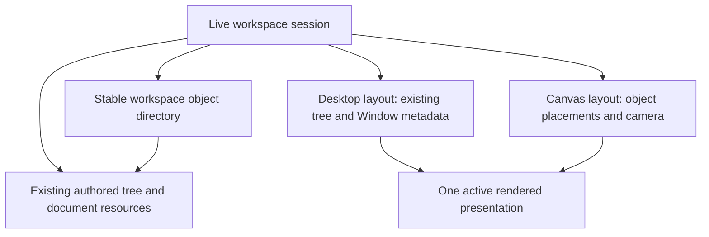

# Canvas workspace / presentation — investigation and plan

Status: **proposal for review; no Canvas implementation is authorized or included.**

Investigated against `3e18a3d` (`Dev docs`), following the accepted Stage 5 baseline `308bd74`. Stages 1–5 remain intact. History extraction, Text Superposition, Spatial/3D and a general presentation-plugin framework are outside this proposal.

**Recommendation:** keep the existing workspace tree and Desktop geometry, add a small workspace-owned object directory and independent Canvas layout, and render one active presentation over the same live repository. Use DOM/CSS transforms. Prove scaled editing and identity-preserving persistence before building out interactions. Do not implement Canvas by scaling the current Desktop shell or by encoding and reopening documents on every switch.

## 1. Current workspace and Desktop architecture

The present application has two materially different hosts in [`workspace-demo.tsx`](src/demo/workspace-demo.tsx):

- The initial demo combines a background editor, a separate document editor and a legacy HTML window shell. Its `activeDemo` bridge exposes the document and window snapshot. Saving assembles a workspace tree, sometimes through a temporary editor.
- `CanonicalWorkspaceSession`, used after loading a workspace, owns one `BackgroundEditor`, application registrations and one projected workspace tree. This is the appropriate first Canvas host. Disposal currently belongs to that session.

The initial demo is therefore not already a single canonical workspace. Reusing its save-and-reconstruct path for switching would risk undo, selection, app state and async operations. The first slice should target canonical workspaces; the initial demo can offer its existing explicit Save/Open path. Live migration of the split demo requires a separate decision, not an invisible conversion.

| Area | Existing implementation and implication |
| --- | --- |
| Composition | [`registerApplicationViews`](src/application/features.ts) and feature adapters supply current extensions. Keep this application composition point. |
| Workspace root | `workspace-block` currently uses a generic container view. Membership and Desktop nesting are encoded together in its descendants. |
| Windows | [`WindowView`](src/rendering/core-block-views.tsx) reads position, size, state and z-index from authored window metadata. Its header has core controls; there is no general app-chrome contribution API. |
| Movement/resizing | Window dragging and [`FloatingWindowResize`](src/rendering/floating-window-resize.tsx) assume viewport pixels correspond to layout pixels. They cannot be used unchanged inside a scaled world. |
| Window state | Canonical windows support minimize/restore and focus handling. They recognize maximized state spellings, but do not implement the legacy demo's complete maximized viewport layout/button. Do not promise a new window manager as part of Canvas. |
| Focus/z-order | Existing focus and mount services remain authoritative for editing. Windows read persisted z-index; there is no general application switcher or universal raise-on-focus service to reuse. |
| Backgrounds | [`StableBackgroundView`](src/rendering/core-block-views.tsx) combines background media, child Blocks and overlays. [`BackgroundMedia`](src/rendering/background-media.tsx) can supply the visual layer separately. `canvas-background-block` means an existing shader background, **not** this proposed workspace presentation. |
| Rendering | [`BlockOutlet`](src/rendering/block-outlet.tsx) resolves a projected occurrence through registered views. [`ReactiveTreeView`](src/rendering/reactive-tree-view.tsx) combines one root with editor overlay layers. Mounting a whole tree view for every Canvas object would duplicate those layers. |
| Compact Document | The Stage 5 [window presentation port](src/runtime/window-presentation.ts) controls margin collapse per document window. Explicit Compact policy and automatic narrow collapse are separate. It is not a whole-workspace presentation API. |
| Persistence | Server manifests externalize/deduplicate documents; browser files currently contain a self-contained workspace tree. These paths have different reference semantics. See sections 7–8. |

State classification matters more than renaming the shell:

| State | Owner / proposed treatment |
| --- | --- |
| Documents, media Blocks, applications and their membership | Shared workspace backing tree and resource registrations; retain existing ownership relationships. |
| Text, standoff properties, links, app fields, media URLs | Authored content; edited through existing semantic/Block APIs. |
| Window position, expanded size, z-index and minimized state | Desktop layout, currently serialized in Window metadata. Retain that representation initially. |
| Canvas rectangles, order, camera and backdrop | Canvas layout only; independent of Window metadata. |
| Explicit Compact request, automatic collapse, pointer capture, selection, focused DOM element, panel state, drafts and subscriptions | Runtime state with existing ownership; do not serialize it as presentation geometry. |

## 2. Workspace versus Presentation model

The proposed model fits the repository, provided it does **not** replace the canonical Block tree with a second content graph.



The directory identifies selectable workspace-scale objects; it contains references, not copies of their payloads. A Window and all its content can be one object. Its paragraphs do not automatically become independent Canvas objects. Existing document sharing remains in the repository/resource layer.

Keep Desktop's current tree/metadata as its layout authority. Represent this explicitly as a `legacy-tree` Desktop layout; do not introduce a second synchronized table of Desktop rectangles. Canvas stores its own rectangles. A later Desktop migration is unnecessary for the first slice.

Workspace membership and visibility become distinct: an object can belong to the workspace without appearing in a particular presentation. Removing a Canvas placement must not delete the shared Block or its Desktop window.

New Canvas-only objects need a backing location. Propose one small, nonvisual core container, tentatively `workspace-object-bank-block`, under the workspace root. It owns ordinary child Blocks using existing tree mechanics; Desktop skips its visual children, while a workspace object list can reveal/open them. It is not a new content store. Existing Desktop objects stay where they are. This addition is justified by direct objects with no Desktop host, but requires review alongside the alternative of creating Desktop windows immediately (section 18).

Spatial is only a sanity check: membership is reusable and layout data is namespaced. No common 2D/3D coordinates, renderer or input system are required.

## 3. Canvas object model and identity

Representative **proposed** types, not current APIs:

```ts
type WorkspaceObjectId = string;  // persisted directory identity
type CanvasPlacementId = string; // persisted layout-entry identity

type WorkspaceObjectTarget =
  | { kind: "block"; blockId: string }
  | { kind: "document"; documentId: string };

interface WorkspaceObject {
  id: WorkspaceObjectId;
  target: WorkspaceObjectTarget;
  label?: string;
  desktopHostBlockId?: string; // generated wrapper, where needed
}

interface CanvasPlacement {
  id: CanvasPlacementId;
  objectId: WorkspaceObjectId;
  bounds: { x: number; y: number; width: number; height: number };
  order: number;
}

interface CanvasLayout {
  version: 1;
  placements: CanvasPlacement[];
  camera: { x: number; y: number; zoom: number };
  background?: { type: string; metadata: Record<string, unknown> };
}
```

`block` targets identify authored objects in the workspace tree. Resolve this anchor only within the workspace-owned portion of the tree, outside document internals. Document targets resolve through stable `documentId`. A future individual-Block reference would need at least a document identity and authored Block identity plus an explicitly supported serialization path; it is not implied by these two target cases.

The [existing identity types](src/block-tree/types.ts) distinguish authored `BlockId`, canonical `ContentKey`, attachment `PlacementKey`, projected `NodeKey` and `ViewId`. Some normalized placements also carry authored `placementId`; that is distinct from `PlacementKey`. **Never serialize runtime keys in this directory or layout.** Resolution produces runtime keys only for the current session.

First derivation assigns missing stable IDs to eligible workspace-level roots, then stores directory entries once. Do not rewrite all document descendants or enroll them in History to obtain IDs. Reject ambiguous duplicate anchors; do not guess which Block a saved placement means. Repeated derivation from the same identified source must yield the same ordering and geometry; ID allocation is a one-time initialization, not a repeated import side effect.

Initially permit one Canvas placement per directory object. Distinct windows referencing one canonical document are distinct workspace objects sharing document content. Rendering the same projected `NodeKey` twice is forbidden: the mount registry does not provide two independent mounts for one occurrence. Multiple Canvas occurrences of one object would require a deliberate projection/occurrence extension and are deferred.

| Object | First-slice treatment |
| --- | --- |
| Existing document window | Render the existing Window and its document, with Canvas geometry supplied by the host. |
| Direct document/note | Possible through existing views; add only when root selection, margins and editing qualification pass. Existing document windows already satisfy the first editing case. |
| Direct image | Primary non-window pilot; existing image renderer, outer Canvas bounds and move/resize chrome. |
| General Window with inline Block application | Primary app pilot. Use a small Counter-style application following the [Window guide](docs/development/CREATING_WINDOW_APPLICATIONS.md), unless an existing inline app meets the same test. |
| PDF | Existing iframe-backed view, not a dedicated PDF engine. Canvas can size its outer host; iframe focus and gesture ownership need qualification. |
| Video/YouTube | Existing applicable views; playback and iframe behavior must be checked individually. No promise of a universal media player. |
| Ordinary Block/reference | Support owned standalone Blocks as qualified. Arbitrary nested Block extraction/transclusion is deferred. |
| Timer, Sticky Notes and other Portal views | Audit before declaring support. Timer's standalone Portal does not become an inline hosted app merely by nesting it under a Window. Preserve existing behavior or mark the object unsupported on Canvas. |

Unknown/unresolved objects retain their directory entry, bounds and authored data and show a labeled placeholder. Unsupported objects are not dropped on save.

## 4. Rendering and technology

Use a clipped DOM viewport, one transformed world element and absolutely positioned object hosts. Use `transform-origin: 0 0`. The system bar and global overlays stay outside the transformed world. World coordinates are CSS layout units at zoom 1, including negative positions; the world does not require an enormous fixed-size DOM box.

Define camera `(x, y)` as the world coordinate at the viewport's top-left:

```text
viewportLocal = zoom * (world - camera)
world = camera + viewportLocal / zoom
newCamera = anchorWorld - pointerViewportLocal / newZoom
```

Apply the viewport's client origin before these formulas. Keep client, viewport-local, object-local and world coordinates explicit in core helpers. Do not globally divide browser events by zoom: native caret hit testing still consumes client coordinates.

Two small rendering adaptations are necessary:

1. Split the core tree-view composition into a provider/root-rendering surface and once-per-view overlay layers. Desktop uses the current root; Canvas renders resolved object roots through `BlockOutlet` under the same projection/provider. Neither an editor nor a full tree view is created for each object. Avoid rendering both an ancestor and its descendant as independent Canvas roots.
2. Give core Window rendering a host geometry/action adapter. The Desktop default reads/writes existing metadata. A Canvas host supplies local bounds, move/resize commits and placement-removal behavior. Child apps still receive only `BlockRuntime`. This is a core host seam, separate from Compact's margin-collapse port, not an arbitrary metadata/DOM capability or header registry.

Audit renderer CSS that assumes Desktop ancestors, absolute Window position or intrinsic media size. The Canvas host supplies the outer placement once; the adapted Window fills that host rather than applying a second stored offset. Direct image/iframe views need bounded sizing rules so changing their host rectangle actually changes their visible extent. Keep these adaptations in the relevant core renderers and scoped presentation styles, without rewriting authored style properties. Retain document-internal providers and ancestry; selecting a render root does not reparent its authored content.

There are real transformed-coordinate defects to resolve before this approach is accepted:

| Existing code | Required investigation/change |
| --- | --- |
| [`MeasurementService.toLayerPoint`](src/runtime/measurements.ts) | SVG uses inverse screen CTM; the HTML path only subtracts a client rectangle. Supply a core coordinate conversion for scaled HTML layers. |
| [`rangeFragments`](src/rendering/standoff-editor-view.tsx) | Subtracts client rectangles and combines them with local scroll offsets; widths/heights remain scaled. Convert into the target surface's local units before producing immutable effect fragments. |
| Window move/resize | Convert pointer deltas to world/local units and use unscaled start sizes and constraints. Canvas bounds must not be clamped to Desktop viewport edges. |
| [`window-presentation.ts`](src/rendering/window-presentation.ts), minimap | Audit mixed client widths, local padding, scroll metrics and ResizeObserver sizes. Margin collapse must use local window width, not zoomed screen width. |
| Panels, annotation controls, selection handles | Preserve viewport anchoring for portals. Coordinate invalidation on camera changes belongs to core scheduling; providers receive already-measured fragments. |

CSS transforms establish a stacking context and can change the containing block of fixed/absolute descendants; `getBoundingClientRect()` reports viewport geometry. These are browser constraints, not assumptions about a particular pan/zoom library. See [MDN transform](https://developer.mozilla.org/en-US/docs/Web/CSS/Reference/Properties/transform) and [MDN bounding rectangles](https://developer.mozilla.org/en-US/docs/Web/API/Element/getBoundingClientRect).

Keep centralized standoff measurement and scheduling. Camera changes may schedule the existing coalesced invalidation path; do not give effects their own observers or transform editable text DOM in an effect provider. Desktop uses the identity coordinate frame and retains its fast path.

No external library is recommended now. A small Solid-owned transform/camera controller can host existing DOM, use native controls for accessibility, and serialize the proposed plain data. A pan/zoom helper would cover only a small part of the work; it would not solve occurrence identity, standoff coordinates, Window geometry, focus or persistence. A drawing/graph canvas adds an unrelated object model; WebGL would complicate ordinary editable DOM. Reassess a dependency only if the coordinate/gesture prototype exposes a concrete benefit, then evaluate its Solid lifecycle, DOM hosting, input ownership, accessibility, size and persistence constraints against that prototype.

## 5. Minimum interaction model

Canvas object selection is separate from native text selection, Grouping, cross-Block selection and authored annotation targets. Canvas selection must never turn Find/Entity highlights into deletion targets.

| Action | Proposed behavior |
| --- | --- |
| Pan | Drag empty background; middle-button drag on Canvas chrome; optional Space+drag only when focus is on Canvas chrome, never while typing. |
| Wheel | Background wheel pans. Wheel inside a document, form field or iframe retains its native scrolling. |
| Zoom | Accessible plus/minus/reset controls; scoped modified-wheel zoom over background anchored at the pointer. Keep browser keyboard zoom shortcuts. Settle the precise modifier during browser qualification; touch pinch is not required for the first slice. |
| Select | Click object chrome/handle; activating editable content preserves its existing selection semantics. Shift-click chrome can select several objects. |
| Move | Drag a dedicated object handle or Window title region through the host adapter. Group movement may use the same delta; marquee and group resizing are deferred. |
| Resize | Explicit handles for qualified object types; Window minima remain local units, image aspect policy is explicit, iframe contents are not introspected. |
| Order | Bring forward/back/front commands update Canvas order only. Do not rewrite Desktop z-index on focus. |
| Activate | Focus/open the existing object view. Use a named chrome control where double-click conflicts with text or media interaction. |
| Remove | Remove placement from Canvas; retain workspace membership and Desktop. Label the action accordingly. Destructive content deletion remains a distinct existing command, not the Canvas Delete default. |
| Add existing | Workspace object list, including currently unplaced and unresolved entries. Reveal an existing placement instead of duplicating it. |
| Add new | Small host-owned actions for a document/window, image and pilot app. Create authored content once through existing tree commands, then add a Canvas placement. No generic property/palette framework. |
| Reset/fit | Reset to 100%; fit the union of saved object bounds with padding and finite zoom limits. Empty Canvas has a deterministic default. No DOM measurement is needed for fit. |
| Keyboard | Tab into named object controls; Enter activates, Escape cancels the owned gesture/returns to chrome, arrows nudge selected objects only while chrome owns focus. Provide menu equivalents for move/order/remove. |

Use existing deterministic ownership principles: a Canvas controller claims only background/chrome gestures it starts; editable interiors continue through existing input machinery. Once owned, use pointer capture and finish/cancel on pointer-up, pointer-cancel, lost capture, Escape, blur or presentation disposal. Do not create all-feature input broadcasting or a general event middleware chain. Pointer capture and cancellation behavior are defined by [Pointer Events](https://developer.mozilla.org/en-US/docs/Web/API/Pointer_events).

Track live movement transiently; commit one layout change at completion, restore the starting rectangle on cancellation. An iframe shield, if needed, exists only during an owned outer-object gesture and is removed on every completion path. Do not permanently block native media/form interaction.

Canvas keyboard Delete/Backspace applies only to Canvas chrome selection. Focused text, IME/composition, dialogs, annotation operations and native inputs retain their current precedence. A presentation switch is delayed during composition, cancels owned Canvas gestures and restores a logical focus bookmark after mounting. Unsaved modal/app drafts need an explicit existing completion/cancel path before unmount; silently discarding them is not acceptable.

## 6. Workspace → Presentations UI and commands

```text
Workspace
  Presentations →
    ✓ Desktop
      Canvas
```

Use session-owned semantic commands such as `workspace.presentation.desktop` and `workspace.presentation.canvas`. Both menu paths invoke these commands, not renderer conditionals. The command selects an existing layout, or derives a missing one once; it does not overwrite an existing layout. Show the checked state from the active presentation. No Spatial entry.

[`CodexSystemBar`](src/demo/codex-system-bar.tsx) currently receives Workspace items from its host and implements a flat menu. Its click handler closes on menuitem clicks; focus navigation queries menuitems. A real submenu therefore requires bounded changes: trigger `aria-haspopup`/expanded state, radio-style checked items, ArrowRight/Left navigation, Escape returning to the parent, and focus selectors that include radio items. A submenu trigger must not close the entire menu. Preserve current Up/Down/Home/End behavior and disabled-item handling.

The system bar remains application chrome shared by both presentations, rather than a child of the transformed world. Provide equivalent commands in the existing fallback toolbar when `codexSystemBar` is disabled. No new global keyboard shortcut is necessary.

Canvas is a major new feature: propose `canvasWorkspace: false` by default, with an explicit development/test opt-in. This follows the repository's [working conventions](AGENTS.md). When unavailable, Desktop remains usable and saved Canvas data remains opaque but preserved.

## 7. Persistence format

Keep both current outer formats: server `speedy-workspace` manifest version 1 and local self-contained `workspace-block` JSON. Put the additive presentation envelope under **workspace root metadata**, tentatively `metadata.workspacePresentation`.

This location is deliberate. [`parseWorkspaceManifest`](src/reactive-editor/workspace-manifest.ts) accepts unknown top-level fields, but `createWorkspaceSaveBundle` reconstructs a fixed top-level manifest. A newly added top-level `presentations` field would otherwise disappear on the next save. Root metadata is copied with the authored workspace DTO and can travel through both formats.

Representative metadata only; the backing root's existing children and document resource table still carry content:

```json
{
  "workspacePresentation": {
    "version": 1,
    "active": "canvas",
    "objects": [
      { "id": "object-window-a", "target": { "kind": "block", "blockId": "window-a" } },
      { "id": "object-image-b", "target": { "kind": "block", "blockId": "image-b" } }
    ],
    "presentations": {
      "desktop": { "version": 1, "kind": "legacy-tree" },
      "canvas": {
        "version": 1,
        "camera": { "x": -120, "y": 40, "zoom": 0.8 },
        "placements": [
          { "id": "canvas-window-a", "objectId": "object-window-a", "bounds": { "x": 40, "y": 60, "width": 840, "height": 620 }, "order": 0 },
          { "id": "canvas-image-b", "objectId": "object-image-b", "bounds": { "x": 960, "y": 80, "width": 320, "height": 240 }, "order": 1 }
        ]
      }
    }
  }
}
```

Validate finite coordinates, positive bounded sizes, finite bounded zoom, unique IDs, valid object references and schema version. Do not create an unchecked arbitrary object merge. Preserve unrecognized fields/presentations on round-trip; unsupported versions remain opaque and fall back to Desktop with an explanation. The feature-disabled reader/writer must not strip Canvas data or require Canvas code to save a workspace.

Keep live camera/layout state in a small workspace-session store, outside document transactions. Hydrate it once from root metadata; merge its latest snapshot into the encoded workspace root on Save. This requires an explicit narrow addition to the workspace snapshot/save path, not direct feature access to `ReactiveEditor` and not a replacement persistence service. The in-memory root metadata is the loaded snapshot, not a competing live layout authority. All application workspace exporters must use the session snapshot path once the feature exists.

Track presentation revision separately from repository revision. Layout changes make the workspace dirty without adding text undo entries, changing document hashes or triggering annotation staleness checks on every pan. Snapshot both revisions when saving; only clear dirty state for the revisions actually saved. Do not add layout History enrollment. First slice can omit layout undo while retaining cancellation and existing document undo; a future explicit layout undo command must not steal text undo.

## 8. Save, Save As and load flow

**Save:** finish or cancel a live layout gesture, capture repository and presentation snapshots, encode existing content, merge the presentation envelope, then use the current local writer or server bundle endpoint. Further edits during an async save remain dirty. Cancellation/failure retains both prior saved state and current unsaved state.

**Server:** reuse [`PersistenceService`](src/reactive-editor/persistence.ts), document registrations and [`workspace-store`](server/workspace-store.ts). Keep location validation, expected document hashes, create-only handling, missing-document diagnostics and the existing exclusion of History-enrolled documents. The server stages documents and publishes the manifest last with rollback on handled errors; do not describe this as a crash-atomic multi-file transaction. Canvas adds no separate endpoint or layout file.

**Local:** reuse [`browser-json-file`](src/demo/browser-json-file.ts) and its File System Access/download fallback. The current browser loader explicitly rejects server manifests because it cannot resolve their separate resources. A local save remains self-contained for supported Blocks; URLs do not become packaged media assets. Blob/session-only URLs must be reported as nonportable rather than silently advertised as recoverable.

**Identity gate:** server `materializeWorkspace` already deduplicates loaded documents by `documentId`. Plain local `decodeWorkspace` is tree decoding and does not provide that same guarantee: shared document content can be emitted as repeated subtrees and become separate content records after reload. Before claiming identity-safe local Canvas persistence, factor a narrowly scoped document-identity materialization step into the local load path. It may merge only matching copies with the same stable document identity; conflicting payloads claiming one identity must be surfaced, never silently combined. Add a repeated-document round-trip test. Do not switch to the debug extended-repository format, persist runtime keys or invent arbitrary Block-reference serialization.

This keeps the existing local envelope even if legacy wire data repeats a document subtree. Canvas itself adds no second content copy. If targeted materialization cannot preserve all qualified references, the fallback requiring review is a versioned local embedded-resource format—not a claim that the current codec already supports them. Arbitrary Block transclusion remains outside the first slice.

**Save As:** wire an explicit workspace command through the same snapshot flow; the browser helper already has a save-as option. Proposed semantics are another file/location for the same logical workspace and document identities, not “duplicate all documents.” On the server, retain referenced document resource locations unless the user explicitly chooses a separate future duplication operation. Do not overwrite a destination without existing overwrite/create-only behavior.

**Load/Open:** decode backing content/resources first, validate/hydrate presentation state, resolve stable anchors, then mount the saved active presentation if available. Missing references get placeholders with preserved placement bounds and existing reload/retarget actions where applicable. Load errors cannot erase layout entries. Unsupported/disabled Canvas opens Desktop; retain the saved Canvas layout and active preference until the user deliberately selects/saves a different presentation.

Selecting an existing presentation is not Load/Open: retain the session, repository, document bindings and undo state. Only view resources change. A new object transaction must atomically coordinate directory membership and authored insertion; failures must not leave orphan layout entries.

## 9. Desktop → Canvas: derive a missing layout

Run only when no Canvas layout exists, including an intentional empty Canvas layout. Build and validate a candidate before committing it.

1. Enumerate eligible top-level workspace objects in stable tree order, traversing the known workspace/background containers. Stop at each Window/document/media object; do not enumerate its internal children again.
2. Resolve or allocate stable directory identities once. Preserve document bindings and authored payloads.
3. For Windows, copy stored position and **expanded** size to Canvas world units at zoom 1. Never measure a temporarily collapsed or minimized DOM window to derive its size. Use current core defaults when metadata is absent.
4. Normalize Canvas Window presentation to open/normal; do not modify the source Window's minimized/maximized metadata. Use a stable `(zIndex, source order, object ID)` sort for Canvas order.
5. Place direct objects without meaningful geometry on a deterministic grid to the right of imported bounds; use documented type defaults, for example 320×240 for unknown-size media. Use metadata dimensions where valid, not timing-dependent image load measurements.
6. Select a deterministic initial fit camera from those bounds; an empty source yields an empty Canvas at `(0, 0, 1)`. Capture a visual-only background copy only if the chosen background policy requires it.
7. Store the Canvas layout, then activate it. Verify that Desktop metadata and document payload hashes are unchanged, apart from necessary workspace-root identity/envelope additions.

Once both layouts exist, repeat switching does not derive, synchronize or “refresh” Canvas. Adding a new Desktop object makes it available in the object list; it does not silently rearrange an established Canvas. An explicit future rederive/replace operation would need its own user-visible semantics.

## 10. Canvas → Desktop: derive a missing layout

Canvas-only means no Desktop layout marker; its content still lives under a workspace root. An explicitly empty Desktop layout counts as present and must not be replaced.

| Direct-object policy | Assessment |
| --- | --- |
| Wrap in a core Window | Predictable, supports existing views, keeps content editable and needs no application discovery framework. Recommended for qualified objects. |
| Open an application-specific viewer | Useful later where one already exists; do not invent a viewer registry for conversion. |
| Omit from Desktop, retain membership | Safe fallback for unsupported types, but requires an accessible object list and a clear import summary. Never silently lose the object. |
| Require all Canvas objects to be Windows | Simplifies conversion but defeats direct Canvas objects; reject as the base model. |

Proposed derivation:

- Reuse existing Window objects. Initialize Desktop position/expanded size from Canvas world rectangles, independent of camera/zoom. Set initial Desktop window state to normal.
- Translate the aggregate origin into a visible Desktop starting region and cascade overflow where needed; apply existing Window minima and reachability constraints without uniformly shrinking document content. Sort deterministically by Canvas order then placement ID. Record normalized rectangles only in Desktop metadata.
- For a direct owned document use `document-window-block`; for qualified direct media/Blocks use `window-block`. Move the existing backing root from the object bank into this new wrapper using existing tree commands. Do not clone its content. Store the wrapper's stable ID as its Desktop host; the Canvas object continues targeting the inner object.
- Do not reparent an arbitrary nested document Block, or create a second inline content tree to simulate a reference. Unsupported/unresolved targets remain in membership and are listed in the derivation summary.
- Commit the candidate wrappers, directory mappings and Desktop layout together after validation. Keep Canvas rectangles, camera and authored document content unchanged. A workspace structural wrapper change is not a document-content conversion.

The first implementation slice need not offer Canvas-only workspace creation, so this reverse derivation can follow separately. It must be completed and qualified before advertising Canvas-only import/Create Desktop. Switching back to an already existing Desktop is required immediately and uses none of these conversion steps.

## 11. Blocks, Windows and BackgroundBlocks

Canvas object hosts supply bounds and interaction chrome; the registered Block view supplies content. Direct image/media views need no conventional Window header. Applications can retain a core Window plus an inline child application. Window metadata remains the Desktop geometry source even while Canvas uses host-provided geometry.

For Canvas-hosted Windows, use normal window content and Canvas placement actions. Suppress Desktop minimize/maximize affordances in the initial Canvas host; offer “Remove from Canvas” rather than silently deleting the backing tree through the existing close action. Desktop controls remain unchanged. This requires a bounded core host policy, not child-application access to window internals. Review this explicit behavioral difference before implementation.

Compact Document stays attached to a mounted document window, with feature-owned explicit policy. Automatic collapse uses unscaled local width. Canvas resize persists expanded local width; zoom and temporary margin collapse must not overwrite Desktop width or Canvas expanded width. Margins, drawers and focus restoration remain core mechanics.

Desktop retains its current background Block and children. Canvas defaults to a neutral viewport background; optional reuse of `BackgroundMedia` draws only a visual layer behind the world. Do not mount `StableBackgroundView` a second time and accidentally render all its children again. A Canvas background copy has independent settings; a shared media URL is fine, shared mutable layout settings are not. Keep backgrounds viewport-fixed initially. No grid/vector drawing or BackgroundBlock redesign is required.

## 12. Lifecycle, ownership and application composition

Use two statically composed presentation implementations in the application host, with Canvas included only when enabled. A small map selected at this boundary is justified by two actual presentations; scattered Canvas checks in editor input, panels and Block applications are not.

The workspace session owns the editor, resource bindings, object directory, layout store, save/load commands and active presentation choice. A mounted presentation owns its DOM view, transient selection/gesture state, frame scheduling and disposal. Switching disposes the old presentation view, retains the session and mounts the other view.

Representative shape only; keep it internal until the first two implementations establish the precise methods:

```ts
interface WorkspacePresentationDefinition {
  id: "desktop" | "canvas";
  label: string;
  View: Component<WorkspacePresentationViewProps>;
}
// ViewProps supplies resolved object summaries, owned layout actions,
// activation/focus requests and core-supplied object rendering.
// It does not expose ReactiveEditor, repository mutation or arbitrary DOM lookup.
```

Core rendering still legitimately accesses core services through its existing provider; that does not make them feature capabilities. Canvas policy uses narrow semantic operations. Host adapters resolve stable identities, render Blocks, coordinate focus and serialize the workspace. Do not pass the editor into Canvas or add a general service locator.

Reuse one session projection initially; resolve object roots within it. Do not create undisposed per-object projections. The current `createView` stores projections in an editor map, so any later multi-projection approach must explicitly handle disposal and deregistration. Mount an occurrence only once at a time.

Before a switch: settle composition and owned gestures, resolve modal drafts, capture a logical focus bookmark, then unmount. After mounting: restore focus/selection where the target is visible and compatible; otherwise focus the presentation/object control and explain unavailability. Preserve established microtask ordering around native selection and pointer completion. Do not keep two live editable surfaces hidden for convenience.

View unmounting can dispose application widget resources and pause media. Authored app state survives through `BlockRuntime`; arbitrary ephemeral drafts do not automatically survive. There is no demonstrated general suspend/resume API, so do not introduce one speculatively. Qualify the chosen pilot's remount behavior and document unsupported draft-heavy apps. Session-owned async feature work retains its existing revision/staleness and disposal rules; mounted panels must not act on an obsolete occurrence after switching.

Feature removal acceptance includes physically excluding Canvas imports/implementation, not just setting its flag false. The application must still build, load/save the opaque Canvas envelope, edit on Desktop and expose unplaced objects through core workspace controls. Unknown application payloads remain preserved. Compact, Entity References and Grouping removal guarantees remain intact.

## 13. Performance considerations

Pan/zoom should update one transform at animation-frame cadence, not rebuild the document tree, commit repository changes, remount apps or recalculate every object's bounds. Move/resize updates the affected host; persist at gesture completion. Core measurement invalidation remains coalesced and must not create per-feature observers.

Initially keep the modest active-presentation cohort mounted. Do not claim unlimited documents because the coordinate plane is unbounded. Profile a small realistic workspace with an editable document, direct media and an app, then a larger repeated cohort to find the cost of document DOM, effect measurement and media—not just empty rectangles.

Add viewport culling only when measurements justify it. The layout table already provides bounds and supports overscan without reading every DOM node. Future culling must pin focused/composing/dragged objects and account for unsaved application drafts, panel owners, media and expensive remounts. Unmounting is not a free visibility toggle. Defer spatial indices, worker layouts, texture rendering and sophisticated virtualization.

Compare Desktop typing/selection against this baseline after adding coordinate adapters, and compare Canvas editing at zoom 1 and representative scaled sizes. Record frame timing and mount counts during pan, plus repository revision/document hashes before and after layout-only operations. No performance improvement or threshold has been measured in this investigation.

## 14. Compatibility and migration

- Legacy Desktop workspaces with no envelope open exactly as today. Derive the directory/Canvas only when requested; do not rewrite files merely by opening them.
- Retain existing Window geometry and Desktop background serialization. Do not migrate every window into a new layout table.
- Feature-disabled/newer readers preserve opaque Canvas data, fall back to Desktop and retain unknown authored Blocks. Older binaries may display an unfamiliar object-bank container through their unknown/generic fallback; data preservation is the compatibility guarantee, not identical historical UI.
- Keep local files self-contained and server manifests resource-based; do not present either as interchangeable without resolving resources.
- Keep current History-enrolled workspace restrictions and explicit errors. This work must not become Stage 6 persistence extraction.
- Missing/duplicate anchors and invalid layouts produce diagnostics/placeholders or a safe Desktop fallback, never inferred destructive repairs.
- Existing layouts evolve independently. Underlying content edits are shared; layout removal, camera changes and Window motion are not copied across presentations.
- Removing a workspace object through an existing destructive tree command invalidates its directory target. Reconcile to a visible missing entry until explicitly removed; do not accidentally bind to a different Block with a reused ID.

## 15. Complexity, risks and evidence

This is a moderate architectural addition with **high-risk integration points**. The transform and menu are relatively small; scaled editing, identity and view lifetime dominate.

| Risk | Severity | Evidence / gate |
| --- | --- | --- |
| Incorrect selection/effect/panel coordinates at zoom | High | Existing client/local mixtures identified in section 4. Browser proof at 0.5×, 1× and 2× before broad UI work. |
| Duplicate content after save/load | High | Server and local materialization differ. Repeated-document identity and conflict tests are mandatory. |
| Input stolen from text, IME, native controls or iframes | High | Canvas claims chrome/background only; browser gesture/cancellation qualification. |
| Switching loses drafts or creates duplicate mounts | High | One active view and stable session; pilot app lifecycle, selection and stale panel tests. |
| Canvas layout accidentally writes Desktop geometry | High | Explicit Window host adapter; compare both layouts and document hashes. |
| Split demo mistaken for canonical workspace | Medium/high | Scope first slice to canonical host; require a separate approved live-migration design if needed. |
| Feature removal loses saved Canvas or unplaced objects | Medium | Core opaque-envelope retention and object access; physical removal build/load/save test. |
| DOM/media cost with many objects | Medium | Measure representative objects before adding culling. |
| Layout save clears newer changes | Medium | Separate presentation revision captured with repository revision. |

Investigation qualification performed on the unchanged baseline with Node 22.12.0:

```sh
npm test -- src/reactive-editor/workspace-manifest.test.ts \
  src/reactive-editor/persistence.test.ts server/workspace-store.test.ts \
  --maxWorkers=2 --minWorkers=1
```

Result: **3 files, 16 tests passed**. These establish current persistence behavior; they do not qualify Canvas or the proposed local identity refinement. No browser Canvas checks or typing benchmarks were run because no Canvas implementation exists. Source inspection, the existing Stage 1–5 reports/guides and the browser references in sections 4–5 inform this plan.

## 16. Staged implementation and qualification plan

All stages below require approval of this plan first. They are proposed Canvas milestones, unrelated to the deferred feature-architecture Stage 6.

| Milestone | Work and completion gate |
| --- | --- |
| A — prove the difficult boundaries | Behind `canvasWorkspace`, prototype one scaled document Window using the core coordinate and host-geometry adaptations; establish local repeated-document materialization fixtures. Stop to reassess if native editing/effects or identity cannot be preserved narrowly. |
| B — session and persistence | Add directory, envelope codec/validation, layout revision, shared snapshot path and canonical host ownership. Test old workspace, malformed/unknown envelope, missing object, local/server round-trip and async save races. No alternate content store. |
| C — presentation and derivation | Add static composition, provider/root/layer split, menu commands and deterministic Desktop→Canvas derivation. Verify repeated switches retain the editor/content identities and preserve both layouts. |
| D — bounded usable Canvas | Add camera controls, object handles, move/resize/order/remove/add-existing, direct image and one inline Window app. Add scoped add-new actions. Qualify scaled editing, focus, Compact and cancellation, then physical removal. This completes the first slice. |
| E — reverse derivation, separately reviewable | Add Canvas-only workspace support and the approved Window-wrapper policy. Test atomic derivation, content identity, unresolved objects and unchanged Canvas source. No overwriting existing Desktop. |

Proportionate automated tests should exercise pure camera inverses/zoom anchoring, deterministic conversion, envelope round-trip/unknown retention, directory resolution, independent geometry and layout revision races. Extend the relevant existing Window, Compact, standoff and menu tests where implementation changes behavior. Do not generate a broad matrix of shallow component snapshots.

Use one supported real-browser environment initially with a fixed representative fixture:

1. Derive Canvas from two Windows (including minimized and Compact/narrow cases), a document reference and a direct image. Move/resize/order, switch repeatedly, save/reopen locally and through the server where supported; compare content identities and both layouts.
2. At 0.5×, 1× and 2×, type/select in a document; exercise native and cross-Block selection, a Grouping operation, annotation effects and Entity panel focus restoration. Check IME composition, Escape and Delete precedence. Confirm camera-only work creates no document transaction.
3. Exercise drag/resize completion outside the viewport, cancellation/lost capture, browser blur, an input field and an iframe/media host. Verify capture/shields always clear and native scrolling still works.
4. Resize across the automatic margin-collapse threshold, use explicit Compact, open drawers and restore focus. Confirm saved sizes are expanded local sizes and do not depend on zoom.
5. Use the Window-hosted app, switch/remount, edit its authored state, then reload. Verify independent app/window lifecycle and no duplicated overlays/mount registrations.
6. Physically exclude Canvas code and registrations, build and run Desktop, load/save a Canvas-bearing workspace and verify opaque data plus unplaced content survive. Re-enable Canvas and recover its layout.

Use the repository's existing focused selection/input/annotation/binding suites for touched paths and the existing typing benchmark if coordinate/input changes affect their fast path. Run a production build/type checks appropriate to implementation. An exhaustive viewport/theme/browser matrix is unnecessary.

## 17. Proposed first implementation slice

The smallest coherent slice is **canonical Desktop workspace + optional Canvas**, not a second standalone application:

- Default-off flag; working Workspace → Presentations submenu and fallback commands.
- One retained live workspace/editor, one active view and independent layout state.
- First Desktop→Canvas derivation, then non-destructive switching in both directions.
- Existing document Windows with usable native editing at tested zoom levels.
- Pan, anchored zoom, reset/fit, single-object selection, move/resize, ordering and removal from Canvas. Shift-selection/group movement can follow within milestone D if simple; marquee and group resize are excluded.
- Add-existing object list and a small set of host-owned new-object actions.
- One direct image and one inline Window-hosted Block application. A small Counter pilot demonstrates the existing BlockRuntime boundary; it does not grant the app editor/window access or refactor Timer.
- Local and server workspace Save/Save As/Open with Canvas geometry/camera, existing Desktop layout and shared document identity restored. Preserve current server location and History restrictions.
- Compact/narrow-window behavior, selection/effects/panels and native input pass the focused qualification; physical Canvas removal succeeds.

Explicit exclusions: Canvas-only creation/reverse derivation until milestone E, arbitrary nested Block transclusion, multiple Canvas occurrences of one object, automatic layout synchronization, graph connectors/drawing, app-header framework, full app switcher/window manager, generalized virtualization, Spatial, History extraction and Text Superposition.

## 18. Decisions requiring review

These are design choices for approval, not requests to start implementation:

1. **Canonical-host scope:** accept the initial Save/Open route from the split demo, or require live split-demo migration in the first slice? Recommended: canonical host first.
2. **Canvas-only membership:** accept the small nonvisual object-bank container and core object list, or require every new Canvas object to acquire a Desktop wrapper immediately? Recommended: bank, preserving direct objects and independent visibility.
3. **Canvas Window controls:** approve normal content with Desktop minimize/maximize suppressed and close replaced by removal from Canvas? Recommended: explicit placement semantics.
4. **Local identity gate:** approve targeted document deduplication with conflicting-copy diagnostics; reconsider a local resource envelope only if this cannot meet the qualified cases. Arbitrary Block references stay deferred.
5. **Reverse derivation timing:** first slice switches back to an existing Desktop; Canvas-only → new Desktop comes afterward. Recommended: separate milestone E with generic Window wrappers for qualified direct objects.
6. **Save As semantics:** another location for the same workspace/document identities, with duplication a future explicit operation. Confirm this matches the intended product meaning.
7. **Transient app state:** accept that supported apps must tolerate view remount and preserve authored state; app drafts require a safe completion/cancel path. No universal suspend API is proposed.
8. **Pilot and controls:** approve a small inline Counter app if no existing app qualifies; settle zoom modifier and initial zoom limits during the browser prototype. These do not justify broader framework APIs.

Implementation should begin only after review of these boundaries. This document concludes the investigation; it does not authorize Canvas work or advancement into the deferred architecture stages.
