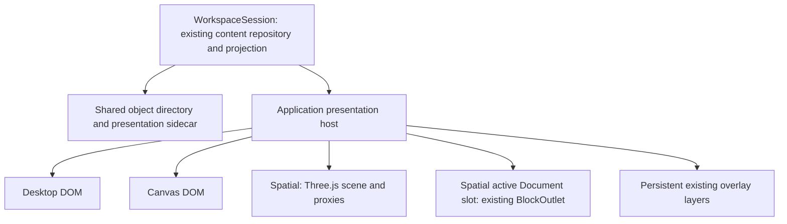

# Codex Spatial Workspace / Presentation — implementation plan

Status: **accepted**. [Milestone A implementation and qualification](./CODEX_SPATIAL_MILESTONE_A_REPORT.md) are complete and awaiting review. Milestone B has not begun.

Inspected baseline: `3e3297f` (`More work Canvas`). Canvas A–E and its application integration are accepted. This proposal does not reopen that programme. No Spatial code, dependency, scene or browser experiment was implemented during this investigation.

## 1. Recommended direction

Build Spatial as a separately removable, default-off presentation of the existing `WorkspaceSession`. Use Three.js for a seated study, desk, object proxies and transitions. Activate one existing Codex Document Window in an **untransformed, screen-space DOM surface**, using the existing projection, `BlockOutlet`, input services and overlay layers.

The scene must make arranging material on a desk useful and pleasant. It should not require navigating a room. The supplied image guides the curved wooden working surface, warm lamp light, cool Alpine night, peripheral shelves and physical papers/photographs. Its browser chrome and large music player are not literal UI requirements. The desk occupies the useful foreground; the window and mountains give depth; decorative objects leave clear working space.

Prove two things separately: A establishes the visual composition and narrow presentation attachment; B establishes reliable live editing and then the continuous physical handoff. If B requires perspective-aware changes throughout the editor, stop and review the design.

Keep orthographic and restrained perspective cameras available in A's comparison harness. Select a default from actual views and interaction, rather than committing on paper. Supporting two permanent user-facing camera modes is not a prerequisite.

## 2. What the existing implementation establishes

The investigation covered the [Canvas plan](./CODEX_CANVAS_WORKSPACE_PRESENTATION_PLAN.md), reports [A](./CODEX_CANVAS_MILESTONE_A_REPORT.md), [B](./CODEX_CANVAS_MILESTONE_B_REPORT.md), [C](./CODEX_CANVAS_MILESTONE_C_REPORT.md), [D](./CODEX_CANVAS_MILESTONE_D_REPORT.md), [E](./CODEX_CANVAS_MILESTONE_E_REPORT.md), and their current implementation.

| Existing seam | Finding and consequence for Spatial |
| --- | --- |
| [`WorkspaceSession`](./src/application/workspace-session.ts) | Owns the canonical editor, loaded projection, object resolution, switching, composition deferral and presentation interaction lifetime. Reuse it; do not create a Spatial editor. Its presentation names and some branches currently assume Desktop/Canvas. |
| [`WorkspacePresentationState`](./src/reactive-editor/workspace-presentation.ts) | Already separates presentation revisions from authored repository revisions and preserves unknown presentation entries. However, its `enabled` value comes from `canvasWorkspace`, and effective `active()`/`select()` only support Desktop/Canvas. This must become independently available to Spatial. |
| [`WorkspacePresentationView`](./src/application/workspace-presentation-view.tsx) | One provider and one set of `ReactiveViewLayers` survive switches. Only active roots mount. Canvas interaction ownership is currently installed even while Desktop is active; a third presentation needs ownership scoped to the active controller. |
| `WorkspaceSession.resolveObjects()` | Resolves the shared directory through stable authored identities; reports missing/ambiguous/replaced targets and pins resolved content identity within a session. This is already independent of Canvas layout. |
| [`canvas-derivation.ts`](./src/application/canvas-derivation.ts) | Contains useful authored-root discovery and identity assignment alongside Canvas layout policy. Do not call Canvas derivation to create Spatial. Extract only demonstrated shared discovery if needed, leaving Canvas geometry unchanged. |
| [`workspace-manifest.ts`](./src/reactive-editor/workspace-manifest.ts), [`persistence.ts`](./src/reactive-editor/persistence.ts) | Local repeated Documents materialize shared identity; conflicting copies reject. Server manifests retain Document references. Saving captures content and presentation revisions before asynchronous work and acknowledges only those captures. No new workspace file format is justified. |
| [`local-coordinates.ts`](./src/runtime/local-coordinates.ts) | Supports positive uniform scale and translation, explicitly not rotation/skew/perspective. The screen-space editor should use its identity path. Canvas's scaled-DOM qualification does not prove a perspective DOM editor. |
| [`WindowGeometryHost`](./src/rendering/window-geometry.ts), [`core-block-views.tsx`](./src/rendering/core-block-views.tsx) | A static hosted Window can use a supplied rectangle without writing Desktop geometry. Window owns important margin/drawer/Compact context; mounting a bare Page view is not equivalent. |
| [`BlockOutlet`](./src/rendering/block-outlet.tsx), [`mounts.ts`](./src/runtime/mounts.ts) | Existing render dispatch is reusable, but mount registration is not a duplicate-mount guard. The application must restrict the eligible live root. |
| [`workspace-open.ts`](./src/application/workspace-open.ts) | Server Document loading already protects shared identity, unsaved live content and asynchronous cancellation. Placement/reveal policy currently branches between Desktop and Canvas. Spatial must not fall through to Desktop insertion or geometry updates. |
| [`features.ts`](./src/application/features.ts), [`App.tsx`](./src/App.tsx) | The application enables Canvas, while generic editor flags default off. Spatial needs its own explicit opt-in; it must not inherit Canvas's application default. Counter is also currently tied to Canvas assembly, so it is not a suitable dependency for this proof. |

These are bounded application/presentation changes. They do not justify a generalized layout registry, renderer registry, input middleware pipeline, replacement identity layer or History extraction.

## 3. Attachment and ownership



Desktop, Canvas and Spatial are mutually exclusive presentation branches. Within Spatial, the scene may remain behind a single active Document slot. The persistent application provider and overlay layers remain outside the branch.

Proposed ownership:

- **Session/core:** content, stable identity resolution, projection, selection/input services, persistence capture, generic DOM measurements and window mechanics.
- **Application adapter:** maps directory objects to eligible proxy descriptions and one qualified live root; mounts `BlockOutlet`; owns presentation switching and the semantic opening/reveal path.
- **Spatial feature:** scene, camera, desk constraints, proxy policy, layout decoder, transitions, arrangement UI and GPU resources.
- **Existing features:** Grouping, Entity panels, effects and Compact continue using their existing capabilities and lifetimes inside the live view.

Give Spatial a small typed port: immutable object summaries and layout snapshot; validated layout/camera commits; select/activate/return requests; availability; and a bounded host-rendered active-document slot. Summaries carry directory/placement IDs, labels, representation kind, dimensions, resolution status and approved image source information. They do not expose the repository, `ReactiveEditor`, arbitrary node lookup or an unrestricted DOM rendering callback. The application resolves an activation request and supplies the authorized slot.

The feature owns its viewport DOM and Three.js canvas. It has no authority to inspect or manipulate editable text DOM. If B needs a mount-ready signal, the adapter provides that specific lifecycle signal through existing mount/layout completion, not general DOM access.

Retain explicit application branches for the three known presentations. Separate capability availability (`canvasWorkspace`, `spatialWorkspace`) from the existence of shared presentation state. Shared composition observation belongs to the session host once; only the active presentation owns its interaction controller. Release the old controller before acquiring the next.

## 4. Minimal persistence and coordinate contract

Keep the existing `workspacePresentation` outer version, object directory, unknown-field preservation and save protocol. Add one named `presentations.spatial` entry. The shared parser recognizes the outer envelope without importing Three.js or understanding Spatial geometry. A decoder owned by Spatial validates its entry when the feature is available.

An illustrative proposed Spatial v1 entry is:

```ts
{
  version: 1,
  environment: { preset: "night-study-v1" },
  camera: {
    kind: "perspective", // alternative: orthographic
    yaw: 0,
    approach: 0          // bounded, normalized seated framing control
  },
  placements: [{
    id: "spatial-placement-id",
    objectId: "shared-directory-object-id",
    position: { x: -0.24, z: -0.92 },
    heading: 0.08,
    posture: "propped", // or lying
    size: { width: 0.21, height: 0.297 }
  }]
}
```

The model is deliberately **desk-constrained**, not an arbitrary 3D transform editor. X points right, Y up, and forward from the seated origin is negative Z; world distances use metres and angles radians. The desk contact plane is Y=0. Position is the bottom-centre contact anchor for a propped page and the corresponding hinged edge for a lying page. The versioned preset defines the two postures' tilt and small surface clearance. Heading rotates about world Y. Size denotes the physical face, independent of DOM pixels. No independent scale/quaternion/Euler triple or redundant persisted Y is needed for A–C. A future freely positioned graph or other native 3D object would require its own justified representation/schema extension; this plan does not promise that desk placements are a universal spatial model.

`approach` is a Spatial framing preference, not a world-space translation shared across camera types. The preset maps it to bounded seated camera travel for perspective and to orthographic framing span for orthographic. Camera position, pitch, FOV, near/far planes and projection matrices are derived from the preset and viewport. They are not duplicated in each placement. Validate finite values, supported versions/enums, unique placement IDs, referenced directory IDs and sensible size/camera/desk bounds. Preserve extra fields when updating known fields.

The exact posture angles, usable desk bounds and framing limits are A experiment outputs, to freeze before declaring v1 stable. Do not change an established preset silently when later improving the scenery.

Four spaces must remain explicit:

| Space | Contract |
| --- | --- |
| Spatial world | Three.js scene coordinates above; independent of Desktop positions and Canvas bounds. |
| Spatial viewport | CSS pixels relative to the scene host, excluding application chrome. Convert client pointer position using its current bounding rectangle, then to normalized device coordinates for raycasting. |
| GPU buffer | Viewport CSS size multiplied by a capped device-pixel ratio. Never use buffer pixels as DOM coordinates. |
| Active editor | An untransformed CSS-pixel rectangle, with existing identity local coordinates. Native caret hit-testing and panels retain client/viewport coordinates. |

World-to-screen projection and screen-to-world unprojection belong to Spatial. They do not extend core's local-coordinate API to perspective. Browser zoom and display scaling must be accounted for through the actual CSS viewport/buffer distinction.

Persist only settled camera/layout changes. Hover, active editor state, animation progress, selection, mount keys, textures and derived meshes are transient. Preview movement during a gesture is runtime state; `finish()` commits, `cancel()` restores its starting state. Save finishes any owned placement gesture before taking the existing sidecar snapshot. An editing transition is not an arrangement change and must never save the page at its temporary camera-facing position.

Unknown Spatial versions or malformed Spatial data are unavailable/read-only in Spatial and preserved verbatim. They should not invalidate an otherwise valid shared envelope or usable Desktop/Canvas entries. A malformed outer envelope retains the existing opaque behavior. An unavailable saved `active: "spatial"` may display the established fallback notice and usable Desktop fallback without silently rewriting the saved preference. Explicitly choosing another available presentation can change that preference.

## 5. Creation, identity and opening content

**Workspace → Presentations → Create Spatial** is an explicit operation, shown only with the feature enabled. It creates a deterministic starter arrangement from known eligible workspace objects, not from Canvas coordinates. If a Spatial entry already exists—even an empty one—offer selection, never overwrite/recreate it. An unsupported existing version is retained rather than reset.

Reuse existing directory IDs wherever present. For a workspace without a directory or with newly discovered roots, reuse the established authored identity rules and add only missing entries. If extracting shared discovery from Canvas derivation is necessary, extract root enumeration/identity validation alone into an application helper; verify Canvas derivation produces unchanged results. Geometry generation and Canvas admission policy remain in Canvas.

Starter layout uses stable source/directory order and a small set of desk slots from the preset. It ignores Desktop x/y/width and Canvas bounds. A practical A fixture has roughly 5–8 items with varied lying/propped states. Excess objects remain in a simple accessible unplaced-items list; do not pile unlimited proxies into the initial view. An empty workspace produces an empty desk. Do not manufacture Documents just to furnish it.

Use the same `resolveObjects()` statuses and content pins. Never choose the first matching occurrence when identity is ambiguous. Stable authored references are persisted; runtime content, placement and node keys are resolved afresh. If a shared Document has multiple authored occurrences, the application must identify the intended eligible host occurrence explicitly or report that activation is unavailable. No new copy of its text is created.

The first qualified editing object is an **existing Window containing an existing Document**. Its desk proxy can look like a paper sheet while its directory target remains the Window/root established by the current workspace. This preserves the host that supplies margins and Compact. Bare Document targets, mixed-content Windows, nested/Portal occurrences and opaque applications can have honest labelled proxies before their activation is qualified. Do not silently substitute a different subtree or restructure authored content on activation.

Opening content is a required integration check, not a new loading subsystem:

- Keep server listing/loading, cancellation, conflict handling, source provenance and live-Document reuse in `workspace-open.ts`.
- Add explicit Spatial placement/reveal handling. New Document Windows/media can use the existing object bank plus shared directory, with only a Spatial placement added. Reopening an existing live Document selects/reveals its Spatial proxy without overwriting unsaved content.
- Never let `active === "spatial"` take a default Desktop branch or write Desktop geometry. No implicit Canvas creation or Desktop-to-Spatial conversion.
- In A, opening/revealing can end at a proxy with a clear preview-only state and a route back to Desktop; full Spatial editing arrives in B. Avoid presenting an activation control as functional before B.

The existing repeated-document local round-trip and conflicting-identity tests remain applicable. Add a fixture with all three layouts referencing shared content; only Spatial presentation data should change when its camera or object arrangement changes.

## 6. Camera and environment experiment in A

Three.js orthographic projection keeps projected size independent of distance; rotation still foreshortens a page. Moving an orthographic camera toward the desk alone does not enlarge it, so approach must adjust framing. Perspective offers depth-dependent size and a more natural seated room, but page-edge distortion and near clipping need qualification. These are projection properties, not evidence that either design is already suitable for Codex. [OrthographicCamera](https://threejs.org/docs/pages/OrthographicCamera.html), [PerspectiveCamera](https://threejs.org/docs/pages/PerspectiveCamera.html).

Compare both using the same geometry, lighting, object placements and viewport sizes:

| Experiment | Orthographic | Restrained perspective |
| --- | --- | --- |
| Starter composition | Architectural clarity; judge whether desk/room feels too flattened. | Start around 40–50° vertical FOV; judge immersion versus distortion. |
| Seated swivel | Rotate around a constrained seated pivot and maintain useful framing. | Same bounded yaw/pivot; no orbit around objects or walking. |
| Approach | Change orthographic span within limits. | Small bounded movement toward the working surface; avoid crossing objects. |
| Handoff rehearsal | Project/unproject a camera-facing rectangle and compare corners. | Repeat at several depths and viewport aspects; validate alignment rather than eyeballing it. |
| Readability/orientation | Recognizable title labels and physical posture at desk edges. | Same criteria, including near and far size differences. |

Start with a 120–150° desk arc, a camera slightly above it looking modestly down, and enough depth for papers rather than a narrow shelf. Dimensions and viewing angles are tuning hypotheses, not acceptance specifications. Test centre and both swivel limits at typical laptop and wider desktop sizes. Keep camera motion bounded and intentional: begin with background drag/trackpad gestures plus explicit left/right/reset controls; compare horizontal trackpad behavior without moving the view whenever the pointer merely crosses the screen. No pointer lock or walking controls.

A's visual review should show paired screenshots/clips, discuss working-space visibility, comfort, edge distortion and the intended handoff rectangle, and recommend a default. The mockup's detail level is not an A requirement. Reduced-motion users must have an immediate or short-fade alternative.

The A scene stays inexpensive: a curved desk mesh with simple wood variation; broad window frame; layered mountain silhouettes, sky/stars and sparse valley lights; a warm desk lamp, limited fill and restrained shadowing; shelves fading into darkness; a few primitive cup/book/inkpot shapes. Props have no application semantics. No rain, moving traffic, volumetrics, imported model collection, postprocessing stack or photographic asset search is needed to answer A's question.

## 7. Three.js integration, lifecycle and loading

Use Three.js directly from Solid-owned feature code. It is not currently a dependency. In A, select and pin a compatible version after checking the existing Vite/TypeScript build; do not add a second UI framework or a scene plugin platform. Lazy-load the Spatial module on entry so ordinary Desktop/Canvas startup does not create a renderer or fetch the environment.

Current Three.js `WebGLRenderer` requires WebGL 2. A must check renderer creation failure and support a useful fallback; do not expand the work into WebGPU or an alternative renderer. Preserve saved Spatial data and allow a return to ordinary editing if graphics support is unavailable. [WebGLRenderer](https://threejs.org/docs/pages/WebGLRenderer.html).

One mounted Spatial lifetime owns one renderer, scene, camera, canvas, input controller, frame scheduler, viewport resize subscription and resource ledger. Async imports/image loads carry a lifetime generation token; late results must be ignored and released after switch/disposal. Use a single viewport size observer or the existing host sizing notification, not observers for each proxy or any editor cell. This scene sizing does not replace centralized standoff measurement.

Handle graphics-context loss as a scene failure, not a content failure: stop scene gestures/animation, preserve layout and any mounted live editor, and provide recovery or an explicit return to Desktop. Rebuild only derived GPU state on recovery; never recreate the workspace session or rewrite the saved active preference merely because graphics failed.

Render on invalidation: camera/object changes, texture completion, viewport resize and active transitions. Coalesce requests into one animation frame. Static browsing and ordinary DOM typing should not run a perpetual scene loop. Continuous environmental animation, if approved in D, needs visibility/reduced-motion controls and bounded work. Stop scheduling in hidden tabs, reset elapsed animation time on return, and avoid a large catch-up jump after sleep. [Three.js on-demand rendering guidance](https://threejs.org/manual/pages/rendering-on-demand.html).

On exit, release pointer capture, cancel frames/listeners/loads, release interaction ownership, unmount the live slot and dispose owned geometries, materials, textures, render targets and renderer resources. Removing meshes from a scene does not free their GPU allocations; material disposal does not dispose its textures. Shared assets need explicit ownership so they are freed once. Resource measurements should stabilize across cycles rather than demand a misleading absolute zero from renderer counters. [Three.js disposal guidance](https://threejs.org/manual/pages/how-to-dispose-of-objects.html).

Use procedural/local assets initially. Load image textures only for visible/needed image proxies, with bounded size and a labelled fallback for failures or CORS restrictions. Do not modify the original authored image URL to encode a GPU cache. Keep any proxy cache ephemeral and content-revision-aware. No hidden live editor should be mounted to generate snapshots. Document proxies can start as a paper surface, title and schematic lines; a stale thumbnail must never be presented as live authored content.

Later assets need recorded source/license, modest resolution and asynchronous loading with stable placeholder dimensions. Color textures and output need deliberate color management; data maps should not be treated as color images. The active DOM editor keeps its normal readable styling rather than inheriting scene darkness or tone mapping. [Three.js color management](https://threejs.org/manual/pages/color-management.html).

## 8. DOM layering and the critical activation proof

Prefer a WebGL scene plus an ordinary DOM overlay. Three.js `CSS3DRenderer` can transform DOM in 3D, but its documented browser/display-zoom limitation is an additional reason not to make it the foundation of full-fidelity editing. It is not needed for A/B. [CSS3DRenderer](https://threejs.org/docs/pages/CSS3DRenderer.html).

Layer order:

1. Scene canvas and proxy browsing controls.
2. The application-owned active Document rectangle, within the same existing provider.
3. Existing menus, contributed panels, dialogs and other `ReactiveViewLayers`, outside transformed scene ancestors.

The DOM slot uses scale 1 and no CSS perspective/rotation. The application supplies a `static` `WindowGeometryHost` for the active Window, with its expanded rectangle in CSS pixels and no Desktop movement/resize persistence. Core continues to calculate narrow margins, drawers and Compact behavior. Respect the existing Window minimum sizes, and use its presented-size/expanded-size distinction rather than saving a temporarily collapsed width. Viewport resizing must not turn into a Spatial object resize.

For B's first proof, retain the existing Window's essential chrome and controls. A physical A4-like proxy does not imply that a multi-Block live Window must be squeezed into A4 proportions. The handoff may expand its backing paper into a useful editing rectangle. Any later chrome reduction is a bounded style decision, not permission to remove margin/focus machinery or duplicate Window internals. Bare-Document activation only becomes qualified if the same necessary host services can be supplied through a small demonstrated seam.

### Activation sequence

Use an explicit, cancellable state machine: `browsing → approaching → aligning → editing → returning → browsing`. A generation token binds every asynchronous step to the requested object and current session.

1. The adapter resolves the selected directory object and eligible occurrence; check composition, overlays, current owned gestures and unsupported widgets before changing views.
2. Retain the saved desk placement. Animate a runtime proxy toward the camera and rotate it parallel to the picture plane. This transform is never persisted.
3. Choose the target editing rectangle in viewport CSS pixels, clear of application chrome and large enough for the hosted Window. Unproject its corners onto a camera-facing plane at a safe depth. Animate the proxy/backing plane to that rectangle. Account for its transition from physical page aspect to editing aspect explicitly.
4. Mount exactly one live `BlockOutlet` root in that rectangle. Wait for its actual host/mount and normal layout readiness; keep the backing plane visible until ready. Transfer pointer/keyboard ownership once, then focus the chosen text target. A short crossfade may conceal the switch, but no interactive tilted DOM is introduced.
5. While editing, freeze scene navigation from editor input. The mesh can remain hidden behind the rectangle. Text, selection, SVG effects and panels all use existing DOM behavior. Do not re-render proxy textures per keystroke.
6. On return, satisfy the same operation/composition checks, capture the applicable focus/selection state, and transfer ownership before unmounting. Restore a non-live paper proxy and animate it back to the unchanged desk placement. Restore focus to the corresponding accessible desk control.

First implement immediate mount/return in B, then animate this proven lifecycle. Rapid activate/return/activate, object deletion, failed loading, presentation switching and disposal must invalidate pending callbacks. A canceled transition returns to a coherent browsing or editing state; it must never leave an invisible focused editor. Resizing during alignment should recompute or finish at the new rectangle deterministically.

### Preventing duplicate live occurrences

In Spatial browsing there are zero mounted workspace Document roots. During editing there is one permitted live root; the scene proxies are not `BlockOutlet`s. Desktop and Canvas roots are unmounted while Spatial is active. Application eligibility excludes overlapping ancestor/descendant render roots and ambiguous occurrences. Mount assertions should check node keys and resolved content/occurrence identity; the current mount registry alone cannot enforce this.

Do not create a second editor for previews, a hidden offscreen Window, a cloned Document DTO or an independent selection engine. Shared Document identity survives remounting even when view-local UI state does not. Qualify retained logical Grouping targets separately from transient cross-Block/native selection, and promise restoration only for a still-valid occurrence. Existing Compact state has view-lifetime behavior; do not introduce persistence for it as part of Spatial.

## 9. Input, focus and cancellation

| Situation | Owner and behavior |
| --- | --- |
| Browse/arrange a proxy | Spatial handles events originating on its scene/control surface. Raycast only eligible proxies, then use a desk-plane constraint. A drag owns capture until completion/cancel. |
| Type/select in live Document | Existing Codex input path. No scene-wide forwarding, feature broadcast or added asynchronous typing step. Native controls retain their own behavior. |
| IME composition | Existing session observation defers switching/return. Preserve the established task ordering after `compositionend`; replacing it with a blanket microtask is not equivalent. |
| Entity panel, modal, sticky draft or owned editor operation | Existing feature/core owner retains focus and Escape/Delete priority. Spatial controls must respect unavailability. No background swivel or proxy activation through a panel. |
| Escape during arrangement/transition | Cancel the owned Spatial operation. During editing, existing editor/overlay handlers get their established opportunity first. Use a visible **Return to desk** command so leaving editing does not rely on stealing Escape. |
| Delete/Backspace | In editing, existing text/Grouping precedence. In browsing, do not delete authored content; no deletion shortcut is necessary for A–C. |
| Pointer capture lost, window blur, cancel | Revert the unfinished arrangement gesture and release ownership. Do not accidentally commit a partial move. |
| Presentation switch/save | Use the existing session cancel/finish lifecycle. Switching cannot leave simultaneous Canvas and Spatial controllers or a live Document under both views. |

Three.js raycasting uses normalized device coordinates and supports scoped intersection targets; the application still owns which objects are eligible. There is no need for a physics engine. [Raycaster](https://threejs.org/docs/pages/Raycaster.html).

Provide keyboard-accessible object selection and activation, left/right swivel, approach/recede and reset. Keep browser Ctrl/Cmd zoom and editor selection shortcuts intact. Do not listen indiscriminately on `window` for navigation keys or wheel events. When live editing, desk commands act only through explicit controls; the editor keeps ordinary wheel scrolling and native focus navigation.

The existing session focus snapshot/remapping is the starting point. Restore only to a mounted, still-valid occurrence; a stale selection should fall back to an appropriate focus target without applying offsets to another shared occurrence. Entity asynchronous revision checks and linked-annotation identity remain in their existing implementation. Spatial must not recreate panels or move them into a camera-transformed subtree.

## 10. Performance and removal qualification

Primary risks are GPU power at idle, shadow cost, high-DPI fill rate, large image textures, leaked renderer resources on switches, duplicate DOM mounts, and animation racing composition/focus. These matter more initially than maximizing object counts.

Start with one renderer, simple materials, few lights, at most one modest shadow map if it improves the desk, capped pixel ratio, and a small visible object set. Measure before introducing instancing, texture atlases, complex LOD or caching infrastructure. A representative target is smooth navigation on the development MacBook, no steady render loop when idle, and no typing degradation beyond normal benchmark variation. Record hardware, browser, viewport/DPR, object count, median/tail frame times and idle behavior; do not report those targets as measured results.

Qualification should use approximately 5–10 normal desk objects and a modest larger fixture, not an exhaustive performance programme. B compares the existing typing benchmark with the accepted baseline under the same settings, reports repeatable differences, and profiles only if needed. Repeated activation/switch cycles should show stable live mount counts, disposed event/frame ownership and a resource plateau.

Physical removal must be demonstrated, not inferred from a flag:

- Follow the isolated-copy approach in [`check-canvas-removal.mjs`](./scripts/check-canvas-removal.mjs). Remove Spatial implementation and its assembly/lazy-import hook; confirm shared modules have no dependency on its schema decoder, Three.js types or GPU classes.
- Build and run ordinary Desktop/Canvas editing, server Document open, save/reopen and selection with Spatial absent.
- Load data containing Spatial and extra unknown fields, including saved active Spatial; verify the unavailable-presentation fallback and exact preservation of the Spatial subtree through an unrelated content edit/save.
- Test flag combinations independently: both off, Canvas only, Spatial only, both on. Spatial-only must not require Canvas layout/controller code to create a desk.
- Preserve a usable empty workspace and existing object-bank content. Removal must not require stripping authored properties or converting Documents.

Add the first removal check in A, extend it after B's DOM integration, and rerun for the C review. D should qualify only its approved additions.

## 11. Refined milestone programme

### A — Study foundation and architecture proof

Implement only after approval of this plan, behind `spatialWorkspace: false` by default with an explicit application opt-in such as `VITE_SPATIAL_WORKSPACE=1`.

Scope:

- Independent availability/state and explicit Create/Select Spatial menu entry; retained data fallback.
- Shared directory resolution and deterministic starter arrangement, including an empty workspace.
- Lazy Three.js lifetime, procedural study/desk/window/shelves/props and simple Document/image proxies.
- Minimum camera swivel, approach/reset, keyboard controls and cancellation required to evaluate the scene.
- Orthographic/perspective comparison and a non-editable plane-to-screen-rectangle alignment rehearsal.
- Initial save/reopen of preset, camera and starter layout; opening/revealing existing server Documents as proxies without a new content loader.
- Physical removal and Desktop/Canvas regression checks.

A therefore includes basic persistence and camera ownership; deferring all of those to C would leave the architectural proof incomplete. It does **not** include document editing, arrangement tools, texture snapshots, rich assets or an environment settings framework.

Evidence: paired views/clips at centre and swivel limits, recommendation for camera default, saved-layout/shared-identity results, fallback/removal results, resource lifecycle/idle observations and build checks. A source-only technical success is insufficient: review whether it actually resembles a calm working study. **Stop for review.**

### B — Existing Document activation, then handoff

B1 first mounts one qualified existing Document Window in an untransformed DOM rectangle with immediate enter/return. B2 adds the raise/rotate/align/reverse animation around that verified lifecycle.

Browser qualification must cover native typing/caret/selection, cross-Block selection, Grouping including Control-held gestures and removal, representative SVG standoff effects/highlights, Entity panel focus/selection and stale asynchronous results, margins/drawers, explicit Compact versus automatic narrow behavior, IME, native controls, undo/redo, Escape/Delete priority, switching, pointer completion, resize during transition and repeated activation cycles. Include opening/reopening a shared server Document with unsaved changes. Use existing suites and fixtures rather than inventing a replacement editor harness.

Check the primary browser and a focused Safari pass where available, browser zoom as well as display scaling, and reduced motion. Distinguish automated coverage from manual real-IME evidence and report unavailable checks. Verify one live root and no new input dispatch on ordinary typing. Compare typing benchmarks and extend removal qualification.

B is successful only when editing is still ordinary Codex and the handoff is credible. If qualification requires substantial changes to core selection, effect measurement, Window composition or perspective DOM coordinates, stop with the concrete blocker before proceeding. **Stop for review before C.**

### C — Restrained desk arrangement

Add desk-constrained movement, heading rotation, lay/prop, accessible select/focus controls and keyboard alternatives. Use ray-plane intersection and preset usable-surface bounds, not arbitrary 3D gizmos, physics, snapping registries or six-axis controls. Allow modest overlap but keep objects recoverable through the accessible object list; define a deterministic surface-clearance/render-order policy to avoid z-fighting.

Persist settled placement through the existing sidecar capture; qualify cancel/capture loss, save during movement, arrangement across presentation switches, invalid/missing objects and unknown-field round-trip. Verify arrangement leaves Desktop/Canvas geometry and authored content unchanged. Camera refinements build on A's ownership rather than replacing it. Do not introduce a new cross-domain undo/history system; document the existing separation between authored undo and presentation changes.

Evidence: useful arrangement with mouse/trackpad and keyboard, repeated-document/all-layout round-trip, independence assertions, activation after moves/posture changes and physical removal. **Stop for review before D.**

### D — Selective environment and additional Block qualification

Agree the bounded D selection after A–C evidence. Candidates are improved photograph presentation, a user-started unobtrusive YouTube music surface, better wood/props/exterior, reduced-motion-aware distant lights, and a small window-local rain effect. Do not treat every candidate as automatically authorized scope.

Reuse the existing YouTube application/player where it provides a clean fit. Define its mount/disposal and playback behavior when changing presentation; do not promise background playback across unmount without separately justified ownership. Avoid new autoplay or hidden audio behavior. Rain is a visual window treatment, not a weather-service integration.

Qualify each additional Block's actual DOM/runtime ownership; unsupported types remain labelled proxies or unavailable for activation. Native GraphView/GraphDataBlock work remains a separate future proposal, not a dependency of D. Rich asset licenses and power/visibility behavior are acceptance items. **Stop for review after D.**

## 12. Proposed implementation map and review decisions

These are prospective files/responsibilities, not scaffolding to create during planning:

| Location | Bounded responsibility |
| --- | --- |
| `src/features/spatial/` | Spatial schema decoder, scene, camera math, proxies, interaction/transition state, resource disposal and styles. No editor import. |
| `src/application/spatial-actions.ts` and a host component | Shared-directory admission, creation/open/reveal policy, narrow feature port and authorized live `BlockOutlet` slot. |
| `src/reactive-editor/workspace-presentation.ts` | Separate presentation availability; preserve opaque entries; named Spatial sidecar commits without importing feature implementation. |
| `src/application/workspace-session.ts` | Explicit third presentation path, existing resolution/focus/composition services and exclusive interaction lifetime. |
| `src/application/workspace-presentation-view.tsx` | Lazy Spatial branch, persistent provider/layers and active-controller ownership. Canvas rendering/geometry remain as implemented. |
| `src/application/workspace-open.ts`, application flags/menu/assembly | Explicit Spatial placement branch and default-off exposure. Preserve server loading/identity semantics. |
| Focused tests and `scripts/check-spatial-removal.mjs` | State/identity/preservation, scene math/lifetime, browser handoff and physical-removal qualification. |

Extract a neutral object-discovery helper only if implementation proves the existing resolver/directory insufficient for Create Spatial. No generic plugin registration API is proposed. No new renderer methods on every Block, layout framework, shared 3D coordinates in core, History extraction or Superposition changes are planned.

Recommended decisions for approval:

1. Separate Three.js presentation, default off; keep Canvas closed apart from narrowly necessary application composition changes and regression qualification.
2. Shared session/directory/save envelope, with a Spatial-owned versioned desk model and no automatic Canvas derivation.
3. One untransformed live DOM Document Window at a time; no CSS3D editor, hidden duplicate renderer or WebGL text editor.
4. Existing Document Window as B's pilot; qualify other roots individually rather than dropping their host behavior.
5. Cheap camera/atmosphere comparison in A; choose the default from evidence. Procedural assets first.
6. Minimum camera/input/state ownership in A; immediate editor proof before animation in B; arrangement in C; bounded optional enrichment in D.
7. Review gates after every milestone, with a specific B stop condition for major editor changes.

This planning stage produced repository inspection and technical-source review only. Browser behavior, visual quality, performance and handoff viability remain to be demonstrated by the approved milestones. **No Spatial implementation had begun when this planning investigation was completed.**
