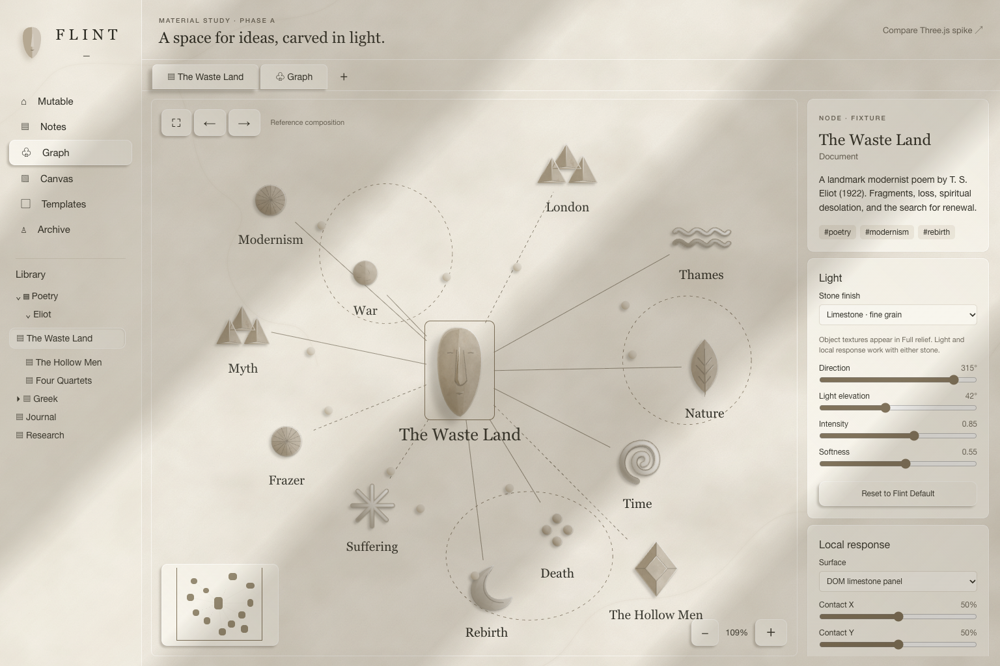
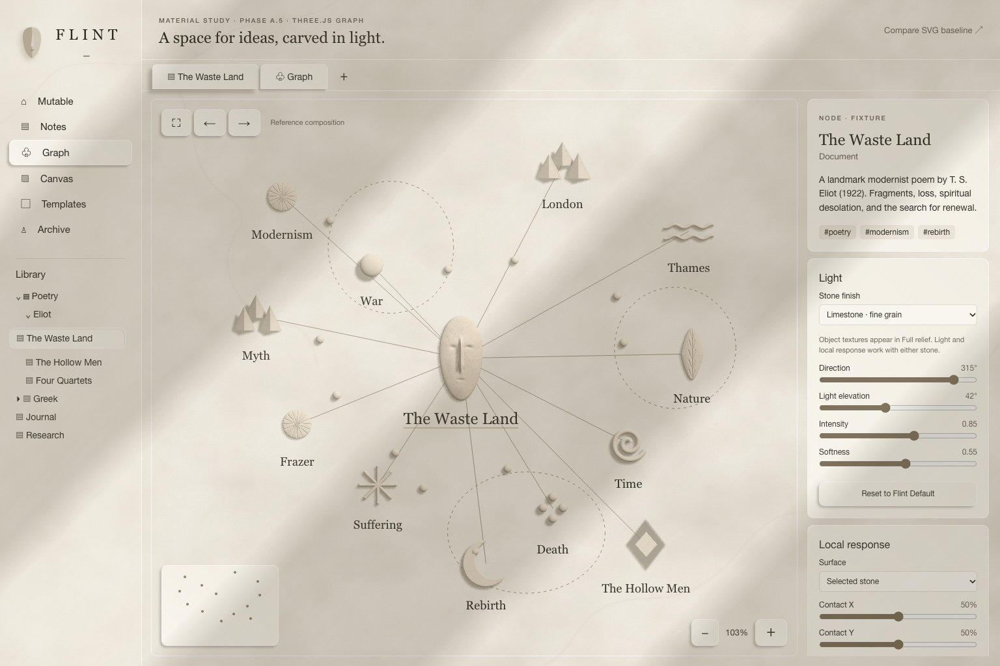
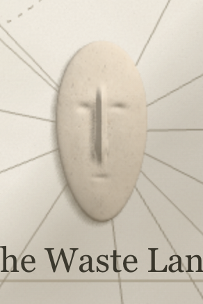
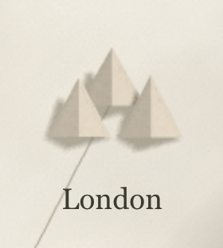
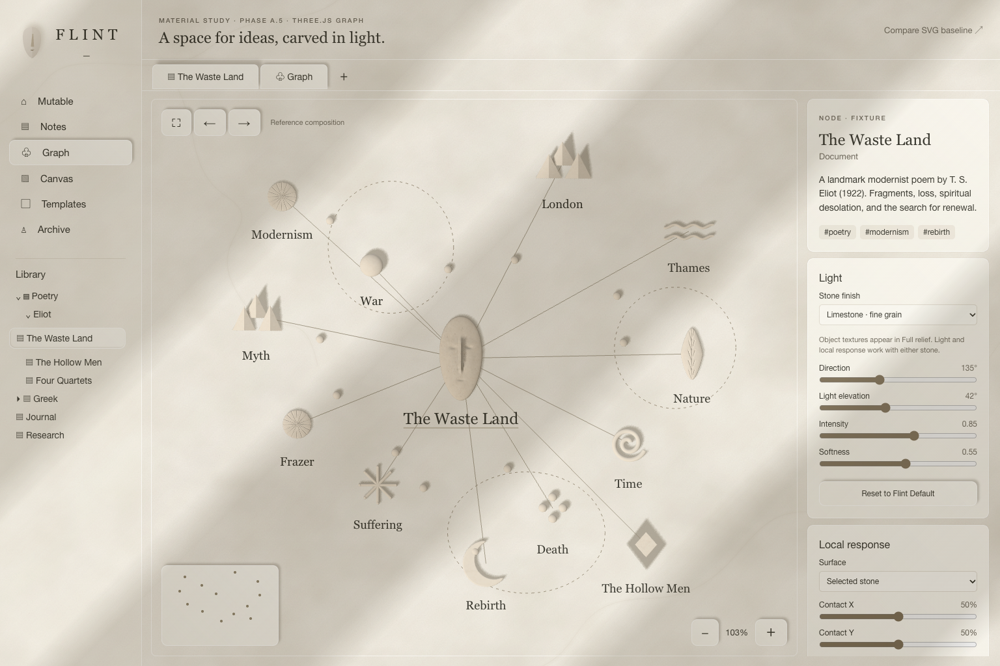

# Flint Phase A.5 — Three.js Graph materiality spike

**Date:** 6 October 2026  
**Status:** Implemented for visual review; production migration remains deferred.

The graph-only experiment is available at **[/flint-material-three](http://localhost:3000/flint-material-three)**. The latest SVG Phase A remains at **[/flint-material](http://localhost:3000/flint-material)**. Both use the same HTML shell, controls, logical light, material vocabulary and reference positions. The new `flintThreeGraphSpike` feature flag is enabled by default; disabling it prevents the Three.js route from mounting.

**Recommendation:** use Three.js for sculptural Graph rendering, retain HTML for chrome and labels, and preserve SVG as a simpler rendering option and engineering fallback. This spike shows a material advantage in volume, carving and coherent relighting. The head still needs artistic refinement to match the original concept; this is sufficient evidence to review the renderer direction, not approval to migrate production Graph.

## Visual comparison

The original supplied Flint concept remains the visual authority. It was supplied inline and is not copied into this repository. The [comparison page](docs/flint-material-comparison.html) displays the two actual browser captures side by side and can display a local copy of the original alongside them. Default and opposite light directions are available. The local reference is displayed in the browser without uploading it.

| SVG Phase A baseline | Three.js Graph spike |
| --- | --- |
|  |  |

These are **actual 1536 × 1024 Chromium browser captures**, not generated concept images. Each uses the same 13-node fixture, default light (315° azimuth, 42° elevation, 0.85 intensity, 0.55 softness), limestone finish and its renderer's fit view. SVG fits at approximately 109%, Three.js at 103%; neither image has been retouched.

| Criterion | Assessment against the supplied concept and SVG baseline |
| --- | --- |
| Materiality | The head, disc, spiral and beads read more readily as placed volumes. Stone surface detail now affects shading through bump response rather than only colouring a silhouette. |
| Form | The head has geometric cheek/forehead transitions, a projecting nose, recessed eyes and mouth, thickness and a closed edge. Pyramids expose real planar faces; the spiral is rounded relief; the crescent has thickness and rounded bevels. These are stronger physical cues than the SVG paint regions. The head remains a procedural approximation of the sculptural reference. |
| Lighting | Reversing the existing light changes internal modelling, nose/eye shadows, grooves, bevels and cast shadows naturally. No hand-authored directional facet colours are updated inside the Three.js scene. |
| Surface response | Related limestone/chalk/marble presets use restrained albedo, roughness and bump variation. The head also has a direction-independent concavity map aligned with its geometric recesses. Texture strength was reduced after the first capture because it competed with the carving. |
| Integration | A transparent canvas and real shadow receiver keep the existing limestone picture plane visible. Architectural light bands, sidebar, tabs, inspector and typography remain HTML/CSS. There is no opaque rectangular 3D backdrop. |
| Interaction | Orthographic XY pan/zoom, raycast hover/select and node dragging remain graph-like. HTML labels support native text selection and keyboard selection; the existing connections list is retained. |
| Performance | The reference is responsive in the short sanity check, and 50/250 simpler-node fixtures render without an obvious failure. Counts and frame intervals below are feasibility evidence, not production qualification. |
| Complexity | Geometry authoring remains real work, especially for the head. Normals, surface lighting and cast/self shadows now come from the renderer, removing the need to keep adding SVG facet/bevel/filter approximations for those behaviours. Production layout, LOD, recovery and accessibility remain separate work. |







## Implementation boundary

The adapter uses the installed Three.js 0.186.1 with [MeshStandardMaterial](https://threejs.org/docs/pages/MeshStandardMaterial.html) and an [orthographic camera](https://threejs.org/docs/pages/OrthographicCamera.html). One directional light and restrained hemisphere illumination consume the existing Flint azimuth/elevation/intensity/softness; [directional-light shadows](https://threejs.org/docs/pages/DirectionalLightShadow.html) provide cast/receive and self-shadowing. Screen-space Flint `(x, y, z)` maps to Three `(x, -y, z)`.

The reusable geometry includes a displaced, closed polar head surface; triangular pyramids with genuine faces; a tubular spiral; a bevelled crescent; a geometrically incised disc/leaf; and inexpensive waves, star, beads and diamond. It does not load or merely extrude the SVG symbol library. Crescent/diamond extrusion is used as one geometry technique within this vocabulary.

Existing generated limestone/marble albedo assets are reused. Colour textures use sRGB, bump/AO data use non-colour sampling, and albedo strength is separate from bump response. A small standard-material shader hook blends neutral albedo with the bitmap; it does not introduce a second lighting model. See the existing [asset provenance](src/features/flint/assets/GENERATION.md).

The shared response resolver supplies press/lift travel as actual Z movement, a local contact light and finite waves. The existing root scheduler renders on demand; a static scene has no continuous loop. Pan/zoom/selection/drag belong to this experimental adapter; no X6 instance or synchronisation layer exists inside the Three viewport. Geometry/material/texture caches are disposed on unmount, along with observers, event listeners, shadow resources and transient targets.

A later Probe could use the same ray intersections, surface normals, contact position, material parameters and elevation inputs. No Probe is implemented here.

## Short performance sanity check

Chrome 154, 1536 × 1024, device scale 1; the reported driver was **ANGLE Metal Renderer: Apple M1**. Each fixture received 24 light updates. The non-reference fixtures substitute a simple rounded stone for the carved head; they are presentation fixtures, not a live corpus.

| Nodes | Median frame interval | p95 interval | Median CPU render submission |
| ---: | ---: | ---: | ---: |
| 13 | 16.7 ms | 16.8 ms | 0.4 ms |
| 50 | 16.7 ms | 16.7 ms | 0.8 ms |
| 250 | 16.7 ms | 16.7 ms | 2.5 ms |

Earlier passes ranged up to a 33.2 ms median at 250 nodes. Host/browser scheduling varies, and submission timing does not measure GPU completion. No 1,000-node optimisation, exhaustive profiling or cross-browser qualification was performed. All fixtures returned to idle; actual mouse dragging and blank-canvas panning passed.

The preceding SVG correction is retained as requested. Its warmed reference measurements remain roughly 67–83 ms median in full detail, with some closer-view costs higher than the pre-correction SVG. The more expensive combined two-shadow filter was discarded in favour of a plain-silhouette contact branch. The SVG and Three timing runs use different tracing/sample protocols, so their numbers do not establish a precise speedup ratio.

## Verification and review gate

- Client/server build and TypeScript sanity passed.
- 18 focused browser checks passed: mounting, real geometry/shadows, shared light, selectable labels, raycasting, mouse dragging/panning, orthographic zoom, physical lift, finite-wave idle, 13/50/250 fixtures, unmount/disposal and feature opt-out.
- No uncaught exceptions, console errors or canonical/persistence API calls were observed.
- 38 SVG route functional checks also passed after introducing the optional renderer factory.

Evidence is retained under ignored `artifacts/flint-material/three-spike-final/` and `artifacts/flint-material/svg-preserved/`. Reproduce the short Three check with:

```sh
node scripts/check-flint-three-browser.mjs
```

**Stop for visual review here.** Production Graph migration, Phase B/C, whole-application Three rendering and the Flint Probe have not begun.
