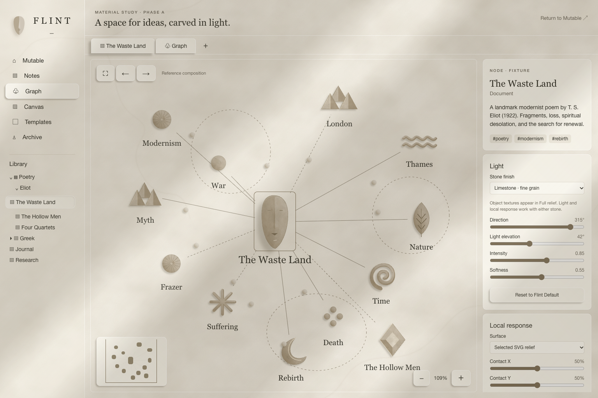
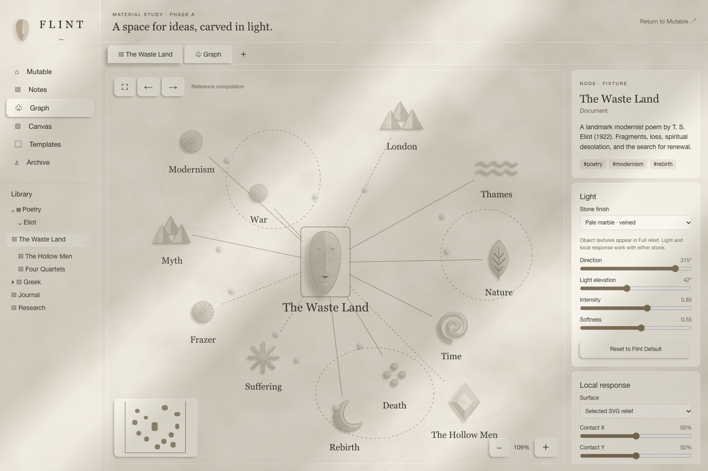
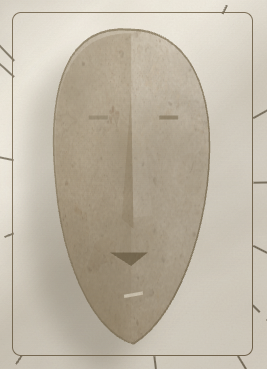

# Flint Phase A — Material Texture and Light-Field Fidelity Pass

**Date:** 6 October 2026

**Follow-up:** The latest SVG baseline now also contains conceptual face normals, related stone response presets, directional edge highlights, static crease AO and a tight plain-silhouette contact shadow separate from its cast shadow. A combined two-shadow filter was rejected after increasing measured cost. The sharpened macro penumbra and all existing response/coordinate/cleanup boundaries are retained. Actual updated baseline captures, performance limits and the separately authorized Graph-only Three.js experiment are recorded in the [Phase A.5 comparison report](FLINT_PHASE_A5_THREEJS_GRAPH_RESULTS.md). The earlier captures below remain historical evidence of the texture pass.

The fidelity pass is implemented in the isolated `/flint-material` playground. It adds material variation at three scales and one workspace illumination/occlusion field, while retaining the Phase A response model, native cursor and graph interactions. Phase B and Phase C have not begun.

## Source-kit decision

The supplied kit was inspected as a material reference. Its macro limestone, pores, sparse mineral marks and pale marble informed the scales and relative strengths. The source sheet was not used as a background or cropped wholesale. The illustrative height/AO/roughness examples were not used as albedo, since their apparent recess shading could compete with dynamic Flint lighting.

The picture plane uses cached procedural SVG images for cloud variation, mineral deposits and micro pores. Sculptural objects also use generated limestone and pale marble **bitmap albedo assets**, with visibly richer stone detail. These are new assets guided by the kit, not extracted panels from the supplied sheet. They were inspected for neutral broad illumination and blend multiplicatively with the existing body/facet shading. Static vector paths provide supplemental sparse veins. The textures remain within the warm chalk, ivory, limestone, marble and mineral vocabulary, while dynamic Flint lighting supplies direction and cast shadows.

The runtime assets are [limestone](src/features/flint/assets/limestone-albedo.png) and [marble](src/features/flint/assets/marble-albedo.png), generated through the built-in image_gen tool using the imagegen skill. Both are 1254 × 1254. [Asset provenance and exact prompts](src/features/flint/assets/GENERATION.md) record their creation and rendering use. Together the original-quality PNGs add approximately 5.6 MB of image resources; production compression is deferred with later integration.

## Implementation

**Three independent layer inputs.** Cloud variation, Mineral marks and Fine grain controls are under **Effects and graph detail**. Fine grain also adjusts the objects' bitmap stone-detail strength. Environment and object adapters apply different gains to the same inputs. Reset restores their defaults alongside limestone, the global light and neutral local inputs.

**Quiet picture plane.** Macro and medium variation cover the environmental plane without repeating at workspace boundaries. Fine pores use a small cached tile. Ordinary controls omit the former grain background and retain shallow relief, crisp text and restrained definition.

**Stronger object material.** Shared SVG patterns composite bitmap albedo, cloud variation, mineral deposits and pores inside the existing alpha silhouettes. Multiplicative blending retains the lit/shaded differences of the underlying body, rather than covering them with an opaque bitmap skin. Marble uses a quieter procedural grain profile and branching veins. Form-specific pattern offsets/rotations avoid stamping identical material placement across different symbols. Noise textures have explicit filter extents; nested tile periods align rather than introducing a cropped tile seam. The noise filters are inside cached image resources, not live filters attached to graph nodes.

**One macro light field.** `light-field.ts` projects a small number of broad irregular light/shadow bands using CSS gradients and a small translation. Its angle uses the existing x-right/y-down source basis; elevation changes apparent projection width, intensity changes strength and softness changes penumbra. The plane extends only 2% beyond each workspace edge to cover its translation, avoiding a large rotated offscreen layer. It overlays the interface decoratively and does not intercept input.

The field has one root subscription, one plane and no node-geometry queries, per-node occlusion calculation, extra scheduler or permanent animation loop. Its own work is independent of graph size; the existing cost of globally relighting SVG objects remains separate. The experimental `flintLightField` feature flag is enabled by default under the project convention. Setting it to false removes the field while retaining the material study.

**Coherent micro light.** Curved-body gradient stops now derive lit, front and shaded tones from the same response resolver and rotate with the source. A fixed world-space facet can no longer reverse those gradient stops when the light crosses the scene. Existing facet geometry, definition strokes and cast-shadow filters remain in use; this pass adds no per-object physical lighting or additional blur filters.

The dynamic CSS-variable boundary at the graph remains intact. Shared definition attributes drive global SVG illumination; target-local definitions still supply contact, press/lift and finite waves. Reduced effects/forced colours suppress environment texture and the macro field as well as decorative graph effects. Reduced motion introduces no animated field transitions. Unmount unregisters the field subscription and retains the existing cleanup path.

## Visual review against the original concept

The following is an implementation assessment, with the captures supplied for user review:

| Criterion | Assessment |
| --- | --- |
| Material background | Improved: cloudy mineral variation, sparse deposits and pores replace the uniform cream fill; environmental treatment remains quieter than object texture. |
| Carved or placed stone objects | Improved body shading and material variation; hand-authored geometry is still more schematic than the sculptural artwork in the concept. This remains the largest visual gap. |
| Common light source | Macro bands, DOM relief and SVG body/facet/shadow changes share the same light direction and parameters. |
| Broad illumination and shadow bands | Present across the picture plane and chrome; they suggest outside architecture without shadow mapping. |
| Restraint for a knowledge application | Pale materials dominate, veins remain sparse, and layer strength can be reduced independently. |
| Typography and ordinary controls | Text remains selectable and visually crisp; controls carry less surface texture than the sculptural objects. |





Actual browser close-up of the limestone relief at 250% graph zoom:



These are actual browser captures at 1536 × 1024, rather than generated mockups. The study remains ready for visual review; the captures do not establish pixel-level equivalence to the concept.

## Verification and limits

- `npm run build` passed for client and server; Vite retains its large-chunk warnings. The material route remains lazy.
- `npm run typecheck` passed.
- 24 tests passed across the material, light-field, scheduling, feature-composition and existing Flint-lifecycle test files.
- 33 Chromium functional browser checks passed, including all existing Phase A behaviours, field direction coherence, field flag opt-out, independent texture controls, decoded bitmap assets, multiplicative shading and actual raster output with texture enabled/disabled. No canonical/persistence API calls or uncaught browser exceptions were observed.

Evidence is under ignored `artifacts/flint-material/fidelity-bitmap/`; the review captures above are retained in `docs/assets/flint/`. Reproduce the functional capture with:

```sh
MATERIAL_BENCH=0 PROOF_ARTIFACTS=artifacts/flint-material/fidelity-bitmap node scripts/check-flint-material-browser.mjs
```

The previous [Phase A scale measurements](FLINT_MATERIAL_LIGHTING_PHASE_A_RESULTS.md) remain historical measurements of that earlier version. The 24-case large-graph benchmark was not repeated in this fidelity pass, and no improved large-graph performance is claimed. The new field's constant-size implementation does not solve the known SVG relighting cost. Safari rendering and physical-device responsiveness remain manual checks.
