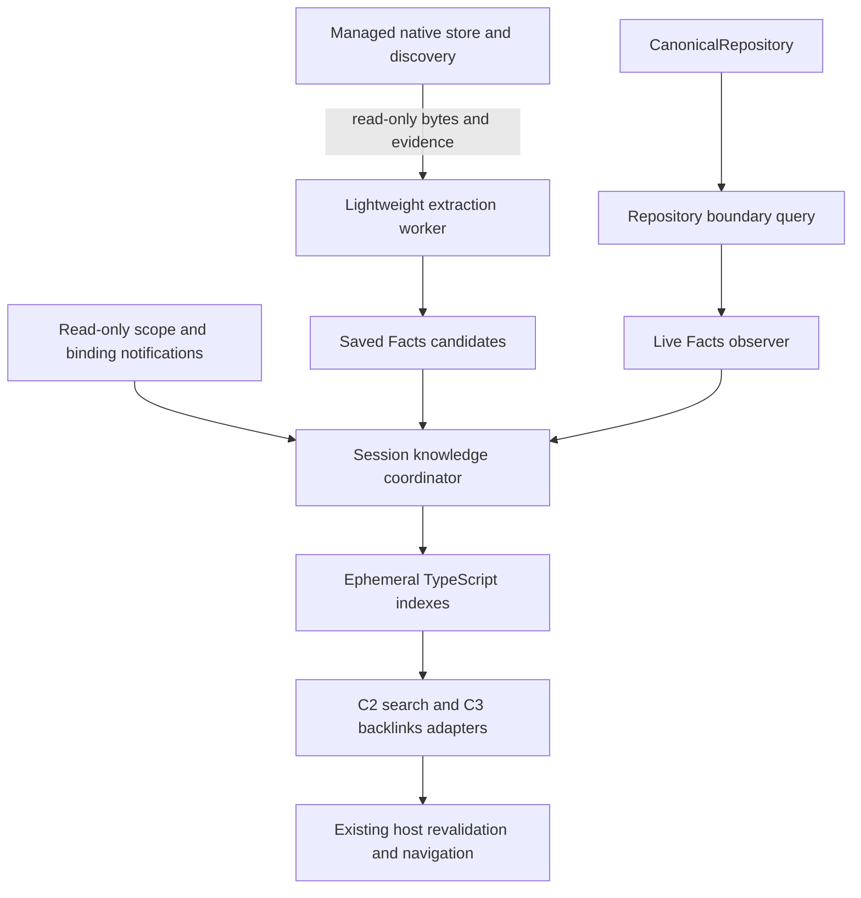

# Native Knowledge and Facts Production Integration Plan

Planning only. Prepared against the accepted C2/C3, saved Facts, live observation and canonical resource-boundary qualifications. No implementation is authorized by this document itself.

## 1. Objective and accepted foundation

Integrate one disposable native knowledge pipeline into Flint: saved native resources supply worker-extracted Facts; loaded canonical resources supply live Facts; live authority suppresses saved contributions; ephemeral TypeScript indexes serve the existing search and backlinks interfaces. The application host continues to validate and perform navigation. The index never saves, admits, owns, binds, relocates or edits Documents.

The exploratory sequence is complete. The stages below are production implementation and regression gates, not another feasibility programme. A new architectural review is required only if implementation exposes a concrete requirement outside these boundaries.

Accepted evidence:

- [C2 plan](FLINT_STAGE_C_IMPLEMENTATION_PLAN.md) and [C3 qualification](FLINT_C3_QUALIFICATION_REPORT.md): canonical targets, native coordinates, explicit coverage, cancellation, occurrence-independent results and invoking-Window navigation.
- [Native Knowledge prototype](MUTABLE_NATIVE_KNOWLEDGE_INDEX_PROTOTYPE_REPORT.md): Facts and disposable TypeScript lookup structures.
- [Lightweight extraction](NATIVE_FACTS_EXTRACTION_QUALIFICATION_REPORT.md): original-byte validation and native semantics without reconstructing text Cells; approximately 21.6 seconds and 279 MiB retained heap for the synthetic 10,000-note rebuild. This is warm-filesystem qualification, not production startup latency.
- [Live observation](LIVE_CANONICAL_FACTS_ADAPTER_QUALIFICATION_REPORT.md): observation without persistence capture, with differential Facts equality, revision checks and live suppression. Its old repository-wide cold proof is superseded by the next result.
- [Repository boundary qualification](CANONICAL_RESOURCE_BOUNDARY_QUALIFICATION_REPORT.md): ready first/post-structural reads at 1/10/100/150 resources use constant target-relative visit counts and no unrelated dictionary enumeration. Approximately 4–5% / 48 bytes per content record is an accepted bookkeeping cost in the measured Cell-heavy workload.

**Resource-local post-admission observation is qualified. Arbitrary structural repository admission remains global.** This project will not make general commits resource-local or change their ownership validation.

## 2. Production ownership and dependency direction

The arrows carry data or invalidation, never delegated persistence authority. The worker cannot mount an editor. The live observer cannot capture/save a resource. The host, rather than the provider or index, opens a selected saved result and performs the DOM reveal.

| Owner | Responsibility and lifetime |
| --- | --- |
| CanonicalRepository | Incoming placement evidence, sparse identity/retention facets, global admission outcome and revision-bound boundary queries. Lives with that repository, independently of Flint or Facts. |
| Native store/session | Canonical file admission, persistence binding, caller baseline, pair status, relocation and recovery. Supplies read-only evidence/notifications; its authority is unchanged. |
| Knowledge coordinator | Explicitly composed once per repository/native-session host, with separate leased vault scopes. Owns jobs, live suppression, candidate Facts and derived indexes. No global catalog or service locator. |
| Vault scope | Discovery snapshot/epoch, policy, coverage and active contributions. Shared by two Flint Windows using the same host/vault; separate repositories/browser sessions remain independent. |
| Resource job | At most one live observation and one supersedable saved extraction request per canonical ID in a scope. Its lifetime is independent of tabs, projections and query panels. |
| Window query adapter | Owns cancellation, result handles and invoking-Window navigation callbacks. Cancelling one query does not dispose another Window's resource jobs. |

The coordinator retains only active scope state. Releasing the last vault scope disposes its jobs, Facts, index entries and subscriptions; it does not dispose canonical Documents, their native session or saves. Reopening a scope starts from current discovery and re-establishes live suppression **before** accepting saved contributions. Closing a tab while its vault remains open does not trigger saved hand-back.

## 3. Factoring qualification code into production

Names below are proposed files, not existing APIs. Keep the production dependency direction explicit; production must not import `src/qualification`.

| Existing source | Production destination or treatment |
| --- | --- |
| `src/block-tree/reference-bookkeeping.ts`, `resource-boundary.ts`, `repository.ts`, `resource-registration.ts` | Retain in block-tree; remove qualification terminology from the public option/API, document semantics and encapsulate tokens. Reuse the same maintained facets and root-selection/ownership predicates. |
| `src/qualification/native-knowledge/extract.ts` | Factor `src/knowledge/facts.ts`, `collect-facts.ts`, `policy.ts`. Separate immutable semantic Facts from location/freshness evidence and timing hooks. Preserve logical mention identity and the qualified extraction profile. |
| `lightweight.ts` | `src/knowledge/saved-reader.ts`; preserve original reserved-wire checks, text-span grammar and private validation witness using existing codec authority. The witness must never escape as an admissible resource. |
| `live-adapter.ts` | `src/knowledge/live-observer.ts`; use the production repository query exclusively. Remove the old global cold-proof branch, consumer ownership maps and proof cache. |
| `live-facts-overlay.ts`, `overlay.ts` | Refactor into `src/knowledge/session.ts`, `scheduler.ts`, `contribution-state.ts`. Do not promote the synchronous removal, one-subscription-per-resource or unverified `restoreSaved` lifecycle unchanged. |
| `index.ts` | `src/knowledge/index.ts`; private contribution stores and bounded query methods. Keep tags, root resolution and typed incoming/outgoing mention lookups. Do not expose the prototype's graph traversal as new product functionality. |
| `files.ts`, `light-files.ts` | Keep synthetic filesystem probes and rebuild harnesses test-only. Production uses managed-store confinement, discovery and pair evidence, not the prototype directory walker or filename-pair inference. |
| Capture/decoder extract wrappers, fixture generators, benchmarks and slow ownership helpers | Remain independent test/benchmark oracles. Adapt imports to production collectors while retaining full-decoder/capture paths for differential validation. No benchmark timing fields in application contracts. |

Facts identify canonical resource and Block IDs; ranges remain half-open native Cell offsets or explicitly tagged UTF-16 ranges for supported non-standoff text. Root Block ID and resource ID remain distinct. Mention identity excludes save generation, path and occurrence key. Entity mentions remain typed separately from Document references and do not become C3 backlinks.

Contribution evidence is separate: repository instance/revision for live Facts; native byte hash and existing store evidence for saved Facts; scope/discovery epoch, policy version and request serial for both. A hash is evidence of the bytes read, not a save generation, ownership proof or binding. Relocation invalidates location evidence without creating a new semantic Document or save generation.

### Compatibility details found in production code

1. `VaultKnowledge.blocks()` currently searches `plain-text-block` and `text-block` as well as standoff text. The prototype collector only populates standoff text. Production factoring must use the existing `canonicalSearchSource` UTF-16 branch for these two types, with live/saved/C2 differential tests. Replacing C2 with the prototype unchanged would regress supported search.
2. `NativeVaultStore.discover()` currently calls `decodeNative` on the server thread for each file. A worker only behind later Facts extraction would leave expensive startup discovery in place. Move discovery's read-only semantic inspection to the same worker facility, preserving its existing validation and store-owned pair/duplicate checks. Do not alter publication, relocation or Open admission validation merely to accelerate discovery.
3. Current binding/scope observations rely on Solid signals and explicit prototype `invalidate()` calls. Add narrow read-only subscription adapters rather than parsing status messages or introducing a general event bus.
4. The existing native session may capture resources on structural change for its own persistence bookkeeping. That cost is outside the new observer; measure it separately in end-to-end tests and do not claim it was removed. The new provider must not introduce another capture.

## 4. Repository boundary contract

Promote the qualified query as a repository-semantic read returning ready, missing, ambiguous, invalid or unavailable evidence. Ready evidence establishes unique Document/root identity, explicit retained-definition membership and validity of the requested owned boundary, with incoming owning-placement evidence available under an instance/revision token. It returns neither serialized content nor Facts, and grants no save/adoption permission.

Preserve registration as non-owning retention, owned-external boundaries, unknown ownership, reference cycles versus invalid ownership cycles, duplicate candidates and outside/shared ownership checks. Reuse current admission validation. Classified input paths maintain only changed facets; unclassified fast mutations invalidate eligibility without initiating global validation. A later admitted general validation may restore it. A query must never repair or recommit the repository to manufacture readiness.

Every admitted revision expires boundary tokens, including unrelated mutations; repository replacement expires every token. Do not add a per-resource dependency graph or retain proofs across unclassified structural changes.

The qualified query is synchronous and can still take time proportional to a very large A. Production should factor its audit into one internal resumable traversal with a synchronous wrapper and a cooperative read entry point. The latter carries only a transient traversal cursor, checks cancellation and the captured repository revision at each slice and before returning, and emits **no ready evidence until the complete audit succeeds**. Incoming witnesses, long child/inline arrays and ownership-audit loops must also be sliced; yielding only between Blocks is insufficient for Cell-heavy resources. This changes execution scheduling, not ownership semantics or maintained state. Do not export a general graph walker or return a partial boundary as valid.

If a pathological single authored value cannot be inspected within the work budget, return explicit unavailable/budget coverage; do not weaken validation or run a repository-wide fallback. Ordinary qualified fixtures must still become ready. Cooperative and synchronous results must match the existing slow oracles.

## 5. Saved extraction and its worker boundary

Use a bounded Node worker facility under the existing server build/deployment pattern: proposed `server/native-knowledge-worker.ts`, `server/native-knowledge-jobs.ts` and `server/native-knowledge-routes.mjs`, assembled through `server/native-document-store.mjs` / `server/index.ts`. Keep the worker free of filesystem, repository, editor and write capabilities: the managed-store adapter reads confined bytes and supplies them with an extraction policy. Transfer byte buffers where possible.

Two task forms share the reader: validated identity/title inspection for discovery, and Facts extraction for a requested saved resource. Start with one worker and a bounded queue; make concurrency an implementation constant justified by measurement, not an extensible job framework. A synchronous decoder phase cannot service an abort message; cancellation/timeout must invalidate the request and terminate/recreate that worker when needed. Account for the affected queued tasks explicitly.

The read-only route accepts a vault-relative location, expected canonical ID and caller discovery/read evidence. It uses existing store confinement, symlink, file-size, pair and pending-relocation guards. Add before/after file identity/hash checks where required to ensure the response describes the bytes actually read; a raced read is unavailable, never a refreshed save baseline. Recheck location and operation evidence before publication. Worker output cannot authorize a file operation.

Retain complete managed discovery as the identity-uniqueness gate. Facts extraction can then publish progressively per resource. An incomplete discovery cannot establish that an absent/duplicate candidate is safe: report incomplete coverage rather than treating omitted rows as deletions or publishing provisional unique identity. Worker-backed inspection must preserve the existing accepted discovery result, including ambiguous, changed and pending states. Keep conservative `paired`/`unenrolled` eligibility initially; Markdown pending or conflict does not license repair by the index.

Responses include Facts, diagnostics and read evidence, not a new native resource DTO. Node worker messages use structured clone. If Facts cross JSON HTTP, annotation `value` fields require the existing `encodeAuthoredValue` / `decodeAuthoredValue` grammar at that declared boundary: raw JSON would lose undefined and special-number values. Bound and validate the derived response; do not invent another authored-value codec, change native envelopes or strip difficult values silently. Large responses need bounded batches/resource limits and measured browser decode/publication cost.

The lightweight reader continues to validate original reserved fields and every original text atom before removing text atoms in its private witness. Unknown authored payloads remain opaque data; reserved wire/version failures reject extraction. Future atom grammar changes require reader differential updates. Blocks/images still incur semantic validation; worker isolation handles that cost, it does not claim to eliminate it.

`.ink` / `.ink.md` remains separate compatibility work. Production initially accepts the formats recognized by the managed store (currently `.mutable.json`); it must not promote the probe's `.ink` filename support or infer projection identity from a name. Markdown is never indexed as native authority.

## 6. Live observation, policy and incomplete Facts

The live observer receives the repository boundary reader plus narrow scope/eligibility and policy reads. No `ReactiveEditor`, native save service, DOM, projection or general application registry is passed into extraction. A small application adapter resolves registry capabilities into an immutable policy description that can also be sent to the saved worker.

Use the qualified resource-scoped borrowed-record approach and current linked-definition/Cell helpers. Borrowed records do not outlive observation; check revision after every yield and before publication. Validate the whole canonical boundary even when extraction deliberately omits opaque content. Do not reconstruct Cells, serialize the repository or send the live repository to a worker.

A shared, versioned extraction policy lists supported text forms and opaque types, and excludes application-host bodies. It applies identically to live and saved traversal. No worker-only guessed registry or default that reads hidden application internals. Policy/capability changes invalidate both paths. Preserve C2's supported plain text and C3's conservative hosted-content behavior through explicit parity tests.

Facts completeness and source validity are different:

| Condition | Contribution behavior |
| --- | --- |
| Ready boundary and complete supported extraction | Publish current Facts with the policy and source evidence. |
| Valid source, unresolved/foreign linked definition | Omit the unproven annotation/mention, preserve safely read text and other facts, mark incomplete with diagnostics. Never borrow a saved mention to fill the gap. |
| Valid source, opaque/external body omitted or traversal limit reached | Publish only the qualified partial result, with explicit omissions. Do not claim a complete absence of backlinks. |
| Annotation/value/transport failure that cannot yield trustworthy partial output | Publish no resource contribution; retain unavailable diagnostics and live suppression. |
| Boundary invalid, ambiguous or unavailable | Suppress live and saved contribution for that ID. No first match, `captureNative` fallback, hidden editor or legacy scan used to bypass the boundary. |
| Boundary missing | Withdraw live facts and consider verified hand-back; missing alone is not sufficient to restore saved Facts. |

A live Document with unresolved definitions may be searchable but not currently serializable. Facts completeness grants no persistence permission. Do not add a foreign-definition subscription graph: the current profile excludes those mentions, and conservative revision/scope invalidation covers reconsideration.

## 7. Overlay state machine and freshness

Each scope/resource slot has saved candidate evidence and one effective state: saved-ready, live-pending, live-ready, live-incomplete, suppressed/unavailable, or verifying-hand-back. These are disposable provider states, not authored state or a catalog.

1. **Canonical appearance:** immediately suppress effective saved Facts before scheduling observation. Presence, even dirty or ineligible presence, outranks saved bytes. Multiple occurrences create one resource contribution.
2. **Edit/Undo/Redo:** invalidate actionable result epochs synchronously, abort obsolete jobs and debounce a new observation. Keep saved Facts suppressed throughout. Monotonic repository revision prevents an Undo branch reviving old offsets.
3. **Completion:** require the current job serial, scope/policy epochs, repository instance/revision, unique identity, binding/location and pending-operation evidence. Replace the contribution atomically from the query's perspective; discard stale or cancelled completions.
4. **Save:** a worker may refresh the saved candidate from confirmed native bytes, but live authority remains in place. Continued editing cannot be overwritten by the just-saved generation; Markdown freshness cannot choose the effective source.
5. **Failure or cancellation:** remain suppressed/pending with truthful coverage. A query cancellation cancels that query; it does not hand the resource back to saved state.
6. **Canonical disappearance:** suppress first and schedule a verifier. Closing an occurrence, panel or observer is not canonical disappearance.

Verified hand-back requires all of the following at publication: current repository-instance evidence of absence rather than ambiguity/unavailability; no pending canonical admission for this ID; complete current scope discovery with a unique eligible file; current location consistent with any retained native-session binding; no pending relocation/recovery; fresh stable native-byte/hash/identity evidence; and an unchanged absence/scope/request epoch after the asynchronous read. Open/admission start invalidates a hand-back ticket before repository publication. If any condition fails, retain suppression. Hand-back never calls Save, adopts a new binding, discards dirty content or treats an external same-ID move as legitimate.

No general unload operation is added. Existing explicit canonical removal/repository-lifecycle events are observed; they are not initiated by Knowledge. On repository replacement, tear down the old coordinator and start a new scope with fresh evidence rather than carrying tokens or suppression authority across instances.

## 8. Notifications, scheduling and index lifecycle

Add explicit subscriptions at existing ownership boundaries. `src/application/document-vault.ts` supplies discovery replacement/lease closure events; `src/persistence/native-session.ts` supplies immutable read-only binding/pending-operation/publication notifications; the application composition root supplies repository replacement and policy changes. Reuse current signals internally where practical. Do not expose mutators, mutable binding objects or receipt baselines as consumer authority.

| Event | Required action |
| --- | --- |
| Repository revision | Expire boundary/query tokens immediately; supersede in-flight live work. Unknown structural changes conservatively invalidate all live evidence in the scope. |
| Discovery Refresh completed | Advance scope evidence; reconcile candidates, duplicates, omissions and operation states; cancel results tied to older discovery. A failed refresh cannot be interpreted as an empty vault. |
| Binding creation/change or Open begins | Invalidate matching resource evidence and hand-back tickets. A discovered external same-ID move remains a conflict until storage explicitly resolves it. |
| Relocation/recovery starts or becomes uncertain | Suppress affected scope results under existing conservative pending-operation rules. Completion triggers fresh discovery/evidence, not a new save generation. |
| Native publication/recovery completes | Re-read a saved candidate as needed. Notifications do not claim that disk matches newer unsaved canonical edits or that a Markdown-pending pair is complete. |
| Vault switch, last lease release, shutdown | Advance epochs, cancel queries/jobs/timers, unsubscribe and release derived memory. No canonical or persistence disposal follows. |

There are no filesystem watchers or polling. External changes become known through existing Refresh/action reads and result activation. UI freshness is therefore “as of verified observation”; activation always rechecks. The index is not a filesystem lock.

The synchronous repository callback performs only revision/epoch invalidation and coalesced scheduling. It must not traverse a Document, capture, enumerate repository dictionaries, remove thousands of index hits, emit per-Cell notifications or fan out full extraction to every subscriber. Use one repository subscription per coordinator. Deferred scheduling can examine active resource read-sets to prioritize likely changes; these are bounded extraction dependencies, not an ownership/membership index, and never preserve an expired boundary proof. Do not build an inverted per-Cell owner map.

Start with approximately 100 ms trailing debounce (within the qualified 30–150 ms range), coalescing per resource, one live traversal at a time and bounded saved-worker concurrency. Prioritize the invoking query/active Document without giving the Window job ownership. A maximum-wait attempt prevents idle starvation, but continuously changing sources remain honestly pending if no stable revision can be published. Structural invalidation may require O(number of active resources) deferred scheduling and resource-local rechecks; report that aggregate cost rather than claiming every refresh is O(1).

Use short cooperative slices (initial target 4 ms) through boundary auditing, borrowing, text/annotation collection, index insertion/removal and matching inputs. Avoid synchronous spreading of huge child arrays and whole-resource snippet/value cloning. Deadline/cancellation checks are also required inside Cell and annotation loops. An indivisible over-budget value is diagnosed, not silently simplified. Reuse the existing search worker for matching/regex safety; do not execute regex on the UI thread.

Index invalidation must be cheap: mark a resource generation, or a whole-scope epoch for structural changes, ineligible immediately. Every lookup filters ineligible generations. Reclaim obsolete tag/mention/text entries cooperatively afterward; publish a replacement only after its prepared contribution is complete. A query spanning a change rejects rather than mixing generations. Bound pending cleanup and staged replacements; do not accumulate one old copy per keystroke.

The index lives in the browser session, shared across this host's vault consumers. Keep one effective Facts object per resource and only the saved candidate retention needed for verification; evicted saved candidates can be reread. Closing one panel cannot clear another Window's index. With no scope leases, terminate work and release everything. Eviction removes derived Facts only and cannot remove live suppression or manufacture canonical absence.

Introduce finite queue, response and retained-Facts budgets with explicit “memory/work budget” coverage. Proposed initial retained-Facts budget: 256 MiB per host across vault scopes, measured with conservative accounting and heap checks; pin active result sources only within that bound. This does not bound the canonical repository or the whole browser. The 10,000-note qualification already exceeds that budget: a stock production run may be incomplete; a separate raised-budget harness measures the full comparison. No database/cache is introduced to hide that limitation.

## 9. C2 and C3 integration and saved-result activation

Preserve `ApplicationKnowledge` in `src/feature-api/document-application.ts` and `BacklinksService` / `ApplicationBacklinks` in `src/feature-api/backlinks.ts`. Add narrow internal query-provider injection to `VaultKnowledge`; reference selection, creation/removal and Undo/Redo remain its current native command path. The index supplies derived search sources/results, not reference-writing authority.

Add a Facts-backed backlinks adapter with the existing query/current/subscribe contract and a host-side resolver. Preserve Document-root reference qualification, linked multi-segment deduplication, explicit legacy unique-root resolution and distinct Entity/Find semantics. Full-text matching uses the current matching engine, native coordinate maps, grapheme actionability and bounded snippets. Keep current C2/C3 request/result budgets initially even if the background index contains more resources; larger coverage limits must be explicit and tested, not inherited accidentally from the prototype.

Integrate loaded resources first. Keep accepted C2/C3 scans available until parity gates pass. There must be no hidden editor, automatic bulk admission or focus stolen from another Window. Result publication remains derived and adds no History entry.

Saved-only coverage is a separate final production gate because current C2 explicitly requires loaded resources. A result click is an explicit request to open **one** selected source; background search is not. The application host must:

1. Recheck query/scope/policy evidence and refresh discovery; reject changed identity/location/operation evidence.
2. Verify the selected native bytes/hash. If they changed, invalidate the result and request a fresh query; do not chase a best-match passage.
3. Reuse an eligible loaded canonical source, or call the existing native Open path for that single location. Open retains all identity/binding, dependency, read-only and caller-baseline guards. A loaded but ineligible source is not replaced from disk.
4. Re-resolve canonical resource/root/Block identity and revalidate the passage or logical mention against **current live** native semantics after admission. This produces a fresh host navigation ticket: expected admission changes the repository revision, so simply demanding that the pre-Open revision remain unchanged would reject every valid saved activation. Tie that transition to the selected Open operation and its admitted resource; unrelated edits, scope changes or superseding activation still invalidate the request. This refresh does not bless any other stale row or overwrite live state.
5. Invoke the existing `KnowledgeHost.navigate` / reveal and selection restoration in the invoking Flint Window, then recheck freshness after asynchronous occurrence mounting and reveal.

The provider never receives `native.open`, binding mutation, command or focus capability. Coverage distinguishes discovered, saved-ready, live-ready, pending, incomplete, suppressed and unavailable sources internally; map these honestly to existing public coverage fields and bounded diagnostic text. Zero results with incomplete coverage must not read as a complete negative answer.

## 10. Implementation stages and review gates

### Stage P1 Repository boundary production primitive

**Files:** `src/block-tree/{repository,reference-bookkeeping,resource-boundary,resource-registration,commit-capture}.ts`, relevant repository constructors/tests. Promote the accepted facets and token/result contract; factor cooperative traversal as described in §4. Retain normal reference-count behavior for a compatibility constructor mode; no Knowledge imports enter block-tree.

**Promote/test-only:** promote repository bookkeeping/query logic; keep slow enumerating helpers, visit instrumentation wrappers, generated workloads and qualification oracles in tests. Remove the consumer-facing `qualifiesResourceBoundary` dependency when the production observer is introduced.

**Gate:** run every accepted boundary differential case, fast-path/Undo/Redo/capture/identity suite and live-versus-capture regression; compare sync/cooperative reads through cancellation and mutations between slices. Include duplicate IDs, same-parent owners, shared Cells, retained/outside ownership, owned-external roots, cycles, placement/root-only changes and repository replacement. Ready evidence must remain identical for the qualified fixtures.

**Performance/memory:** rerun 1/10/100/150 resource controls with A held constant, recording construction, admission, first/post-target/post-unrelated read and combined costs separately. Require zero unrelated dictionary enumeration on reads and zero new global input-path work. Observe the accepted approximately 48-byte/record representation rather than redesign it; investigate a repeatable increase beyond 64 bytes/record on the identical fixture. Compare three warmed input pairs; a repeatable median addition above 0.1 ms requires explanation/review before accepting this stage. Add large-A scheduling traces, not just ready ordinary-note results.

**Rollback:** a repository-construction option can select the accepted count-only path for diagnostics/reversion; switching requires reconstructing the repository, not clearing live bookkeeping mid-session. Production evidence defaults on when this stage is integrated. Consumers must tolerate unavailable evidence. **Stop for P1 review.**

### Stage P2 Shared Facts semantics and worker-backed saved reader

**Files:** proposed `src/knowledge/{facts,policy,collect-facts,saved-reader}.ts`; `server/native-knowledge-{worker,jobs}.ts`, read-only route module and managed-store composition; `server/native-vault-store.mjs`, `server/native-document-store.mjs`; dedicated worker build entry following `scripts/build-history-worker.mjs`. Existing native codec/value modules are reused, not redesigned.

**Promote/test-only:** factor collector/span reader; retain full-decoder/capture extraction and filesystem generators as tests. Move discovery inspection off the server thread using the validated worker result while leaving store-owned pair evidence, duplicate handling, guards and returned hierarchy semantics intact. No background provider is yet wired into Flint.

**Gate:** complete saved-reader differential suite plus native B1/B1.1/B1.2/B2 and C1a discovery/relocation regressions. Add plain-text/text-block parity, identical opaque policy, rich values across worker/HTTP, malformed wire/version/text atoms, read races, duplicate identities, symlinks/confinement, pending operations, read-only mode, crash/timeout/cancellation and restart. Invalid resources remain rejected; no native bytes or receipts change.

**Performance/memory:** repeat 100/1,000/10,000 synthetic extraction comparisons in a raised-budget isolated harness, separating discovery, read/hash, worker validation, transport, Facts and insertion. Compare reader CPU to the accepted lightweight control; investigate a repeatable >20% regression in equivalent phases. Record worker/server/browser peak and retained heap separately, worker restart recovery and long-task/heartbeat behavior for the 10,001-Block fixture. No full text-Cell reconstruction on the saved path and no new semantic decoder execution on the UI/server request thread. Production discovery limits remain unchanged; do not claim a full 10,000-resource store scan where its existing entry budget prevents one.

**Rollback:** internal discovery inspector injection retains the existing decoder implementation for controlled fallback/tests; worker unavailability returns explicit unavailable saved coverage, not heavy synchronous Facts extraction. Legacy Flint behavior remains active. **Stop for P2 review.**

### Stage P3 Live observation and resource-owned knowledge lifecycle

**Files:** proposed `src/knowledge/{live-observer,session,scheduler,contribution-state,index}.ts`, `src/application/native-knowledge-scope.ts`; narrow notifications in `document-vault.ts` and `native-session.ts`; lifecycle composition in `document-application-capabilities.tsx` or a directly owned host helper. Do not give these services the editor object.

**Promote/test-only:** refactor the observed overlay and index around generation eligibility, deferred cleanup and explicit hand-back verification. Remove the observer's consumer structural-proof cache and old whole-state scan branch. Keep capture-based differential, fake delayed workers and scheduling probes test-only.

**Gate:** complete live/saved Facts equality and overlay tests; immediate suppression before every async operation; edits, Undo branches, scope/policy changes, duplicate IDs, unresolved definitions, stale completions, external same-ID moves, partial publication, pending relocation/recovery, read-only stores, failed discovery, canonical admission/disappearance and repository replacement. Test hand-back success and each failed precondition. Two Windows must share one resource job, close independently and leave saves/content untouched. Assert zero hidden projections, zero capture/encode/admit calls from live extraction and no canonical/History mutation from query work.

**Performance/memory:** browser typing with no query, an open search panel and backlinks, at 1/10/100/150 loaded resources; report synchronous invalidation separately from deferred work and total eventual refresh. Require no synchronous content traversal or hit removal. Target <=4 ms cooperative slices and no repeatable new >=50 ms UI long task from provider work in ordinary and qualified heavy-resource cases; report indivisible over-budget cases explicitly. Keep three-pair input control with the P1 0.1 ms investigation threshold. Test memory pressure, bounded obsolete generations, scope release and repeated acquire/dispose; post-GC derived memory must plateau rather than grow per cycle. Count repository bookkeeping separately from Facts and index memory.

**Rollback:** the host factory remains directly injectable; legacy C2/C3 still owns product queries. Dispose the new session without touching canonical resources/native saves. No mutation/schema rollback is needed. **Stop for P3 review.**

### Stage P4 Loaded-resource C2 and C3 provider replacement

**Files:** `src/application/vault-knowledge.ts`, proposed `facts-backlinks.ts` and `facts-query-provider.ts`, `document-application-capabilities.tsx`, `src/feature-api/{document-application,backlinks}.ts` only if a minimal compatible typing change is necessary; `src/configuration.ts`; Flint coverage/status rendering and tests.

**Promote/test-only:** reuse existing application navigation and reference commands. Keep `CanonicalBacklinks` and the original loaded search behind explicit host selection as the rollback implementation. Do not run two providers continually in production; test-only shadow comparisons are sufficient.

**Gate:** differential loaded-only results, mention identities, ranges, snippets, budgets and coverage against accepted C2/C3; native reference creation/removal/Undo/Redo, source/target rename/relocation, source disappearance, stale queries, IME/selection, margins, Grouping and Entity smoke tests. Two-Window activation must use its own occurrence and revalidate after mounting. Rerun Stage A/native persistence/C1/C2/C3 service and relevant real-browser gates. No query-induced History entries or native changes.

**Performance/memory:** repeat browser typing controls with actual adapters/panels; measure query latency/cancellation and cleanup under churn, confirming that multiple Windows do not duplicate the Facts store or live extraction. Keep existing result limits and explicit incomplete coverage. A worker failure must leave editing and eligible loaded-resource operation usable.

**Rollback/defaults:** add a `nativeKnowledge` host feature switch, **default on**, when this gated replacement is integrated, consistent with the user's feature-default instruction. Until P4 passes, product composition continues using the already accepted implementation. Off selects the legacy loaded-only provider for the session; it does not rewrite data. In-session provider failure cannot use legacy scanning to bypass invalid/ambiguous boundary evidence; affected IDs remain omitted. **Stop for P4 review.**

### Stage P5 Saved coverage, explicit result Open and integrated release

**Files:** scope/session provider adapters, `document-application-capabilities.tsx` host activation, read-only saved route/client, Flint status/coverage UI and integrated browser scripts. Native Open may accept a narrow read-only expected-evidence check if necessary; its admission, binding and stale-client rules remain authoritative.

**Promote/test-only:** no prototype UI or filesystem probe is promoted. Implement §9's explicit one-resource activation through existing host/native paths. Saved Facts never automatically enroll or mount resources.

**Gate:** restart/open vault with zero loaded Documents; progressive saved coverage; search/backlinks through an unopened source; explicit activation into each of two Windows; changed disk bytes between query, click, Open and mount; external same-ID relocation; duplicate identity; conflicts/dependency failures/read-only behavior; live dirty content dominating saved facts; save with continued editing; canonical disappearance and verified hand-back; vault switch/shutdown during each async phase. Assert that only the selected file is admitted, reference identity is stable and indexing itself does not mutate canonical state or History. Expected admission invalidation must not refresh other stale results.

**Performance/memory:** measure real UI/server startup separately from extraction, responsive editing during rebuild, cancellation/restart and budget-limited coverage at 100/1,000 resources and the practical large store limit. Run the 10,000-note extraction comparison separately where appropriate. Include transport serialization, browser publication and first lookup; no claim that the old 21.6-second benchmark equals end-to-end startup. Verify the configured retained-Facts budget and release plateau. Rerun the accepted full native/C2/C3 regression selection and browser gates on the final default-on composition.

**Rollback:** `nativeKnowledge=false` returns to accepted loaded-only C2/C3 behavior with corresponding coverage, after disposing derived state and expiring old result handles. Keep the legacy implementation for at least this release/review boundary; removal is a later explicit cleanup. No files, formats, bindings or authored data need migration. **Stop for integrated production review.**

## 11. Known issues and scope limits

The independently reproduced `BlockTreeProjection` / Solid development-wrapper enumeration failure remains a tracked pre-existing regression. Preserve its assertion and baseline evidence; do not waive it as passing. New extraction has no projection dependency, so it does not block P1–P3. The P4/P5 browser gates must report whether it directly interferes with provider lifecycle or responsiveness. Fixing it is separate unless such evidence establishes a necessary bounded correction.

Observe production memory by category and workload: repository facets, borrowed traversal scratch, saved/live Facts, index handles, pending cleanup and worker/transport buffers. Possible later compaction of singleton witnesses or boundary arrays is follow-up work, not a prerequisite or permission to redesign the accepted representation.

Excluded: SurrealDB or another database, persistent semantic caches, a second ownership/membership graph, per-resource dependency/invalidation graph, filesystem watchers, synchronization, native filename migration, Workspace persistence, general unloading, ownership transfer, History redesign, general commit optimization, graph UI and broader Markdown support. Existing native formats, paired-save receipts, resource registration and external-owned guards remain unchanged.

A genuine blocker means a required behavior cannot be delivered without crossing one of these authority/model boundaries—for example, a worker requiring a permissive replacement codec or navigation requiring arbitrary rebinding. Stop with the concrete failing case and minimum decision required. Routine factoring, adapters, worker packaging, cooperative traversal and regression failures belong to these implementation stages, not another feasibility stage.

## 12. Implementation order and final review boundary

**P1 repository primitive → review → P2 shared Facts and saved worker → review → P3 live/overlay/index lifecycle → review → P4 loaded C2/C3 replacement → review → P5 saved coverage and integrated release → review.**

Each stage returns its changed production surfaces, semantic regression results, performance/memory measurements, remaining coverage limits and rollback evidence. A passed gate does not automatically authorize the next stage. This document requests review of the production plan only; production implementation has not begun.
