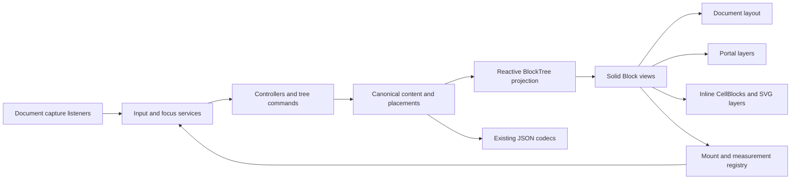

# Rendering Blocks from a SolidJS BlockTree

Technical migration proposal · 11 September 2026

Feature-module implementation update (25 September 2026): Stage 0/1 is complete
under the [feature-module architecture review](CODEX_FEATURE_MODULE_ARCHITECTURE_REVIEW.md).
Timer now lives in `src/features/timer`, activated by application composition.
A module registers a Block Type; each mounted occurrence receives a separate
self-bound `BlockRuntime`. Authored JSON survives module absence, while Solid
owns each running instance's resources. The [current developer guide](docs/architecture/FEATURE_MODULES_AND_BLOCK_APPLICATIONS.md)
and [Stage 1 report](CODEX_FEATURE_MODULE_STAGE_1_REPORT.md) describe the implemented
API, removal test, and limitations. [Stage 3](CODEX_FEATURE_MODULE_STAGE_3_REPORT.md) now extracts Grouping through the neutral Stage 2 boundaries; Stage 4 awaits review.
The original proposal below remains historical design context; do not copy its
editor-wide access patterns into new hosted feature modules.


Annotation-monitor extension (12 September 2026): original shortcut/action
inventory, requested Ctrl+period alias, attribute editing and verification are in
[ANNOTATION_MONITOR_MIGRATION.md](ANNOTATION_MONITOR_MIGRATION.md).

Margin-handler extension (12 September 2026): original bindings, owned-relation
creation/reuse, relative layout, focus policy and qualification are documented in
[MARGIN_HANDLER_MIGRATION.md](MARGIN_HANDLER_MIGRATION.md).

Text-edit performance extension (12 September 2026): the scoped incremental
command/repository/projection plan, compatibility safeguards, benchmark results
and remaining limits are in [TEXT_EDIT_PERFORMANCE.md](TEXT_EDIT_PERFORMANCE.md).

Background/context-menu extension (12 September 2026): source mapping, exact
renderer/lifecycle work, input policy, applicable menu actions and acceptance
checks are specified before implementation in
[BACKGROUND_CONTEXT_MENU_MIGRATION.md](BACKGROUND_CONTEXT_MENU_MIGRATION.md).

Standoff styling extension (12 September 2026): the complete current schema
inventory, saved-token census, explicit rendering rules, and grouped-range/plugin
follow-up are in [STANDOFF_PROPERTY_MIGRATION.md](STANDOFF_PROPERTY_MIGRATION.md).

Document-store extension (12 September 2026): the user-requested folder browser,
Open/Save/Save As workflow, server API compatibility, session ownership, and
acceptance gates are specified in [DOCUMENT_STORE_MIGRATION.md](DOCUMENT_STORE_MIGRATION.md).
This extension was recorded before its implementation. Track completion in the
[progress log](RESTRUCTURE_PROGRESS.md).

Input-parity investigation update (11 September 2026): before generating more
conversion code, read the [input-handler and annotation-boundary addendum](INPUT_HANDLER_AUDIT.md)
and its [complete source ledger](INPUT_HANDLER_SOURCE_LEDGER.md).
They map all current TS Block/panel input paths, distinguish installed handlers
from dormant declarations, and record annotation endpoint/styling/tombstone
behavior and remaining reactive gaps. A rendered Block is not evidence of input
parity. Track implementation against the ledger IDs in the
[progress log](RESTRUCTURE_PROGRESS.md).

This proposal moves structural ownership from Block instances that construct and insert their own DOM to an application-owned BlockTree rendered by SolidJS. Block behavior remains available through controllers and commands. The migration is incremental, with `PlainTextBlock` providing the first complete example of the replacement architecture.

The target is a flexible editing platform with shared Blocks, interchangeable backgrounds, and arbitrary attachments. A rendered tree is therefore a **projection of a canonical content and placement model**, not the entire data model. Sections 2.4 and 12 establish the additional contracts needed for transclusion, reliable history, and future extensions. The PlainText pilot may implement a one-content/one-placement subset, but must use these identities from the start.

The existing document, workspace, annotation, and clipboard JSON contracts must remain unchanged. Opening a new interactive Block normally transfers focus to it, including when it renders in a floating layer. Standoff's mixed inline CellBlocks, SVG decoration layers, and model-owned cursor/selection system are now required parts of the Solid renderer. Its imperative host is retained only as a temporary migration bridge. New inline image semantics use an explicitly separate persistence contract; existing text-only JSON retains its current shape.

This is a design document, not an implemented migration. Repository observations below come from source inspection; proposed APIs and code snippets do not currently exist. Browser behavior and the migration acceptance tests have not been exercised as part of this document. The lockfile resolves SolidJS **1.9.9**; use the existing Solid 1.x APIs and validate against that installed version.

Reading paths: [state and ownership](#2-ownership-and-state-model), [JSON compatibility](#3-preserve-the-json-boundary), [structural commands](#4-tree-commands-insertion-movement-deletion-and-history), [input dispatch](#6-input-routing-from-the-highest-dom-level), [focus](#7-programmatic-focus-and-selection), [floating views](#8-floating-blocks-portals-and-measurements), [CellBlocks and SVG rendering](#9-solid-rendered-cellblocks-and-svg-annotation-layers), the [PlainText example](#10-worked-migration-plaintextblock), and [platform contracts to establish now](#12-platform-contracts-to-establish-now).

## 1. Current architecture and the changes it requires

The application starts in [src/index.tsx](src/index.tsx), mounts [App](src/App.tsx), and initializes [BlockManagerWindow](src/components/workspace.tsx). That component creates a `UniverseBlock`, registers `getBlockBuilder()` factories, and builds a workspace and demonstration document.

Today a Block combines at least five responsibilities:

1. Persistent data: identity, type, metadata, properties, and children.
2. Structure: `blocks`, `relation.parent`, `previous`, `next`, and special relationships.
3. Rendering: its `container`, inner elements, and DOM insertion into a parent.
4. Interaction: input bindings, caret operations, focus, and application commands.
5. Lifecycle: registration, serialization, subscriptions, and destruction.

Changing only the builders to return JSX would leave several competing representations of the tree. Structural commands, lifecycle, and input dispatch must change alongside rendering.

| Current implementation | Observed behavior | Required replacement |
| --- | --- | --- |
| [AbstractBlock](src/blocks/abstract-block.ts), constructor | Creates a container and registers the instance with its manager. | Separate node creation, controller creation, and view mounting. |
| `UniverseBlock.recursivelyBuildBlock`, `buildChildren` | Builders append elements; manager subsequently relates and indexes instances. | Decode data first; render a registered view by node type. Handle external loading separately. |
| `DocumentBlock.addBlockBefore/After`, `insertBlockAt` | Mutate child arrays, relations, registrations, history, and DOM. | A structural transaction changes the tree; Solid updates the DOM. |
| `UniverseBlock.insertBlockBefore/After` | Move an already-parented Block within or between parents. | Explicit move operations, distinct from insertion of new nodes. |
| `AbstractBlock.explode`, `replaceWith` | Promote children or transfer them to a replacement while moving elements. | Unwrap and replace commands with explicit child policies. |
| `DocumentBlock.generateIndex` | Builds a traversal index, then retains Standoff and Checkbox Blocks for navigation. | Derived navigation indexes with equivalent filtering and ordering. |
| `UniverseBlock.setBlockFocus` | Updates `focus`/`lastFocus`, highlights, raises a window, and calls the Block's `setFocus()`. | A focus service with logical focus, mount readiness, and type-specific focus adapters. |
| `StandoffEditorBlock.bind`, `updateView` | Builds Cells, manages selection, measures layout, and redraws annotations. | Canonical inline CellBlocks, mapped editing operations, Solid flow and SVG layers, and a per-view geometry service. |
| [block property schemas](src/properties/block-properties.ts) | Apply classes, styles, animations, and draggable behavior directly. | Declarative appearance plus scoped effect adapters with cleanup. |

Some existing inconsistencies should be fixed at the ownership boundary, rather than reproduced as invariants:

- `DocumentBlock.deleteBlock()` removes a node and then calls `destroy()`, which can remove it again through `AbstractBlock.destroy()`. `removeBlockFrom()` does not guard an index of `-1`; a second removal can remove an unrelated last sibling.
- Recursive destruction iterates child arrays that descendant destruction also mutates. Build a deletion plan before making changes.
- Relation generation assigns links without consistently clearing old first/last sibling links. Derive neighbors from child order.
- `getAncestors()` appends the universe unconditionally; deduplicate it if the parent traversal already reached it.
- Some operations, notably indentation, build different DOM and `blocks` relationships. Characterize the intended nesting and encode it once.
- The Standoff Enter binding looks up the first registered document. It should resolve the originating Block's document, especially with several document windows open.

These are source-level findings, not claims that every path has been reproduced interactively.

## 2. Ownership and state model

### 2.1 A normalized tree with explicit attachment slots

Expose a reactive node table indexed by runtime occurrence key to the Solid renderer. Each node has ordered child keys. This is a tree representation even though it uses a node table: it allows constant-time lookup without storing cyclic object references in reactive state. Back it with the canonical records in section 2.4, using Solid `createStore` for plain data and read-through selectors for shared payloads. Solid stores support nested reactive reads and updates through a setter. See the [Solid createStore reference](https://docs.solidjs.com/reference/store-utilities/create-store).

Keep a runtime key separate from the serialized `id`. The existing `clientId` already distinguishes a mounted instance from persistent identity. An embedded document can appear more than once with the same saved IDs; those occurrences must not overwrite one another in the runtime registry. Resolve saved IDs within the relevant document occurrence. Moving a node preserves its runtime key; copying creates new runtime keys and follows the existing command's saved-ID policy.

Conceptual renderer-facing types; these are read-only projections, not a second independently mutable repository:

```ts
type NodeKey = string; // Runtime occurrence identity; never serialized.
type ContentKey = string; // Canonical content identity.
type PlacementKey = string; // Identity of an attachment/reference edge.
type ViewId = string; // A particular editor surface/session.

type Slot =
  | { kind: "children" }
  | { kind: "inline-content" } // Standoff's typed sequence; distinct codec.
  | { kind: "relation"; name: string }
  | { kind: "session" }; // Transient UI children; never serialized.

interface BlockNode {
  key: NodeKey;
  contentKey: ContentKey;
  placementKey: PlacementKey;
  viewId: ViewId;
  viewType: string;
  // JSON fields other than children/relation, including original id/type.
  readonly payload: Readonly<Record<string, unknown>>;
  children: NodeKey[];
  inlineContent?: NodeKey[]; // Projected CellBlocks; never old JSON children.
  ownedRelations: Record<string, NodeKey>;
  opaqueRelations: Record<string, unknown>; // Uninterpreted wire relations.
  sessionChildren: NodeKey[];
}

interface BlockTreeState {
  rootKey: NodeKey;
  nodes: Record<NodeKey, BlockNode>;
  revision: number;
}

interface Location {
  parentKey: NodeKey;
  slot: Slot;
}
```

`Location` is a derived, rebuildable index maintained atomically with structural changes. Do not expose a second independently editable parent map. The `payload` type is broad here to explain preservation; implementation should add discriminated per-type payload interfaces.

The payload selector resolves `contentKey` to shared content and merges only declared placement presentation fields. All writes go through commands, which resolve the appropriate canonical record. Child lists are similarly projected from canonical placement edges. The codec also records field-presence information outside the payload, so omitted `children`/`relation` can remain omitted on an unchanged export. New or edited structural fields are emitted in their existing schema shape. `opaqueRelations` and `ownedRelations` must never contain the same name.

All non-root nodes have exactly one ownership location. A relation such as `leftMargin` owns a subtree in a named slot, rather than pretending to be a normal paragraph child. Reference-only links, including entity IDs and source references, do not create another ownership edge. The schema for each Block type decides which serialized relations contain owned Blocks; unknown relation data must survive decoding and encoding without speculative interpretation.

Do not serialize `parent`, `previous`, `next`, or runtime `firstChild`. The compatibility facade computes those from locations and order. A relation slot holds a single Block: before/after operations on that Block are invalid unless the caller explicitly targets a list inside it. Use `replaceRelation` or `removeRelation` for the slot itself.

### 2.2 Separate durable data, session state, and DOM handles

| Store | Contents | Lifetime |
| --- | --- | --- |
| Canonical repository | Shared content, placement edges/order, owned relations, revisions | Persistent session model; encoded using existing JSON plus explicitly separate records for new capabilities |
| BlockTree projection | Read-through payloads, occurrence keys, projected child order | Rebuildable per editor view |
| Session UI store | Focus, active tabs where transient, open panels, return-focus bookmarks, selection IDs, pending loads, drag preview | Runtime only except fields already saved by existing codecs |
| Controller registry | Shared content services plus occurrence-specific behavior, modes, and editor capabilities | Content lifetime or occurrence lifetime, explicitly declared |
| Mount registry | Root/focus elements, mount generation, measurement and selection adapters, disposal callbacks | View mount lifetime |

Never put DOM elements, `Range` objects, class instances, promises, or draggable objects into the persistent store. For example, `blockDraggable` currently places a dragger in property metadata. The replacement keeps the effect handle in the runtime registry and retains only the existing serializable positioning fields in the JSON projection.

The canonical repository becomes authoritative for migrated structural state; the BlockTree is its renderable projection. Controllers read that state and invoke commands; they do not own a second mutable `blocks` array. Legacy islands retain authority only over the explicitly unmigrated portion assigned to them. Section 10 defines that boundary.

### 2.3 Distinguish three relationships

**Ownership parent** controls lifetime and tree location. **Input parent** controls handler fallback. **Render placement** controls the DOM mount location. These usually agree, but windows and margin documents demonstrate why they cannot be assumed identical.

- An ordinary paragraph inherits input through its ownership parents.
- A margin document is owned through `leftMargin`/`rightMargin`. Today its children route through that document, then the universe: `marginParent` is not traversed by `getAncestors()`. Preserve this as an explicit document input boundary initially.
- An entity-search panel can be a session child of the source Block for cleanup, rendered in an overlay layer, with an input boundary that routes to the panel and then the universe. Typing in it must not reach the source document's text-editing commands.
- A document window remains a persistent child of the workspace background in the existing JSON. Internally, a stable surface owns its content layer independently of the interchangeable background visual, as described in section 12.5.

Input ancestry defaults to ownership ancestry, with explicit boundary policies for these cases. Source/anchor references are used by commands and positioning, not automatically followed during input dispatch. Validate the input-parent graph for cycles too.



### 2.4 Shared content, placement, and view are separate identities

Separating saved `id` from runtime `clientId` prevents DOM collisions, but does not by itself implement transclusion. Two occurrences must resolve to the **same content record**, rather than independent payload copies whose IDs happen to match.

| Identity | Example | Owns |
| --- | --- | --- |
| `ContentKey` | The paragraph “Research question” | Text, semantic properties, annotations, canonical ordinary child structure, revision |
| `PlacementKey` | That paragraph attached to page A, or a live reference to it in page B's margin | Target content key, edge kind, owning content/slot, declared local layout overrides |
| `NodeKey` within `ViewId` | The margin occurrence displayed in window 2 | Mount, caret, selection, focus, composition, scroll, and local open/closed UI |

One content record may be rendered through many placements and many views. A placement can be displayed twice by opening its document in two windows. Those windows share content and placement order but have independent selections and scroll positions. Child placement edges belong to canonical container content: editing the child structure of a live-transcluded subtree updates every projection of that subtree. Rearranging the transclusion's outer placement changes only its host.

Maintain a canonical ownership forest plus reference edges. Owned content has at most one ordinary owning edge; reference edges do not add another owning parent. Project this graph into finite view trees with ancestry-based cycle detection and loading/depth limits. Render a reference placeholder for recursive expansion instead of recursing indefinitely. Include left/right attachments in ownership-cycle validation.

Distinguish commands precisely:

- **Copy:** create independent content and placement identities; remap internal references where appropriate.
- **Live transclude:** create a reference placement targeting existing content; edits target the original content.
- **Open another view:** create only view/occurrence state for an existing placement.
- **Move:** relocate the selected placement; no content copy.
- **Unlink:** remove a reference placement; never delete its target.
- **Detach:** replace that reference with an independent content copy in one reversible transaction.
- **Remove owned placement:** remove the containment edge. Retain content required by references/history in an archive or tombstone store; reclaim only when it is no longer reachable under the retention policy.
- **Delete everywhere:** an explicit content-level command with defined reference consequences, not the default Delete key behavior.

Commands that accept `NodeKey` remain convenient UI entry points, but resolve to content/placement targets before executing. Runtime keys must never become the addresses stored in a durable transaction. A key is stable for an occurrence during reordering; a new projection can get a new key while still resolving to the same placement/content.

Semantic annotations are shared with content. Margins and layout need explicit scope: a source-owned margin belongs to the canonical Block; a presentation override belongs to a particular placement. The initial feature set may support only the existing source-owned margins. Do not silently make every property local or every property shared—declare scope in the property/slot schema and codec.

## 3. Preserve the JSON boundary

Keep the HTTP envelopes and endpoints unchanged, including `/api/saveDocumentJson`, `/api/loadDocumentJson`, `/api/saveWorkspaceJson`, and `/api/loadWorkspaceJson`. The backend in [server/index.ts](server/index.ts) should not need to understand runtime node keys or Solid components.

Implement explicit codecs:

```ts
decodeDocument(dto): DecodedSubtree
encodeDocument(rootKey, context): ExistingDocumentDto
decodeWorkspace(dto): DecodedSubtree
encodeWorkspace(rootKey, context): ExistingWorkspaceDto
```

Required rules:

1. Preserve saved IDs, type strings, metadata, property data, field names, and order-sensitive arrays. No new wrapper objects, normalized node tables, or migration-version fields on the wire.
2. Preserve type-specific fields: `text`, `checked`, embedding filenames, window metadata, annotation values/IDs/flags/plugin data, and fields not yet represented in the TypeScript interfaces. Preserve omitted fields versus explicit `null` and empty values where the existing contract distinguishes them. JSON whitespace and object-key order are not semantic requirements.
3. Encode ordinary children back into `children`. Encode margin subtrees back into `relation.leftMargin`/`relation.rightMargin`. Never flatten these into the ordinary child list.
4. Exclude session panels and runtime state. Preserve the existing omission of `clientOnly` Standoff annotations. Persistent windows remain in the workspace structure; visual position alone does not make a node transient.
5. Handle `metadata.loadFromExternal`, folder, and filename as existing document loaders do. A hydrated document can have loaded children in memory while workspace export still writes the existing external-reference form with `children: []`. Document export writes full content. Use an export context, not one universal spread of store state.
6. Preserve `metadata.focus` in the existing shape (`blockId`, optional caret). Obtain it from a document-scoped focus bookmark when a transient panel is focused. Export a copy; do not mutate live metadata while taking a snapshot.
7. Resolve legacy aliases such as `main-list-block`/`membrane-block` for view selection separately from wire encoding. Do not introduce another automatic rewrite of saved type tokens as part of this migration.
8. Preserve unknown Block and property data with a fallback view. A rendering error should not silently replace the original saved payload with an error Block's data.

New persistent capabilities must not be smuggled into this contract. Arbitrary live Block references, placement identities/overrides, revision history, and stable anchors are not fully expressible in the current document schema. Keep existing JSON and HTTP bodies unchanged; introduce an explicitly separate repository sidecar/database contract for those capabilities (section 12.8). Without that store, offer only semantics the existing format can retain, such as current external-document loading. Exporting a snapshot into old JSON is possible, but loses live-link semantics and must be identified as such. Old clients cannot be expected to edit features their format does not represent.

Compatibility fixtures must exercise both directions: existing JSON → new model → existing JSON, and a document edited using the new renderer → current loader. Compare JSON objects, including annotation boundary values. Where old loaders regenerate property IDs or drop fields, do not use their lossy output as permission to lose more data; preserve the original payload and document the existing discrepancy.

**Offsets require special care.** `StandoffEditorBlock.toCells()` uses `[...text]`, which iterates Unicode code points, while clipboard and property serialization also use `substring`, whose indexes are UTF-16 code units. EOL Cells use carriage return (`13`), and property text extraction and clipboard selection do not uniformly use the same inclusive/exclusive end convention. Preserve existing numeric offsets and text during the rendering migration. Before any future Unicode or boundary correction, characterize these paths with non-BMP and combining-character fixtures; an internal grapheme model must translate back to the established external representation.

## 4. Tree commands: insertion, movement, deletion, and history

### 4.1 A command interface that expresses intent

```ts
type Destination =
  | { kind: "at"; parentKey: NodeKey; index: number }
  | { kind: "before"; anchorKey: NodeKey }
  | { kind: "after"; anchorKey: NodeKey };

interface TreeCommands {
  insert(dto: ExistingBlockDto, to: Destination): NodeKey;
  move(key: NodeKey, to: Destination): void;
  remove(key: NodeKey): void; // Placement subtree; apply content retention policy.
  unwrap(key: NodeKey): void; // Promote ordinary children explicitly.
  replace(key: NodeKey, dto: ExistingBlockDto,
          children: "preserve" | "replace"): NodeKey;
  setRelation(owner: NodeKey, name: string, dto: ExistingBlockDto): NodeKey;
  removeRelation(owner: NodeKey, name: string): void;
  transaction(label: string, operation: () => void): void;
}
```

These methods are synchronous command entry points that compile into the operations defined in section 12.2. Fetching, uploading, and loading external documents happen before a commit or through an explicit loading placeholder. Do not hold a mutation transaction open across `await`.

`insert` decodes a new subtree and registers it once. `move` operates on an existing key and never clones it. `before`/`after` resolve the anchor's current ownership location, so callers need no DOM coordinates. `at` indexes refer to the destination child list **after removal of the moving node**; document this convention and reject out-of-range indexes.

Examples reproducing the current interfaces:

```ts
// DocumentBlock.addBlockBefore(newBlock, anchor)
commands.insert(dto, { kind: "before", anchorKey });

// DocumentBlock.addBlockAfter(newBlock, anchor)
const newKey = commands.insert(dto, { kind: "after", anchorKey });
focus.request(newKey, { caret: "start" });

// UniverseBlock.insertBlockAfter(anchor, existingBlock)
commands.move(existingKey, { kind: "after", anchorKey });

// Add the first child of an empty container.
commands.insert(dto, { kind: "at", parentKey, index: 0 });
```

The facade must preserve the existing argument-order difference between the document and universe APIs until callers migrate.

### 4.2 Transaction algorithm and invariants

For insertion or movement:

1. Validate source, destination, allowed child types, and ownership slot. Reject moving the universe root, attaching a node below itself, duplicate occurrence keys, and unresolved anchors. Moving before/after oneself is a defined no-op.
2. Prepare the resulting affected lists without changing live state. For a same-parent move, remove the source first and locate the anchor again in the resulting list. For example, moving `B` after `C` in `[A,B,C]` gives `[A,C,B]`; moving `A` before `C` gives `[B,A,C]`.
3. Capture affected document IDs, any editor contents that require flushing, and focus/selection bookmarks before detaching. Cross-document moves affect both document indexes and dirty states.
4. Validate and apply the complete proposed operation sequence to an isolated model draft. Publish canonical record/list updates, projected occurrences, and location indexes in one Solid batch; increment the transaction revision once. `batch` delays reactive work but is not rollback: validation and command planning must precede publication.
5. Update derived navigation indexes and history once per transaction, then publish a model change notification. Rendering follows from the changed child keys.
6. Apply requested focus and layout work only after the relevant mount reports readiness. Never perform `insertAdjacentElement`, `appendChild`, or `.remove()` on a Solid-owned Block root.

Structural commands are independent of visual visibility: inserting into an inactive tab is valid. A request to focus the inserted node must first activate its tab and expand the necessary containers.

Replace `skipIndexation` with transaction-level dirty-document accumulation. A table, grid, or checkbox wrapping operation updates the index once at commit, rather than asking every caller to suppress intermediate updates correctly.

### 4.3 Preserve higher-level editing behavior

Tree primitives do not decide all editor semantics. Port the existing document commands onto them:

| Trigger | Existing behavior to retain |
| --- | --- |
| Enter at start of Standoff text | Insert a preceding text Block and keep focus in the current Block. |
| Enter inside text | Split text and annotations; insert the second Block after the first; focus its start. |
| Enter at EOL or on a non-Standoff Block | Insert a following Standoff Block; inherit the existing property behavior; focus its start. |
| Delete/Backspace at text boundaries | Merge, remove an empty neighbor, or navigate as the current type-specific command dictates. Do not translate every Delete into subtree removal. |
| Shift-Delete | Remove the selected Block and focus next sibling, otherwise previous sibling, otherwise parent; put a text caret at the start. |
| Move up/down | Use the current document navigation index and structural rules, including nesting/tab behavior, not just array index ±1. |
| Indent/deindent | Express the intended ownership change as a transaction; preserve first-item restrictions and indentation metadata. |
| Make checkbox, convert to tab, image beside text | Insert a wrapper/layout subtree and move the existing content into its designated slot in one transaction. |
| Explode | Promote ordinary children into the wrapper's previous list position, preserving order and runtime keys. |

For unwrap/replace, define a type-specific policy for margin and session attachments. They must be transferred deliberately or closed; they cannot be silently promoted into an ordinary child list. Keep split/merge annotation calculations in the editor adapter initially and commit their resulting tree/text changes together.

### 4.4 Deletion must be a complete lifecycle operation

Plan deletion before changing arrays. Collect the node, ordinary descendants, owned relation subtrees, and session-owned UI. Resolve focus fallback and selection changes against the pre-deletion structure.

Commit the placement removal once. Remove its projected location/index entries and selected Block keys; close occurrence-owned panels; cancel pending loads, drags, timers, and stale focus requests. Dispose occurrence controllers and subscriptions exactly once. Let Solid unmount view roots. Shared content controllers remain alive while another placement, reference, history entry, or retained document needs them. View cleanup releases mount resources without issuing another tree deletion.

For multiple selected Blocks, discard selected descendants whose ancestor is also selected; delete the resulting disjoint placement subtrees in one transaction. Do not mutate the selection array while iterating it. A reference-only link from another document is not ownership: deleting a target must not recursively delete referring documents. Apply the explicit retention/unlink/delete-everywhere policies in section 2.4. A removed projection is not evidence that canonical content is unused.

Deletion is idempotent for cleanup callers: requesting removal of an already removed runtime key performs no additional mutation. Invalid insertion anchors, by contrast, return a useful command error rather than inserting somewhere else.

### 4.5 History and asynchronous work

Current document history subscribes to `beforeChange`, throttles snapshots, and can rebuild a document during undo. Preserve the user-visible undo commands while introducing explicit transaction boundaries. Keep the existing text-edit grouping policy initially; record a multi-node structural operation as one undoable unit.

Snapshots are a bridge for unmigrated islands and checkpoints for recovery, not the target undo mechanism. Capture them from the codecs after flushing active imperative editors; do not snapshot DOM or reactive proxies. Migrated commands use reversible operations and position maps (section 12.2). Capture return-focus and selection bookmarks separately. Undo must restore the data first and the caret after mounting. A cross-document move requires a coordinated history entry for both documents; two independent undo records could duplicate or lose the moved content. Do not enable editable transclusion backed by independent snapshot histories.

An async command stores the initiating node key, document occurrence, revision or relevant preconditions, and a request token. After a fetch resolves, revalidate the anchor and ownership. If they no longer exist, discard the result or report that the operation could not be applied. A late result must not recreate a deleted panel or steal focus from a newer user action.

## 5. Solid rendering and mount lifecycle

### 5.1 Registry and recursive outlets

Introduce a registry containing the codec, view, controller factory, child-slot layout, input policy, and focus/measurement capabilities for each Block type. `getBlockBuilder()` remains only as a legacy bridge.

Conceptual recursive outlet:

```tsx
function ChildBlocks(props: { parentKey: NodeKey }) {
  return (
    <For each={tree.nodes[props.parentKey].children}>
      {(key) => <BlockOutlet nodeKey={key} />}
    </For>
  );
}

function BlockOutlet(props: { nodeKey: NodeKey }) {
  const node = () => tree.nodes[props.nodeKey];
  return (
    <Dynamic
      component={views[node().viewType] ?? UnknownBlockView}
      nodeKey={props.nodeKey}
    />
  );
}
```

Imports and application services are omitted here. Each view owns its Block root and explicitly renders the child outlets in the correct place. There is no universal extra `<div>` around every Block: the current tables use CSS `display: table/table-row/table-cell`, tabs render into panels, and Checkbox children occupy a wrapper beside the control. Preserve those layouts and existing CSS classes during the first migration; a later change to semantic table elements must also preserve valid table nesting.

Use stable runtime keys as `<For>` items. Solid's `<For>` tracks item identity and can move a rendered item within its list instead of recreating it; `<Index>` is inappropriate for editable Blocks that change order. Do not create fresh wrapper objects for the items on every read. See the [Solid For reference](https://docs.solidjs.com/reference/components/for).

**This does not guarantee preservation across parents.** Moving a key between two different recursive outlets can unmount one view and mount another. Keep persistent data and controllers independent of component lifetime; save and restore caret/selection, scroll, and relevant media/editor state through adapters. Composition-sensitive moves should be deferred until composition commits. If a future feature needs uninterrupted DOM identity across parents, treat that as a separate renderer capability requiring evidence; do not implement it by manually moving Solid-owned nodes.

### 5.2 Mount registration and focus readiness

Each view registers its root, focus target, and capabilities through `ref`/`onMount`. Use a `WeakMap<Element, MountHandle>` for DOM lookup and a map by node key for programmatic operations. Preserve `data-block-id` and `data-client-id` for existing CSS/debugging, and add a runtime-key marker if useful; the registry is authoritative.

Registration returns a generation token and disposer. Cleanup removes a registration only if it still belongs to that generation, so an old mount cannot erase a replacement mount's handle. Distinguish `detachView()` from `destroyNode()`; a remount during movement is not a document deletion.

Use `onCleanup` to release listeners, editor views, observers, property effects, portal registrations, and animation work owned by that mount. Existing helpers such as `renderToNode()` discard the disposer returned by `render()`; the bridge must retain and invoke it. Solid's lifecycle cleanup is associated with its reactive owner. See the [Solid onCleanup reference](https://docs.solidjs.com/reference/lifecycle/on-cleanup).

Apply classes/styles through JSX where migrated. For legacy effects, assign exclusive ownership of named style fields or an inner element. Do not let both a Solid `style` binding and a dragger write the same `transform`. Position, scale, and rotation need an explicit composition order, potentially using separate wrappers.

## 6. Input routing from the highest DOM level

### 6.1 Current dispatch behavior to preserve explicitly

The current central listeners are native **bubble-phase** listeners on `document.body`, not capture-phase listeners. Local listeners also exist in PlainText, Checkbox, window controls, dragging, and Solid panels.

| Event path | Origin and traversal today | Consumption/default behavior today |
| --- | --- | --- |
| `keydown` | Uses `manager.focus`; requires its container to contain the event target; walks focused Block then ancestors. | First matching keyboard binding wins. `allowPassthrough()` allows browser behavior and stops the lookup; it does not mean “try parent.” Otherwise prevents default after awaiting the handler. |
| Unmatched character key | Only for focused Standoff Block, when `input.key.length == 1`. | Inserts a character imperatively and prevents default. |
| `click`, `dblclick` | Finds nearest registered container from DOM target, checks `suppressEventHandlers`, switches focus, remembers Standoff caret, then walks ancestors. | Runs matching mouse handlers at every level; no first-match stop and no central prevent-default. Both event types use the same matcher. |
| `copy`, `paste`, `contextmenu` | Finds the Block from the DOM target, then walks ancestors. | First custom binding with matching source/name wins; normally prevents default before invoking it. Mode priority is not consulted here. |
| `onTextChanged` | A second `keydown` listener synthesizes this custom name from the event target. | Runs even for keys that do not change text, and can overlap async keyboard work. Calls `DocumentBlock.textProcessor.process`. |
| `beforeinput` | Uses manager focus, with a special `e.data == ". "` case. | Suppresses macOS double-space period behavior and inserts a space for Standoff text. This is not a general text-input pipeline. |
| PlainText local handlers | Textarea click sets manager focus; local keydown checks Block bindings. | Can overlap central keydown handling. |
| Window and panel local handlers | Control actions, context menus, input fields, pointer drag/resize. | Some behavior occurs before body bubbling; moving listeners to capture changes that ordering. |
| Tab-label actions | Labels in a row header activate a particular tab and call its custom focus behavior. | The DOM label's enclosing Block is not necessarily the tab being activated. |
| Canvas and outside-click listeners | `InfiniteCanvas` handles mouse pan/minimap and non-passive wheel input; the context-menu component listens for outside mousedown. | These are surface/control interactions that cannot be inferred from focused text alone. |

Keyboard and mouse binding selection uses the mode stack from last mode to first, then the first matching binding in that mode. Preserve platform/modifier matching and alternatives in `trigger.match`. `inputBuffer` mentions multi-part chords, but the current matcher does not establish a complete sequence recognizer; do not claim one must be reproduced without finding a caller that implements it.

The mouse matcher currently treats `button == 1` as right click; that is the middle button. Correct this deliberately, using explicit event kind, button, and pointer type. Also fix string parsing of `KeyboardEvent.code` as a number; keep `key` and `code` as distinct strings.

### 6.2 One native event gateway, with deliberate native-control delegation

Install one gateway on the relevant `Document` in capture phase. Register the main workspace and portal surfaces with it. Capture observes events before a descendant can stop bubbling; ownership resolution prevents the gateway from intercepting unrelated application UI.

Cover `keydown`, `keyup`, `beforeinput`, `input`, composition events, `click`, `dblclick`, `contextmenu`, `copy`, `cut`, `paste`, `focusin`, `focusout`, `pointerdown/move/up/cancel`, pointer-capture loss, `wheel`, and `change`. Include `dragover`/`drop` if native file/text dropping is enabled, separately from pointer-based window dragging. Subscribe to `selectionchange` on the Document. Observe scroll/resize for layout through the measurement service rather than treating them as editing commands. Install non-passive listeners only where default cancellation is needed.

Resolve the innermost registered root/control using `event.composedPath()`; use a parent-element fallback for ordinary DOM when needed. Never assume the target is an `HTMLElement`—text nodes, SVG, and shadow hosts require care. Resolve its Block occurrence before consulting saved IDs. Native DOM propagation only finds the origin; model input ancestry determines handler fallback.

Register control parts as well as roots: tab labels, window close/minimize buttons, drag handles, and annotation buttons identify their action and target key explicitly. For example, a tab label executes `activateTab(tabKey)` and requests that tab's editing target, rather than adopting the row header as final focus. Route Block-changing control actions through the gateway/commands; local UI handlers may still manage presentation state under their declared native/widget boundary.

Run outside-pointer dismissal against the registered open-panel surfaces before rejecting an event for having no Block origin. Clicking unrelated page UI may close a menu without dispatching an editing command. Treat nested panel surfaces as inside their owner for dismissal, and let the clicked target take focus rather than restoring an old text caret. Preserve canvas wheel/pan behavior through a surface policy, allowing normal page/editor scrolling whenever that policy does not claim the gesture. Ensure compatibility mouse events cannot start a second drag after a handled pointer event.

The gateway must **capture all relevant events without claiming to replace browser/widget internals**. A textarea owns text insertion and native selection. CodeMirror owns its editing keymap and composition. Route selected application shortcuts for those controls, then leave the rest to the native control or widget. Panel fields must not inherit destructive paragraph commands. Register this as an input policy, replacing the loose `block-modal` passover mechanism. Listeners inside opaque third-party editors remain legitimate behind that boundary.

Events inside an iframe do not bubble to the containing document. Same-origin iframe support needs a gateway in that document; cross-origin frames remain opaque and report only focus at the frame boundary unless they implement an explicit messaging protocol. Closed shadow roots likewise require cooperative control registration. A top-level listener cannot provide universal access across those boundaries.

Solid has its own delegated event handlers. Do not attach a second competing `onKeyDown` to every Block or rely on Solid's portal bubbling to define model ancestry. Use native capture for the application gateway, normal Solid handling for unrelated local UI, and an explicit adapter contract where they meet. See [Solid event handlers](https://docs.solidjs.com/concepts/components/event-handlers).

### 6.3 Resolve origin, focus, and handler owner separately

```ts
interface RoutedContext {
  originKey: NodeKey;       // The Block receiving this input.
  handlerOwnerKey: NodeKey; // The ancestor supplying the binding.
  focusKey?: NodeKey;
  event: Event;
  selection?: SelectionBookmark;
  revision: number;
}
```

For keyboard commands, use logical focus after synchronizing it with a registered DOM focus target. If the event comes from an unrelated native field or stale/nonmatching surface, allow native behavior; do not run a command against the last text Block. Programmatic commands can explicitly target a key without synthesizing a keyboard event.

Document-level `selectionchange` has no useful originating Block element. Resolve it from the selection's anchor/focus nodes through the mount registry. If the range crosses Block boundaries, apply an explicit multi-Block selection policy; do not invent an origin from `event.target`. Native textarea selection requires its own selection properties rather than `window.getSelection()`.

For pointer/click commands, derive the origin from the target and adopt Block focus without resetting the browser's caret or moving focus away from a clicked child input. Record focus on `focusin`; coordinate pointer focus separately from the existing click command to avoid firing the command on both `pointerdown` and `click`.

For clipboard/context-menu input, preserve target-origin routing, including keyboard-invoked context menus. Snapshot origin and logical ancestry before dispatch. `args.block` in the legacy adapter must continue to mean the origin, even when a document ancestor supplies the handler. New handlers also receive `handlerOwnerKey`, avoiding incorrect casts of the origin to a window or document.

### 6.4 Separate matching, consumption, and execution

Browser cancellation must be decided synchronously, before any asynchronous work. Returning `false` from an `addEventListener` callback is insufficient. `preventDefault()` only affects cancelable default actions and does not itself stop propagation. See the [Event preventDefault reference](https://developer.mozilla.org/en-US/docs/Web/API/Event/preventDefault).

Introduce a synchronous planning step:

```ts
type Routing = "continue" | "stop" | "broadcast";
interface DispatchPlan {
  routing: Routing;
  preventDefault: boolean;
  exclusive: boolean; // Whether downstream app listeners must be stopped.
  execute(): void | Promise<void>;
}

function dispatch(event: Event) {
  const context = resolveContext(event);
  if (!context) return;
  const plan = planInput(context); // No awaits or data mutations.
  if (!plan) return;
  if (plan.preventDefault && event.cancelable) event.preventDefault();
  if (plan.exclusive) event.stopPropagation();
  runPlannedAction(plan, context); // Sync prefix + observed async completion.
}
```

`runPlannedAction` catches synchronous failures and promise rejections, validates stale results, and emits completed-change notifications. It does not defer clipboard data reads/writes that must happen during the native event dispatch. Copy writes and paste payload capture occur synchronously; file uploads and document fetches may continue asynchronously afterward.

Policy by source:

- Keyboard: first eligible binding wins. Preserve passthrough as `stop + allow browser`; introduce a separate explicit `continue` result for ancestor fallback.
- Mouse: preserve legacy broadcast where required, including Control-click selection. Capture the source and ancestor list once; skip owners removed by an earlier handler. A focus change from one handler must not redirect the same event to a different origin. Distinguish `click` from `dblclick` in new bindings; preserve legacy matching until intentionally changed.
- Custom/clipboard: preserve first-match dispatch and current mode-insensitive matching in the compatibility adapter. New custom bindings can opt into modes explicitly.
- Model notifications: publish `beforeChange`/`afterChange`/`textChanged` through a typed bus with explicit document ownership, not DOM events. Existing `AbstractBlock.publish()` is a local subscription mechanism; do not silently convert it into broadcast-to-all-ancestors input.

Do not call an old async handler and wait to discover whether it invokes `allowPassthrough()`. Port those decisions into binding preconditions/default policies before enabling capture routing. During mixed operation, each Block occurrence belongs to exactly one dispatcher: disable or filter old body handlers and remove local duplicate handlers when that occurrence joins the gateway. Do not depend on `preventDefault()` alone to prevent old listeners from executing again.

### 6.5 Text input and device improvements

Keep legacy Standoff character insertion for the first renderer milestone. Treat a more capable input manifold as a separate, testable migration stage:

1. Use `keydown` for navigation and application shortcuts. Suppress character fallback while `isComposing` is true, for dead keys, and when modifiers represent shortcuts or AltGraph input.
2. Use `beforeinput.inputType` to plan text insertion, paragraph breaks, replacement, deletion, and history actions in supported custom-editor paths. Map each intent to existing editor commands, preserving Enter/split/merge behavior.
3. Exactly one path owns an edit. When `beforeinput` owns insertion, `keydown` must not insert the same character. Deduplicate paste/drop intents against already captured clipboard/drag data.
4. Track a composition session. Do not replace the composing DOM during intermediate updates. Commit the final text once, then update annotations and selection. For noncancelable or missing `beforeinput`, observe `input` and reconcile the actual DOM change through the editor adapter; add an edit revision/source marker to avoid feedback loops.
5. Run `TextProcessor.process` after a completed Standoff text mutation, once for the resulting edit group. Preserve replacement/markup rules, while removing the accidental dependency on every keydown. Do not run it while an IME candidate is still composing.
6. Keep the double-space period preference as a named editor policy. Scope it to the Standoff editor and never cancel input in an unrelated native field.

`beforeinput` is not universally cancelable and does not cover every browser/OS modification, so an `input` reconciliation path is required. See the [beforeinput reference](https://developer.mozilla.org/en-US/docs/Web/API/Element/beforeinput_event).

Retain the existing Codex clipboard envelope (`source`, `format`, `context`, `data` and `application/json`) and annotation offsets. A `text/plain` fallback improves interoperability. Native cut requires an explicit decision because Control-X currently extracts a Block into a document window; retain that shortcut initially and document any later reassignment. Touch selection, long-press context menus, pen input, dictation, and virtual keyboards need browser tests rather than keydown-only simulations.

## 7. Programmatic focus and selection

Provide one public focus API and preserve the old calls through it:

```ts
focus.request(nodeKey, {
  caret: "start",          // Or a type-specific bookmark.
  reveal: true,
  raiseWindow: true,
  reason: "opened-panel"
});
```

The service maintains `focusedKey`, `lastFocusedKey`, per-document last editing bookmarks, and monotonically increasing request tokens. It records the logical target immediately, reveals hidden ancestors, and waits for a matching mount generation before calling the focus adapter. A newer request cancels an older pending request. A deleted target never receives focus.

Each view supplies its meaningful focus target: textarea for PlainText, editable wrapper/caret adapter for Standoff, input for search, and a focusable root (`tabIndex=-1`) for a window or menu where appropriate. Highlight and window stacking derive from session state. Handle both `WindowBlock` and `DocumentWindowBlock`; the current exact-type ancestor lookup does not cover every window case.

`focusin` adopts genuine browser focus without calling `.focus()` recursively. A browser blur leaving the application must not cause immediate refocus. Preserve the last editing bookmark for toolbar actions, but keyboard input in a new panel targets that panel. Formatting buttons can pass an explicit source bookmark to a command.

Opening search or an annotation panel captures a return-focus bookmark, inserts the session node, and requests focus for the new node. Closing it restores the saved source/caret only if the source still exists and the close operation has not been superseded by another focus action. Nested panels use a stack of return targets; closing an unfocused panel must not steal focus.

Use bookmarks rather than retaining live `Range` or `Cell` references across structural changes. A Standoff bookmark includes runtime node key, existing Cell index, side/direction, and content revision; PlainText uses `selectionStart`, `selectionEnd`, and `selectionDirection`. Resolve or transform bookmarks after text edits. Existing short `setTimeout` caret repairs should be replaced with mount/layout readiness, not a larger guessed delay.

Persist only the existing `metadata.focus` representation through the codecs. Runtime keys, DOM focus targets, pending requests, and panel return stacks remain outside JSON.

Section 9.13 extends single bookmarks into per-view selection sets with one primary range. Focus transfer activates that primary range's native input bridge; secondary selections are mapped/rendered without receiving DOM focus. Selection setters preserve focus unless the caller explicitly requests a transfer.

## 8. Floating Blocks, portals, and measurements

### 8.1 Render elsewhere without losing ownership

Current examples include `WindowBlock.onContextMenu()` appending to `document.body`, `createDocumentWithWindowAsync()` attaching to the workspace background, and document methods positioning find/search/annotation UI relative to text or document containers. The new API should describe these explicitly:

```ts
overlays.open({
  ownerKey: sourceKey,
  inputBoundary: "panel",
  viewType: "entity-search",
  anchor: { nodeKey: sourceKey, selection: bookmark },
  placement: "viewport-overlay",
  focus: true
});
```

The overlay service inserts a session child, records the anchor/source reference, and requests focus. Each node has exactly one rendering route. The normal outlet either renders its view inline or portals that view to a stable mount; it never also appears in a second overlay list.

Solid's `Portal` renders into another DOM mount while retaining the Solid component hierarchy. That supports separate placement and lifecycle, but application input ancestry still comes from the BlockTree policy. See the [Solid Portal reference](https://docs.solidjs.com/reference/components/portal).

Use separate layers for workspace windows and viewport overlays. Moving every absolutely positioned Block to `document.body` would change scrolling, clipping, transforms, and inherited CSS. Marginalia can remain absolutely positioned in an anchor layout slot where that preserves the current behavior; only use a portal when escaping that layout is intended.

Portal content may lose CSS inheritance and ancestor selectors from its source location. Supply theme/font/CSS variables at the layer root, review stacking contexts, and maintain accessible relationships through labels and `aria-controls` where appropriate. Use a focus trap only for genuinely modal UI; ordinary document windows remain independently focusable.

### 8.2 DOM measurement is compatible with Solid

Reading a mounted element's geometry does not conflict with Solid. Keep reads in a measurement service and express resulting positioning through state or a single designated effect owner. Do not measure during node construction.

Useful capabilities:

```ts
measurements.blockRect(nodeKey): DOMRect | undefined
measurements.selectionRects(nodeKey, bookmark): DOMRect[]
measurements.toLayerPoint(viewportPoint, layerKey): Point
```

`getBoundingClientRect()` reports viewport-relative geometry and reflects scrolling. For an untransformed fixed viewport layer, use viewport coordinates directly. For a document-absolute layer, account for page scroll; for a scrolled container, account for its rect, borders, and scroll offset. Transformed/scaled canvases require an inverse transform into the layer's coordinate system, not just subtraction of two rectangles. See the [getBoundingClientRect reference](https://developer.mozilla.org/en-US/docs/Web/API/Element/getBoundingClientRect).

The existing Cell cache uses `offsetTop`, `offsetLeft`, and accumulated values such as `cy`; those are not automatically viewport coordinates. Adapt Cell/Range geometry to a named coordinate space before anchoring a portal.

Invalidate measurements after mount, text layout, relevant property changes, resize, ancestor scroll, font/media loading, workspace pan/zoom, and window movement. `ResizeObserver` alone cannot detect every positional change. Coalesce reads in an animation frame, then apply changed positions together; suppress unchanged writes and cancel scheduled work when the mount disappears. Suspend/hide an anchored popup when its source has no usable rect, and remeasure after reveal.

### 8.3 Dragging and resizing

Keep current positioning fields in the codec even where window metadata and draggable-property metadata overlap. At load, reproduce the existing effective precedence; use one runtime layout model and write back through a type-specific compatibility policy.

Move drag/resize behavior to a controller that receives refs and emits position/size commands. Prefer Pointer Events with pointer capture and handling for `pointercancel`, lost capture, and unmount. Apply `touch-action` only to drag handles so text selection and scrolling remain usable. These mechanisms are defined in the [W3C Pointer Events specification](https://www.w3.org/TR/pointerevents3/). Commit final geometry as one history operation; high-frequency preview positions can live in session state.

During the bridge phase, an existing dragger may exclusively own a designated inner transform, but Solid must not also bind that transform. Minimized icons currently appended to `document.body` become owned session views with disposal. Closing a window releases its dragger, icon, listeners, and associated panels.

## 9. Solid-rendered CellBlocks and SVG annotation layers

### 9.1 Decision: CellBlocks are part of this migration

The editor called `StandoffPropertyTextEditorBlock` in the design discussion is implemented here as [StandoffEditorBlock](src/blocks/standoff-editor-block.ts). Its inline content should now participate in the same data-driven Block architecture. The former proposal to defer Cell rendering is superseded: an imperative editor host remains a temporary compatibility stage, not the final target.

**Absolutely positioned SVG decorations remain supported.** Their annotation ranges belong to shared content; their coordinates belong to each mounted view. Solid renders both inline content and SVG paths, while a layout service reads the browser's actual geometry. Measurements are derived view state and never become document edits or shared annotation coordinates.

Current [Cell](src/library/cell.ts) already has text, neighbors, an index, a DOM element, and cached geometry. Converting it should introduce a lightweight **inline Block capability**, rather than subclassing today's `AbstractBlock` for every character. CellBlocks share identity, property schemas, commands, serialization adapters, and view registration where needed. They do not each need a manager, window, mode stack, independent history, focusable root, or global event listeners.

### 9.2 Mixed inline content and identities

Add an ordered `inline-content` slot to the canonical Standoff content record. Keep this distinct from its existing ordinary `children` and margin slots. CellBlocks are canonical content records with placements in this slot; rendered occurrences remain view-specific. Use compact records/indexes for this high-volume case while preserving the common Block capability contract.

```ts
type InlineCellContent =
  | { kind: "text-cell"; id: ContentKey; text: string }
  | { kind: "image-cell"; id: ContentKey; assetId: string;
      alt: string; width?: number; height?: number }
  | { kind: "inline-embed-cell"; id: ContentKey; target: ContentKey };

interface InlinePlacement {
  id: PlacementKey;
  contentKey: ContentKey;
}

interface InlineSequence {
  placements: PlacementKey[];
  revision: number;
}
```

These types refine the canonical records in section 2.4; they do not introduce a competing text store. The Standoff `text` string becomes a codec/search projection of its inline content, not an independently editable copy. Ordinary typing creates owned Cell content; transcluding an editor projects the same sequence. Sharing an individual character independently is not the default behavior.

An inline image behaves as an atomic object in the text flow, with positions before and after it, asset loading state, alternative text, and declared sizing/baseline behavior. It can be selected, copied, removed, resized, and annotated through commands. An embedded editor is either an atomic inline preview or an explicit nested editing boundary; it must not become an uncontrolled second contenteditable inside the outer editing flow.

The inline slot accepts only types advertising suitable inline capabilities. A large document/image Block can provide an inline variant, be wrapped into an inline embed, or be attached outside the flow by the insertion planner. The Block abstraction does not mean every HTML element is valid at every inline position.

### 9.3 A character, a grapheme, and a glyph are different

Do not define Cell identity in terms of rendered glyphs. A font can combine characters into one glyph or render one character using several glyphs; layout and font changes must not change document identities. User-perceived characters can contain several Unicode code points. See [Unicode Text Segmentation](https://www.unicode.org/reports/tr29/).

For the first implementation, a TextCellBlock can hold one Unicode code point, matching the current `[...text]` construction. Normal caret movement, backspace, selection, and insertion planning must nevertheless respect grapheme boundaries across adjacent text Cells. Combining marks and joined emoji must not be broken apart by an ordinary character edit. Segmentation is recalculated around edits, with stable identities retained for surviving Cells.

Keep explicit conversions among canonical Cell boundaries, grapheme boundaries, UTF-16 DOM offsets, and legacy annotation offsets. Do not reinterpret loaded numeric annotation positions. Boundary affinity controls whether insertion at an annotation edge extends that annotation. Inline atoms contribute object boundaries in the internal sequence; that does not authorize inventing a character placeholder in existing saved text.

The current carriage-return EOL Cell also needs an explicit codec policy. Model the editor's terminal caret boundary independently of an ordinary user-insertable Cell, and preserve the existing saved EOL convention through the codec. Soft wrapping is entirely derived layout; it never creates saved CellBlocks. Explicit line breaks need their own text/operation policy.

### 9.4 Editing, focus, and selection operate on the sequence

Add operations for inserting/removing inline placements, replacing text, updating inline assets, and splitting/joining inline sequences. Allocate stable IDs during planning and restore them on undo. Split/join maps must update both annotation endpoints and view selection bookmarks; replacing an image with text is one transaction rather than unrelated delete/insert calls.

An annotation should address a range using stable placement-boundary anchors within a sequence, plus affinity and mapped fallback positions. The same content can occur twice in a sequence, so content ID alone does not identify its range endpoint. Support explicit annotation policies for mixed ranges: decorate text only, include atomic objects, or reject an incompatible target. Treat zero-width annotations as boundary anchors with a marker, not a missing first/last Cell.

The input gateway resolves both `originCellKey` and `editingHostKey`. A TextCell click normally keeps logical editing focus on the containing Standoff editor and sets its caret; it does not make every character a tab stop. Selecting an ImageCell can activate object-specific commands. Fallback proceeds through the inline/editor capability chain. Legacy handlers expecting `args.block` to be a Standoff editor need an explicit adapter; passing them a CellBlock would break their casts and caret access.

Provide DOM-to-model and model-to-DOM position mapping for text nodes, inline atom boundaries, and the terminal caret. Preserve selection anchor/focus direction and visual navigation in bidirectional text. Use browser hit testing with feature-detected adapters for pointer-to-position resolution. Keyboard selection and structural Block selection remain distinct model types.

Render ImageCells through an inline wrapper with `contenteditable="false"` and a meaningful image `alt`. Add editor-owned boundary caret support where browsers require it, but keep such sentinels out of saved text, clipboard content, and annotation offsets. Do not rely on a zero-width character accidentally becoming part of the document.

### 9.5 Solid ownership, shaping, and composition

Solid owns the canonical inline DOM and the SVG decoration DOM. New views must not use `Cell.createSpan()`, `wrapper.innerHTML = ...`, `wrapRange()`, or DOM reparenting to update their content. Text is rendered through text bindings, and appearance derives from annotation/property state. Arbitrarily crossing annotation ranges remain separate from the inline DOM hierarchy.

Start with keyed inline spans for text and keyed atom wrappers for images. Use normal inline layout for text; making every character `inline-block` changes wrapping and shaping. Validate Arabic joining, ligatures, combining marks, whitespace, bidirectional text, and font fallback. If individual spans or reactive records are too costly or harm shaping, coalesce adjacent text Cells into rendered runs while retaining Cell identities and a run-offset map. Being a model Block does not require one heavyweight component or DOM element per Cell.

The `beforeinput` gateway plans supported edits and cancels their browser mutation synchronously; operations update the canonical sequence and Solid renders the result. Missing or noncancelable input needs an `input` reconciliation adapter, as in section 6.5.

Composition requires a bounded ownership exception: during an IME session, freeze Solid updates to the composing span/run and let the browser maintain its provisional DOM. Track the composing range and base revision, commit the final sequence change once, then reconcile the canonical view and restore selection. Queue or map competing shared-content edits rather than replacing composing DOM. A temporary composing run belongs to one view and is not replicated as intermediate shared text.

Never put SVG elements or margin/panel contents inside that editing run. Browser mutation reconciliation must distinguish its own edits from Solid's known patches. Rebinding the whole editor on every store update is unacceptable for selection, composition, and linked views.

### 9.6 SVG rendering pipeline

The current `createUnderline()` in [svg.ts](src/library/svg.ts) groups Cells by exact `offset.y` and joins the first and last Cell in each group. The other outline/highlight helpers often infer a shape from endpoint boxes. `updateView()` measures offsets in an animation frame and calls imperative annotation renderers. These establish useful behavior, but exact top equality and endpoint-only geometry are insufficient for mixed heights, wrapping, and bidirectional text.

Replace that path with:

```text
Canonical inline sequence + annotation ranges
                 |
          Solid inline rendering
                 |
     Mounted text/atom geometry registry
                 |
   Visual fragments in the local SVG space
                 |
      Pure decoration layout functions
                 |
       Solid-rendered SVG paths/groups
```

A geometry cache is keyed by `(viewId, editor occurrence, inline revision, layout epoch)`, with mount-generation checks. Two transcluded views share an annotation ID but have independent fragment lists and paths; different widths can produce different numbers of underline segments.

Separate paint-only decorations from text-affecting styles. Bold, font size, superscript, and other metric-changing properties update the inline view before measurement. Underlines, highlights, brackets, animated outlines, and connector paths are derived paint. A paint update must not invalidate text layout merely because it changed an SVG path.

### 9.7 Layer placement and coordinate conversion

Prefer an editor-local positioned surface containing the text flow and sibling absolute SVG layers. A highlight layer can sit behind the text; underlines/outlines sit in front as required. All layers share the same transform and scrolling context. Put ordinary child Blocks and margin outlets outside the editable flow and give each its declared layout ownership.

```text
Standoff surface (position: relative)
  highlight SVG (absolute; non-interactive)
  selection-fill layer (absolute; non-interactive)
  editable inline flow (TextCellBlocks and ImageCellBlocks)
  foreground SVG (absolute; non-interactive)
  caret/presence layer (absolute; non-interactive)
  explicit control/attachment outlets
```

SVG must not determine the surface's text height. Its dimensions come from the content box; allocate any intended decoration gutter explicitly rather than letting an observer/path feedback loop expand the editor. Define overflow/clipping and stacking so strokes near a line edge remain visible. Set decorative layers to `pointer-events: none`, `aria-hidden="true"`, and nonfocusable. Annotation UI remains available through the editor/annotation panel, not only by clicking a stroke. If an annotation handle must be interactive, give that specific control a registered target and accessible equivalent.

Measure text ranges using `Range.getClientRects()` and inline atoms using their element rectangles. A range may yield multiple rectangles; a single `getBoundingClientRect()` union loses gaps and wrapping. See the [Range geometry reference](https://developer.mozilla.org/en-US/docs/Web/API/Range/getClientRects).

For a borderless, untransformed SVG with a 1:1 local viewport, convert a measured client point by subtracting the SVG viewport origin. Use the actual SVG origin, not an arbitrary ancestor's `offsetTop`. For viewBox and supported affine transforms, map genuine client-space points through the inverse SVG screen matrix:

```ts
function clientPointToSvg(svg: SVGSVGElement, x: number, y: number) {
  const matrix = svg.getScreenCTM();
  if (!matrix) return undefined; // Not currently measurable.
  const inverse = matrix.inverse();
  const point = new DOMPoint(x, y).matrixTransform(inverse);
  return Number.isFinite(point.x) && Number.isFinite(point.y)
    ? { x: point.x, y: point.y }
    : undefined;
}
```

Guard singular/unavailable transforms and stale mounts in the production adapter. `getScreenCTM()` exposes the SVG transformation matrix; verify CSS-transform/viewBox behavior in supported browsers. See the [SVG matrix reference](https://developer.mozilla.org/en-US/docs/Web/API/SVGGraphicsElement/getScreenCTM).

Do not add page scroll again to client coordinates before this conversion. Screen/client coordinates are also not physical display pixels: no device-pixel-ratio multiplication is needed for ordinary SVG geometry.

**Rotation needs more than inverse-transforming a rectangle.** DOM client rectangles are axis-aligned bounds. After rotation/skew, their corners are not the original fragment corners; an inverse matrix cannot recover information already lost. The first geometry adapter should explicitly support axis-aligned translation/scaling. For exact rotated/skewed text, measure local fragments in a matching untransformed layout surface or use a verified quadrilateral-capable adapter, then let the shared text/SVG ancestor transform both. Do not advertise exact rotated underlines based solely on transformed bounding boxes. Arbitrary 3D/perspective decoration geometry is a separate capability.

A portal layer is still appropriate for annotations crossing editor surfaces or escaping clipping. It needs geometry transformed into that portal's coordinate space, plus scroll/transform invalidation for each source. Local underlines should normally stay local: when text and SVG move together without reflow, their relative geometry remains valid.

### 9.8 Visual fragments, inline images, and overlap

Measure the full covered range, including intermediate content, not just its first and last Cell. Normalize duplicate/nested rectangles from DOM ranges and retain distinct visual runs. Group fragments by line band with a subpixel tolerance and writing-mode information; do not assume equal `top` values mean one line or different tops mean different lines.

Bidirectional text can place logically adjacent Cells in different visual positions. Merge only adjacent covered fragments on the same visual run. Do not draw through an uncovered gap merely because the range's logical endpoints enclose it. For vertical writing, use inline/block axes rather than hard-coding horizontal rows.

An inline image may change line height and push later Cells onto another line after decoding or resizing. Measure its atom box, invalidate affected flow geometry, and recompute every affected annotation fragment. Set a declared baseline/vertical alignment and reserve known dimensions or an aspect ratio where possible to reduce layout movement.

Decoration schemas choose the policy for mixed content:

- A text underline follows the text run's configured underline metric and may omit images.
- An object-inclusive underline includes atom segments, typically below each atom box or using a declared common line baseline.
- A highlight uses the union of covered visual fragments, preserving gaps; it need not be one large rectangle.
- A bracket/outline can use per-line segments or a joined contour, computed from the complete fragment set.

Text bounding-box bottoms are not exact typographic baselines. Preserve a box-relative offset for initial visual parity, and expose a font/line-metric adapter for precise baseline alignment. Do not use a tall image's top/bottom as the text baseline by accident.

Assign overlapping underlines deterministic lanes per visual run, based on annotation priority and stable IDs, with explicit offsets and collision policy. Lane assignment is view state and may differ between layouts. A zero-width annotation uses measured caret-boundary geometry; if the boundary is unavailable, hide its decoration until the view is measurable rather than painting at `(0,0)`.

### 9.9 Invalidation, scheduling, and cleanup

Invalidate layout after sequence changes, metric-affecting properties, container width changes, font loading, image decode/load/error/resize, line-height changes, writing-direction changes, and relevant transforms. Replacing a background normally does not change inline geometry unless inherited metrics or layout change.

Use a shared `ResizeObserver` for editor surfaces and relevant variable-sized atoms; it reports size changes, not every positional change. Track font readiness/events and media events separately. See [ResizeObserver](https://developer.mozilla.org/en-US/docs/Web/API/ResizeObserver) and the [CSS Font Loading API](https://developer.mozilla.org/en-US/docs/Web/API/CSS_Font_Loading_API). Portal geometry additionally responds to ancestor scroll, viewport changes, and source movement. Recompute local geometry only when relative layout actually changes.

Coalesce dirty editors into an animation-frame job: first read all required text/atom/SVG metrics, then compute fragments, then publish changed geometry for Solid to paint. Do not interleave a layout-affecting write after each Cell measurement. After an asynchronous measurement, reject results whose content revision, layout epoch, or mount generation no longer matches. Continuous transform animations need a shared transform or an explicit animation-frame measurement policy; a size observer alone is insufficient.

Index annotations by covered intervals/anchors so an edit need not scan every annotation in the workspace. Reflow can invalidate later lines even when their text did not change, so invalidation must include the affected layout region. Preserve SVG path identity using view-local annotation/fragment keys, and namespace SVG IDs for clip paths, gradients, and masks by view to avoid collisions between linked editors.

Use `onCleanup` to unregister mounts, observers, font/media subscriptions, and scheduled frame work. Unmounting a view clears only that view's geometry. Annotation deletion removes the relevant SVG groups through Solid; no imperative `.remove()` is issued against Solid-owned nodes. Use `vector-effect="non-scaling-stroke"` only when the decoration deliberately needs constant screen stroke width; ordinary strokes should otherwise follow the text's scale.

### 9.10 Decoration renderer contract

Refactor `createUnderline`, `createRainbow`, and outline/highlight helpers into pure geometry functions returning path/line data. Their input is resolved visual fragments plus annotation styling; their output contains no DOM elements or mutation callbacks.

```tsx
interface DecorationInput {
  annotationId: string;
  viewId: ViewId;
  fragments: VisualFragment[]; // Coordinates already in the target SVG space.
  style: DecorationStyle;
}

interface DecorationShape {
  key: string;
  path: string;
  stroke?: string;
  fill?: string;
}

function UnderlineLayer(props: { shapes: DecorationShape[] }) {
  return (
    <svg class="annotation-layer" aria-hidden="true" focusable="false">
      <For each={props.shapes}>
        {(shape) => <path d={shape.path} stroke={shape.stroke}
                         fill={shape.fill ?? "none"} />}
      </For>
    </svg>
  );
}
```

This is a responsibility sketch; the actual layer also registers its SVG ref, applies its measured size/viewBox, and preserves shape-object identity or maps stable shape keys to reactive records. CSS makes the layer absolute and non-interactive. Animations can update path presentation without mutating text layout. Annotation commands operate on canonical annotation IDs; SVG shape keys remain view-local.

The existing property methods that wrap or move Cell DOM require individual migration. Some can become text styles, others decoration geometry, and some need an explicit inline container capable of the effect. Overlapping semantic ranges must not force impossible overlapping DOM parentage. Keep unsupported legacy effects behind the legacy renderer until a declared adapter exists.

### 9.11 JSON compatibility and mixed-content persistence

For existing text-only documents, decode `text` into the inline sequence and map existing annotation offsets to internal boundaries. Encode it back to exactly the existing `text`/`standoffProperties` structure, including established EOL and offset conventions. Cell IDs and the inline slot must not appear as ordinary `children` in old JSON; those children already mean something else.

Nontext ImageCells introduce information and ordering that the existing text field cannot encode losslessly. Store their sequence, asset references, and extended annotation anchors in the separate repository described in section 12.8. Do not silently insert U+FFFC, a URL, Markdown, or alternative text into old saved text and claim full compatibility. Legacy export may offer a declared text/alt-text projection or conversion to supported Block layouts, with explicit semantic loss. Plain-text clipboard export similarly uses a declared textual alternative; rich clipboard data retains typed inline items through a supported extended format.

The complete editor repository must preserve the mixed sequence on reload. A file containing only old JSON remains a supported text-only interchange format; it cannot independently round-trip new inline image semantics. This is a representational constraint, not a Solid limitation.

### 9.12 Migration work and acceptance gates

Retain a legacy Standoff host briefly while extracting the sequence/annotation operations, import/export mappings, and selection adapters. It has exclusive DOM ownership inside its host and must never share editable descendants with the new renderer. Adapt `destroy()` into separate content deletion and view disposal; retain/dispose nested editor render roots and plugins explicitly. Nested Cell-sized documents use the shared gateway and a declared nested editing boundary.

Then implement a Solid Standoff view containing TextCellBlocks, an ImageCell view, and the two annotation layers. The geometry registry and pure decoration functions replace `calculateCellOffsets`, row-by-exact-y grouping, and SVG creation/removal inside the text wrapper. Feed both linked views from canonical sequence operations; do not synchronize full DOM snapshots.

Required focused demonstrations:

1. A mixed sequence `A`, inline image, `B` renders in natural flow. Insert/delete/move the image and undo/redo with stable identities and valid carets on both sides.
2. An annotation spanning text and an image draws according to its declared mixed-content policy; image loading/resizing and container reflow keep the SVG aligned.
3. Overlapping annotations span several lines, including RTL text and differently sized inline content, without drawing through uncovered gaps.
4. Two linked views at different widths share content/annotations but have independent geometry, selections, and SVG IDs. Editing/undo updates both once.
5. Translation, scrolling, zoom, font changes, and background changes maintain alignment. Rotation tests use the declared exact-geometry adapter or explicitly report the unsupported case.
6. Combining marks, joined emoji, Arabic shaping, ligatures, and IME composition preserve text and caret behavior. A glyph change caused by a font does not change Cell identities.
7. Ordinary editor events reach the correct host even when their DOM target is a Cell; SVG does not intercept text selection. Image controls remain keyboard accessible.
8. Legacy text-only fixtures retain their JSON and offsets. Mixed-content repository fixtures retain typed inline order/assets/anchors after reload; legacy exports identify any loss.
9. Unmount/deletion cancels layout jobs and subscriptions. Rapid edits cannot paint stale paths from an old revision or resurrect a removed annotation.

This CellBlock/geometry work is now a required migration track. PlainText remains a useful small proof of the common infrastructure, but completing that pilot is not a reason to postpone the Standoff model and renderer.

### 9.13 Model-owned cursors and customizable selections

**Own cursor/selection state and render it through the editor's view layers. Retain a native input bridge for the active primary range.** This supports multiple local carets, independently styled ranges, inactive-view selections, and remote presence without asking the browser's Selection object to represent the entire editor state.

A caret is a collapsed text selection. Selection, DOM focus, and the pointing-device cursor are separate concepts. There is still one active local input host and one primary range for browser interaction; secondary carets are model positions targeted by explicitly multi-selection-aware commands. CellBlocks do not each become independently focused elements.

The portable Selection API model provides a document selection with a single range; browser-specific multiple-range behavior is not a basis for this editor's multi-cursor model. See the [Selection API specification](https://w3c.github.io/selection-api/). The existing native textarea pilot retains its native selection adapter; the custom multi-range implementation targets Standoff's inline model.

#### Selection state and ownership

```ts
interface ViewPosition {
  contentKey: ContentKey;
  occurrenceKey: NodeKey;
  boundary: InlineBoundary; // Stable placement boundary plus affinity.
}

interface TextSelectionItem {
  id: string;
  kind: "text";
  anchor: ViewPosition;
  head: ViewPosition;
  preferredInlineCoordinate?: number; // Vertical-navigation intent, view-local.
}

interface SelectionSet {
  viewId: ViewId;
  primaryId: string;
  items: TextSelectionItem[];
  revision: number;
}
```

`InlineBoundary` uses the mapped boundary model in sections 9.4 and 12.4; it is not a pixel coordinate or live DOM Range. The full selection algebra also includes Block/object and grid selections as separate tagged variants. Commands declare the variants and multiplicity they support. Invariants require unique item IDs, a valid primary item, resolvable boundaries, and explicit ordering. A cross-Block text range is decomposed against that view's projected document order; it must not jump through an unrelated portal or reference expansion merely because their DOM happens to be adjacent.

Keep local selection sets per view in session state. A separate presence store holds remote participants' positions and display identity. Persistent standoff annotations remain in canonical content. Reuse geometry and rendering utilities across all three, but never turn transient selections into annotations automatically or include remote ranges in a local editing command.

Expose APIs such as `setSelectionSet`, `addCaret`, `extendPrimary`, `clearSecondary`, and `selectNextOccurrence`. Setting selection defaults to preserving DOM focus; callers opt into focus transfer through the focus service. Inactive linked views retain and render their own mapped selection sets without calling `window.getSelection()` setters. Removing an occurrence invalidates or explicitly relocates its bookmark; a surviving canonical Block does not identify which replacement occurrence to focus.

#### Rendering and native selection synchronization

Use the section 9 geometry service to derive selection fill fragments, atom outlines, and caret segments for each occurrence. Render fills in a dedicated selection layer and carets/handles in a foreground layer with explicit priority relative to annotation paint. This layer is separate from saved annotation shapes, even when both use SVG.

A caret is a geometry result at a boundary, with height, direction, and affinity. At a wrapped-line or bidirectional boundary, one logical position can have more than one plausible visual location; preserve the intended side/line affinity. Measure using native collapsed/adjacent ranges and the inline position adapter. An empty editor and boundaries around inline atoms require explicit caret geometry; do not draw at an arbitrary neighboring box or `(0,0)` when a collapsed range has no usable rect.

Allow theme-level styles for primary/secondary carets, selection fills/outlines, inactive selections, and participant colors. Keep selection visible in forced-colors/high-contrast modes, respect reduced-motion preferences for blinking/animation, and stop active caret blinking when its view loses editing focus. Remote and inactive selections do not imply multiple active OS input targets.

For the initial bridge, mirror only the active primary model range into the native Selection of the real Standoff contenteditable. Native pointer/touch/accessibility selection changes are translated back into the primary model range. Track synchronization tokens and revisions so the resulting `selectionchange` event is not interpreted as a second user gesture. Reapply native selection only when the corresponding mounted DOM revision is ready, and never from an inactive view's effect.

When custom painting is enabled, suppress duplicate native caret/selection painting only within that editor and only while custom geometry is valid. Keep the native range and accessible editable content intact. Preserve a native-visual fallback for composition, touch selection handles, accessibility needs, forced colors, or failed geometry. Do not globally clear the browser selection or apply `user-select: none` to the editing surface.

#### Hit testing and navigation

The interaction controller maps pointer coordinates to a view-local boundary, then issues selection-state commands. Support click, Shift-click, drag, word/paragraph selection, keyboard extension, and an explicit add-caret gesture/command. Resolve gesture conflicts centrally: current Control-click selects Blocks, so multi-caret addition must not silently take that shortcut away. Offer a discoverable command and configurable binding before selecting a platform default.

Use model grapheme/word boundaries for logical movement and measured visual line runs for up/down movement, retaining each caret's preferred inline coordinate. Handle RTL/vertical writing, Home/End, line wrap, atomic images, and crossing editor/container boundaries through explicit policies. A rectangular/column selection can later generate several ordinary ranges from visual lines; it is not an index range in the string.

Pointer drag selection needs capture/cancellation handling and edge autoscroll. Reveal or pin the relevant offscreen content while dragging rather than losing the model range when a view is virtualized. On touch, keep native selection handles until the custom handle interaction has passed real-device tests. Selection handles, where implemented, are registered interactive controls; decorative fills/carets remain non-interactive.

#### Editing at multiple carets is one transaction

An editing command snapshots the active local selection set and source revisions, resolves all targets to canonical sequence positions, and plans one transaction:

1. Normalize duplicate carets and overlapping ranges. Merge compatible overlapping replacements while preserving a deterministic primary result. Two displayed occurrences of the same source range must not receive the same edit twice.
2. Validate every target before publishing changes. For an ordinary multi-edit, one incompatible/read-only target rejects the operation with a useful explanation rather than silently editing a subset. A command may explicitly offer a separate partial-application mode.
3. Plan against one pre-edit state. For independent replacements in one sequence, applying from the end toward the start avoids offset shifts; general cross-Block edits require composing the operation maps, not merely sorting indexes.
4. Commit all replacements, annotation adjustments, and structural consequences once. Map the complete selection set to resulting carets and keep the chosen primary identity. Other views and remote-presence markers map through the same content operations.
5. Record one history group, with the initiating view's before/after selection sets as session bookmarks. Undo restores the content and that view's relevant selection state without moving focus or resetting every other view's selection.

Typing, backspace/delete, formatting, paste, and Enter must each declare multi-range support. Enter at several carets in one Block is particularly important: the planner must map subsequent splits into the newly created Blocks. Initially disable unsupported structural multi-edits rather than repeatedly calling a single-caret handler against changing state.

Copy uses a deterministic view order for disjoint ranges. Plain-text export joins them with a documented separator. Default multi-caret paste repeats the same clipboard content at each normalized target; distributing different fragments requires an explicit richer clipboard format and count/order policy. Cut captures clipboard content synchronously and deletes all eligible ranges in one transaction only when clipboard handling succeeds. Preserve existing single-range Codex clipboard envelopes; multi-range payloads need a distinct negotiated format, not an unannounced change to old JSON.

#### IME, mobile input, and accessibility remain native integration work

Custom cursor rendering does not remove the need for a browser input host. Keep the primary native caret at the actual composing position so keyboard invocation, IME candidate placement, spellchecking, dictation, and native selection have an appropriate target. A hidden textarea can be a future alternative bridge, but it requires explicit surrounding-text, candidate-geometry, selection, clipboard, and accessibility mapping; it is not a complete solution merely because it emits key events.

For the first multi-cursor version, composition and browser-directed replacements affect the **primary range only**. Suspend secondary edit fan-out during composition/autocorrection and show that scope clearly; retain and map secondary bookmarks. The final composed replacement commits once. Replicating a composed edit to other carets is a later, explicit operation with validated contexts, not replay of provisional composition events.

Browser replacement targets can differ from the currently stored selection. Use input target ranges when available and reconcile the actual edit otherwise. `getTargetRanges()` provides pre-input target ranges for applicable contenteditable input and can return an empty list for other hosts/actions; it does not expose the editor's secondary selections. See the [input target range reference](https://developer.mozilla.org/en-US/docs/Web/API/InputEvent/getTargetRanges).

Keep `EditContext` behind a feature-detected input adapter for evaluation; its browser availability is limited, so it cannot be the sole cross-browser input path. See the [EditContext reference](https://developer.mozilla.org/en-US/docs/Web/API/EditContext). The initial implementation uses the existing contenteditable bridge and tests its integration instead of coupling the model to a particular emerging API.

Preserve semantic editable text and a usable primary native selection for assistive technology. Decorative SVG is not an accessibility representation of text or selection. Provide keyboard-accessible multi-selection commands and concise announcements of selection count/primary changes where useful. Multiple visual carets must not produce competing DOM focus targets or hide the underlying text from screen readers.

#### Delivery and acceptance

Implement the selection algebra, operation mapping, and custom selection/caret layers alongside the CellBlock work. Start with one primary range plus secondary visual ranges, then enable multi-caret text replacements and formatting once their transaction planners pass. Remote presence rendering uses the same view layer later; real-time collaboration still requires the synchronization work in section 12.10.

Required gates: two local carets insert/delete with one undo; overlapping ranges and duplicate transcluded targets edit once; selection direction and primary identity survive mapping; wrapped/RTL/empty/image-boundary carets draw correctly; resizing/scrolling keeps all ranges aligned; inactive views do not steal focus; IME edits commit only to the declared primary target; native touch/accessibility fallback remains usable; failed multi-edits publish no partial result; clipboard ordering is deterministic; and selection overlays never enter saved document/annotation JSON.

## 10. Worked migration: PlainTextBlock

### 10.1 Why this Block

[PlainTextBlock](src/blocks/plain-text-block.ts) is small but exercises the important seams: a native textarea, programmatic focus, text serialization, local event listeners, block properties, and optional children. It avoids the Standoff editor's Cell model and the Checkbox Block's more involved navigation behavior.

Today its constructor allocates a textarea, appends it, and installs click/keydown listeners. Its builder applies properties, builds children, binds text, and appends its container. Its serializer reads `textarea.value`.

The replacement consists of a codec, a view, an input/focus adapter, and command handlers. No `new PlainTextBlock()` is required inside the migrated renderer.

### 10.2 Persistent shape stays identical

```json
{
  "id": "plain-1",
  "type": "plain-text-block",
  "text": "Editable notes",
  "metadata": {},
  "blockProperties": [],
  "children": []
}
```

The codec stores these fields as the node payload plus decoded child keys and emits the same shape. It preserves additional input fields as required by section 3. Saving reads the model's current `text`; the input adapter is responsible for keeping it synchronized. Optional children still render after the textarea, as in the existing builder.

### 10.3 Solid view sketch

The services below are proposed interfaces. This sketch demonstrates the view's responsibilities; it is not a drop-in file.

```tsx
import { onCleanup, onMount } from "solid-js";

function PlainTextBlockView(props: { nodeKey: NodeKey }) {
  let root!: HTMLDivElement;
  let textarea!: HTMLTextAreaElement;
  const node = () => tree.nodes[props.nodeKey];
  const appearance = () => blockAppearance(props.nodeKey);
  let disposeMount: (() => void) | undefined;

  onMount(() => {
    disposeMount = mounts.register(props.nodeKey, {
      root,
      focusElement: textarea,
      inputPolicy: "native-text",
      focus: () => textarea.focus({ preventScroll: true }),
      captureSelection: () => ({
        start: textarea.selectionStart,
        end: textarea.selectionEnd,
        direction: textarea.selectionDirection
      }),
      restoreSelection: (s) =>
        textarea.setSelectionRange(s.start, s.end, s.direction)
    });
    focus.mountReady(props.nodeKey);
  });
  onCleanup(() => disposeMount?.());

  return (
    <div
      ref={root}
      class="abstract-block"
      classList={appearance().classes}
      style={appearance().style}
      data-block-id={node().payload.id as string}
      data-client-id={props.nodeKey}
      data-block-type="plain-text-block"
    >
      <textarea
        ref={textarea}
        data-input-part="plain-text"
        value={(node().payload.text as string | undefined) ?? ""}
        style={{ width: "100%", height: "auto" }}
      />
      <ChildBlocks parentKey={props.nodeKey} />
    </div>
  );
}
```

There is deliberately no local keydown or click command handler. The gateway resolves the mounted textarea. `blockAppearance` returns the merged focus/selection/property classes and styles, with unsupported imperative property effects handled by a scoped adapter.

The `value` binding initializes content and applies programmatic model changes. For native typing, the browser updates the textarea first and the central `input` handler records that value without replacing the element. During composition, record native value updates without issuing competing programmatic replacements; defer unrelated undo/reload operations until composition has settled. Restore selection only when an external change or remount requires it, not on every keystroke.

### 10.4 Central native-text adapter

```ts
// Invoked synchronously by the gateway for a registered native-text target.
function recordPlainTextInput(key: NodeKey, target: HTMLTextAreaElement) {
  commands.setPayloadField(key, "text", target.value, {
    source: "native-input",
    selection: {
      start: target.selectionStart,
      end: target.selectionEnd,
      direction: target.selectionDirection
    }
  });
}
```

`setPayloadField` participates in the existing edit/history grouping, records the previous model value, and marks the owning document dirty. No DOM value is read during normal serialization. The mount registry supplies a final snapshot capability for unusual unmount/save timing and composition reconciliation.

This field-update command extends the structural command interface from section 4; equivalent typed commands update block properties, annotation payloads, and window metadata. They use the same revision/history machinery rather than exposing arbitrary store setters to views.

For shared text, this adapter must also supply the view's last acknowledged content revision and pre-edit text/selection. Compile the native value change into a `ReplaceText` operation against that base, rather than replacing the entire latest canonical string. If the base is stale, map or reject the edit; comparing an old textarea value directly with the newest shared value can erase intervening edits. The one-view pilot may start with simple field updates, but the two-view gate requires this operation adapter.

Recommended deliberate input change: native textarea editing should retain Enter, arrows, Backspace, Delete, selection, copy/paste, and its composition behavior. The existing centralized ancestor dispatch can intercept some of those as document commands. For this migration, designate them native-owned; route explicit application shortcuts through the ancestor chain after the Block's own eligible bindings. Preserve explicit structural commands such as Shift-Delete according to the binding policy. Document this difference in the pilot acceptance tests rather than treating it as accidental drift.

Programmatic operations remain simple:

```ts
const key = commands.insert(plainTextDto, { kind: "after", anchorKey });
focus.request(key, { reveal: true });
commands.move(key, { kind: "before", anchorKey: anotherKey });
commands.remove(key);
```

Deleting the model node unmounts the view and unregisters its handles; no `textarea.remove()` or Block `destroy()` call appears in the view.

### 10.5 How to introduce it without replacing every Block

First prove the view and codec in an isolated development document with a Solid-owned child list. That demonstrates the replacement architecture completely for PlainText: load, native input, insert, reorder, focus, serialize, and delete.

The first production island needs more than changing one builder:

1. Add a Solid-owned child outlet for a chosen document/container and route **all structural writes to that child list** through commands. Adapt that container's builder and controller to expose its child host.
2. Render PlainText entries with the new view. Render supported old entries through a `LegacyBlockHost` adapter. The host owns an opaque inner mount and an instance/disposer; old code may manage only the contents assigned to it.
3. The facade resolves a runtime key to either a new capability handle or an old instance. Calls to add/remove/move on the migrated list mutate the tree. `container` access remains available for measurement but not structural mutation.
4. Remove the legacy PlainText local listeners and filter old body dispatch for nodes handled by the new gateway. Forward ancestor document behaviors through a compatibility controller rather than running both dispatchers.
5. Capture and serialize unmigrated editor state through the adapter at defined transaction/save boundaries. Export stitches together each authoritative region through codecs; it does not save an out-of-date mirrored tree.

`LegacyBlockHost` is not permission to put an arbitrary self-hoisting subtree under Solid. If legacy code removes its host, reparents a Solid sibling, or recursively builds children already owned by a Solid outlet, the boundary is broken. Either refactor that operation to commands first or leave the entire enclosing subtree legacy-owned until it can migrate.

For containers gradually migrated inside an island, replace recursive legacy child construction with named mount slots, one at a time. An imperative container may provide a stable slot to a Solid outlet, but must not clear or move the slot's contents. Retain and dispose every bridge-created Solid root. This makes the temporary dual architecture explicit without requiring two writers for the same subtree.

### 10.6 Concrete file changes for the pilot

| Proposed file/change | Responsibility |
| --- | --- |
| `src/block-tree/types.ts`, `store.ts`, `commands.ts` | Runtime keys, ownership slots, structural planning, revisions, indexes |
| `src/block-tree/codecs.ts` | Existing JSON import/export, starting with PlainText and pilot container types |
| `src/block-tree/registry.ts` | Type/view/controller/capability registration |
| `src/rendering/block-outlet.tsx`, `legacy-block-host.tsx` | Recursive rendering and controlled legacy mounts |
| `src/rendering/plain-text-block-view.tsx` | New PlainText implementation |
| `src/input/gateway.ts`, `bindings.ts`, `native-text.ts` | Origin resolution, dispatch plans, native textarea synchronization |
| `src/runtime/focus.ts`, `mounts.ts` | Focus requests, bookmarks, DOM registration and disposal |
| `src/universe-block.ts` | Compatibility facade and old-listener ownership filtering |
| `src/blocks/document-block.ts` | Redirect pilot structural operations; expose a child host and input controller |
| `src/components/workspace.tsx` | Select the pilot renderer and register supported type adapters |

These names are proposed organization, not a requirement to create many abstractions before the pilot works. Keep the first implementation small, but preserve the ownership contracts.

## 11. Migration stages and acceptance criteria

| Stage | Deliverable | Exit condition |
| --- | --- | --- |
| 0. Characterize | JSON fixtures and browser traces for structural/input behavior | Intended behavior and deliberate fixes are distinguishable. |
| 1. Model and codec | Commands and unchanged JSON projection | Insert/move/delete/relation operations preserve invariants and fixtures. |
| 1a. Shared-model foundation | Content/placement/view identities, operation application/inversion, position-map contract | Two PlainText views edit one content record with independent selections and one history. |
| 2. PlainText prototype | New view in an isolated Solid document | Load/edit/focus/reorder/delete/save works without self-hoisting. |
| 3. Production island | Container outlet, compatibility facade, gateway ownership | Mixed siblings operate without duplicate dispatch or DOM ownership conflicts. |
| 4. Structural coverage | Tables, grids, tabs, lists, wrappers, margins, replacement | Existing layout and navigation commands use tree transactions. |
| 5. Windows and panels | Portal placement, focus return, measurement/drag services | Detached views receive correct input and clean up with their owners. |
| 6. Standoff model and temporary bridge | Inline sequence, annotation/selection maps, text-only codec, isolated legacy host | Existing text/annotations survive operations and codec round-trips; ownership is explicit. |
| 6a. Solid CellBlocks and input | TextCell/ImageCell views, DOM-position mapping, beforeinput/composition reconciliation | Mixed inline editing, grapheme-aware navigation, and undo work without competing DOM writers. |
| 6b. SVG geometry | Per-view fragments, local coordinate conversion, reactive SVG layers | Wrapping, mixed heights, reflow, fonts, and supported transforms preserve decoration alignment. |
| 6c. Editable transclusion | Shared sequence/annotation operations and extended persistence | Linked views synchronize once with independent selection/geometry; mixed content survives reload. |
| 6d. Cursors and selection sets | Custom view layers, primary native bridge, multi-range transaction planning | Multiple local carets edit/undo atomically; composition/native fallback and focus isolation pass section 9.13. |
| 7. Browser/device qualification | Complete pointer, IME, shaping, accessibility, and performance coverage | Required editing/geometry gates pass on the supported device matrix. |

Stages can be combined where a pilot needs a particular window or margin feature, but each ownership boundary must be complete before enabling that feature. Choose renderer mode per subtree at load, not by flipping a live view while editing. Rollback to the legacy renderer uses a fresh export snapshot; switching implementations is an explicit reload with focus/selection restoration.

### Required verification when implementing

**Model tests:** insert at empty/start/middle/end positions; before/after; same-parent and cross-parent moves in both directions; self/descendant rejection; duplicate occurrence IDs; relation-slot handling; unwrap/replace; nested multi-selection deletion; idempotent cleanup; index consistency; both documents' history in a cross-document move.

**JSON compatibility tests:** ordinary documents, workspaces with external documents, nested layouts, left/right margins, PlainText/Checkbox/Standoff, persistent window metadata, unknown fields/types, missing optional fields, client-only properties, property IDs/plugin data, EOL, emoji and combining marks. Verify existing API envelopes and current-loader acceptance of newly saved data. Include clipboard fixtures separately from document fixtures.

**Input browser tests:** local-over-ancestor precedence; mode priority; keyboard passthrough; mouse broadcast; target-origin custom dispatch; correct right button; exactly-once handling in mixed legacy/Solid views; native textarea/CodeMirror boundaries; Control-click selection; Enter at start/middle/EOL; split/merge; annotation shortcuts; text processor ordering; synchronous clipboard access and cancellation; focus in portaled panels; keyboard-invoked context menu; programmatic focus before mount.

**Lifecycle and layout browser tests:** insert/remove while focused; reorder without losing textarea selection; cross-parent editor remount; tab reveal; multiple document windows; nested panel close/return; delete a panel's owner during fetch; scroll/resize/pan/zoom with anchored UI; drag cancel; closing a window during drag; no stale mount registration, minimized icon, listener, or scheduled annotation redraw after unmount.

**Device matrix:** Chromium, Firefox, and WebKit desktop; Safari/iOS and Chrome/Android with real virtual-keyboard and composition checks; touch/pen drag and native selection; at least one IME, dead-key/AltGraph layout, dictation or replacement path, and supplementary Unicode text. Automated key presses alone do not establish mobile or IME correctness.

For the PlainText pilot, specifically verify that editing `"Editable notes"` to `"Editable notes!"` updates the model and saves that exact text with the existing JSON structure; inserting a preceding sibling preserves the active textarea; moving between parents restores its selection; deletion removes precisely one subtree; and native Enter inserts a textarea newline under the declared native-text policy.

The repository currently has no configured automated test script. Add focused command/codec tests and browser integration coverage as the migration is implemented. Do not present this proposal's snippets or source inspection as passing tests.

## 12. Platform contracts to establish now

The first proposal addressed renderer ownership, but a mature editor also needs a stable semantic editing model. The following concepts should be designed before committing the public command, plugin, or persistence APIs. Most can be implemented incrementally; postponing their contracts would force another model rewrite.

### 12.1 Gap assessment and implementation priority

| Concept | What exists in this repository | Decision needed now |
| --- | --- | --- |
| Shared content and multiple views | Saved/client IDs, document embedding, block-reference annotations; embedded editors construct another manager and load their own state. | Canonical content, placement, and occurrence identities; explicit copy/reference/detach semantics. |
| Reversible edits | Commit descriptors and document snapshots, throttled history, document rebuild on undo. | Data operations, inversion, position mapping, one shared history authority. |
| Stable annotations and selection | Cell references and numerical indexes, with partial shifting during edits. | Mapping semantics for every text/structure operation, boundary affinity, deletion policy, cross-Block selections. |
| Arbitrary insertion and attachments | Many hard-coded builders and special margin relations. | Named slot/capability schema plus insertion planning, wrapping, and conversion policies. |
| Interchangeable backgrounds | `switchBackground()` calls `replaceWith()`, which transfers children and moves DOM. | Stable surface/content layers; swap only the background visual. |
| Discoverable commands/extensions | Binding arrays, menus, type switches, property schemas. | One command registry, capability discovery, deterministic extension hooks. |
| References/backlinks/query views | Entity graph indexing and a graph helper. | Canonical reference index, source-aware query projections, explicit writes back to sources. |
| Reliable saving/recovery | JSON file writes and database indexing. | Save revisions, atomicity/error handling, recovery, and new-feature persistence outside old JSON. |
| Large workspaces | Registered instance scans, rebuilds, DOM-based geometry. | Lazy views and indexes independent of mounts; a virtualization/selection contract. |
| Collaboration | No general operation integration protocol. | Actor/origin/revision metadata and a replaceable synchronization boundary; no claim that Command Pattern alone solves concurrent edits. |

### 12.2 Commands express intent; transactions contain reversible operations

A command such as `makeCheckbox`, `attachRight`, or `replaceSelection` is a reusable intention. Its keyboard/menu/slash-command entry point should expose `canExecute(context)` and `plan(context, args)`. Planning returns an operation sequence or a reason the action is unavailable. UI enablement and actual execution use the same validation.

Operations are data addressed by canonical IDs, not closures over Block instances or DOM nodes. They form a small editing vocabulary:

- `InsertPlacement`, `RemovePlacement`, `MovePlacement`, `SetSlotTarget`.
- `CreateContent`, `UpdateField`, `ArchiveContent`, and explicit reference/detach operations.
- `ReplaceText`, `SplitTextContent`, `JoinTextContent`.
- `AddAnnotation`, `UpdateAnnotation`, `RemoveAnnotation`.

Each operation supports validated application, inversion using the pre-operation state, and a position/identity map. Inversion of a deletion needs retained content and annotation data; inversion of a move needs its old location. Compose inverses in reverse order. Stable IDs are allocated while planning and retained for redo—redo must not rerun a factory that generates different identities.

```ts
interface EditTransaction {
  id: string;
  actorId: string;
  originViewId?: ViewId;
  source: "user" | "undo" | "redo" | "remote" | "system";
  baseRevisions: Record<ContentKey, number>;
  operations: Operation[];
  historyGroup?: string;
}

interface AppliedTransaction {
  transaction: EditTransaction;
  inverse: Operation[];
  mapping: PositionMapping;
  changedContent: ContentKey[];
  changedPlacements: PlacementKey[];
  revisions: Record<ContentKey, number>;
}
```

`Operation` and `PositionMapping` are proposed domain interfaces, not existing library types. Runtime selection/focus bookmarks can be associated with the history entry, but are not replicated as global editor focus.

Validate and apply the operation sequence to an isolated draft. Either publish all resulting records and the history entry or publish nothing. Validation includes read-only/capability checks, slot constraints, schema rules, revisions, and cycle prevention. Deterministic normalization, such as an explicitly required wrapper, produces additional operations in the same transaction; it must converge and must not silently discard unsupported Blocks.

Commands are allowed to start an upload or external fetch, but those side effects are not reversible model operations. Commit a pending asset/reference placeholder with a request ID, and later resolve it through a second validated transaction. Undoing the placeholder cancels or detaches the job. Redo refers to the known result or explicitly restarts the job; it does not repeat arbitrary network effects during operation replay.

**History policy:** start with one transaction timeline per workspace/session. Linked views and cross-document edits share that authority. Undo reverses the most recent eligible user action in that history domain, once; it is not one independent stack per DOM editor. Keep structural edits, paste, composition, and explicit commands as clear history groups. Coalesce adjacent typing only when content, actor, selection continuity, and edit kind permit it. Focus, scrolling, measurements, and remote display refreshes do not become content history entries.

Keep a redo branch until a new eligible local edit invalidates it. Remote/system edits may require transforming pending inverses rather than discarding others' work. Source-scoped or actor-selective undo is a later policy requiring operation mapping; a simple inverse applied against stale positions is unsafe. If an inverse cannot be mapped, report an undo conflict rather than restoring an old whole-document snapshot over intervening edits.

ProseMirror separates commands from transactions: commands decide applicability and dispatch, while transactions describe document and selection changes. Its steps provide application, inversion, and mapping interfaces. That is the useful architectural precedent here; adopting that separation does not require adopting its document schema. See the primary [command/transaction implementation](https://github.com/ProseMirror/prosemirror-state/blob/master/src/transaction.ts) and [Step interface](https://github.com/ProseMirror/prosemirror-transform/blob/master/src/step.ts).

### 12.3 Editable transclusion: two views of one source

Consider content `C` containing `hello`, rendered as occurrence `A` in a document and occurrence `B` in a margin. They have independent selection bookmarks and DOM caches. An edit in A produces a canonical `ReplaceText(C, 5, 5, "!")` operation; the example uses ASCII to avoid implying a new wire-offset convention.

The transaction engine validates C's revision, commits `hello!` once, records its inverse once, and publishes the operation plus mapping to subscribed projections. B applies the content update and maps its selection, without acquiring focus. A acknowledges the same transaction ID so it does not insert the character twice. Undo from either view addresses the shared history and changes both displays once. If a local edit was displayed provisionally and the transaction fails validation, its view must reconcile back to acknowledged state or retain an explicit conflict draft; it must not remain silently divergent.

```text
View A input -> command -> canonical transaction -> content C
                                      |
                         operations + revision + mapping
                                /                 \
                     View A acknowledgement    View B update
```

Synchronization is between views and a model, not two views continually serializing and overwriting each other. The same mechanism supports two windows on a full document, a Block reference embedded in another document, and a zoomed view of a subtree.

For a transcluded subtree, expanding children projects canonical child placements into the current view. Commands inside that subtree edit its source structure; commands on the outer reference move/unlink the host reference. A transclusion boundary must make those targets clear in the command context. Input can bubble through the displayed ancestry for UI behavior, while mutation validation and history resolve the canonical source. Do not infer edit ownership solely from the nearest displayed `DocumentBlock`.

ProseMirror's footnote example illustrates the relevant mechanism: an inner editor maps its steps into an outer document, forwards undo to the outer history, and marks outside updates to avoid feedback loops. Its view update applies a limited content change to preserve the cursor where possible. This is an explicit adapter, not automatic arbitrary transclusion between unrelated documents. See the [official example source](https://github.com/ProseMirror/website/blob/master/example/footnote/index.js) and [explanation](https://github.com/ProseMirror/website/blob/master/pages/examples/footnote/index.md).

For this editor, use Block-local source addresses instead of offsets into a single ProseMirror document. Every receiving view gets content operations and maps its own local state. Do not broadcast the origin view's DOM selection as everyone's selection. Apply permission/read-only checks at the canonical source, even when the edit is initiated through an editable-looking host.

IME composition remains view-local provisional state until commit. Updates to the same source arriving during composition must be queued with revision-aware mapping, merged by the chosen synchronization engine, or cause an explicit conflict; they cannot simply rebind the composing DOM. In the first local implementation, permit one composing writer per shared content record and defer competing writes. This restriction is separate from allowing many synchronized, noncomposing views.

Live references also need source-unavailable, archived, forbidden, and cyclic states, with a visible placeholder and retry/navigation actions. Detaching a reference must capture an exact source revision. Persisted reference links must resolve through source identity, not the currently mounted instance or a mutable file path.

### 12.4 Positions, selections, and annotation anchors are core model types

Add a model position that identifies canonical content plus an internal text position and boundary affinity. Selection bookmarks additionally identify the view occurrence. A boundary insertion can either enter or stay outside a selected/annotated range; specify this for each annotation kind instead of deriving it from whichever Cell survived.

Every text/structure operation supplies a map with at least these semantics:

| Operation | Mapping responsibility |
| --- | --- |
| Insert text | Shift following positions; use affinity at the insertion boundary. |
| Delete/replace text | Map surviving positions; collapse or invalidate positions inside removed text according to policy. |
| Split Block | Map right-side positions into the new content ID; partition or duplicate crossing annotation ranges according to schema. |
| Join Blocks | Map source positions into the target, including its join offset; preserve referenced identities through a redirect or retained source record where required. |
| Move placement | Preserve content positions; update occurrence/location bookmarks. |
| Remove/unlink | Distinguish a missing view occurrence from deleted canonical content. |

Apply the maps to selections, standoff annotations, comments, search results, panel anchors, pending commands, and history—not just the caret. A deleted annotation target can become a tombstone/orphan requiring resolution; it should not silently point at unrelated text. Define whether zero-width annotations, overlapping annotations, and annotations crossing a split are supported before exporting them.

Represent text selections, Block selections, and grid/table selections as a tagged union with explicit command behavior. A cross-Block copy/delete is a planned structural/text transaction, not several unrelated key handlers. When a visual selection includes two occurrences of the same canonical Block, deduplicate source edits or reject an ambiguous operation; otherwise one Delete could edit the same content twice. Copy may intentionally include both rendered occurrences, using explicit copy-versus-reference semantics.

The initial position implementation can use the existing numerical convention plus operation maps. Keep a replaceable anchor interface for a later collaborative sequence model. Do not claim a Cell index, a live DOM Range, or an unqualified character offset is a durable anchor. Any internal grapheme/CRDT representation still translates to the unchanged JSON indexes at the boundary.

### 12.5 Stable surfaces and interchangeable backgrounds

Introduce a `Surface` concept with independent visual-background, content, and overlay layers. A surface can belong to a workspace or another Block that supports it. Its pan/zoom/scroll coordinate frame is stable while its background implementation changes.

Conceptual rendering:

```tsx
function SurfaceView(props: { surfaceKey: string }) {
  return (
    <div class="surface">
      <BackgroundOutlet surfaceKey={props.surfaceKey} />
      <SurfaceContentOutlet surfaceKey={props.surfaceKey} />
      <SurfaceOverlayOutlet surfaceKey={props.surfaceKey} />
    </div>
  );
}
```

`setBackground(surfaceKey, descriptor)` replaces only the background slot, in one reversible transaction. It must not recreate the content outlet, change document identities, close windows, or disturb focus, selection, and scroll. Do not key the entire Surface component by background type. Background visual properties and input policy are independent: a passive image/video should not intercept content clicks; an interactive canvas background can claim explicit pan/zoom gestures.

The current `UniverseBlock.switchBackground()` delegates to `AbstractBlock.replaceWith()`. That establishes the intent to preserve children, but its DOM transfer is too broad to use as the target architecture. The stable-layer design makes that intent explicit and avoids relying on cross-parent DOM preservation.

The compatibility codec still writes the current `Workspace -> BackgroundBlock -> children` nesting and the existing image/video/canvas type and metadata. The stable internal surface/layers are projected into that nesting rather than added as new wrapper nodes to old JSON. On import, separate the background descriptor from its content while retaining the wire field/ID data needed for export.

Keep the previous visual until a replacement is ready, or use a declared loading fallback; discard stale loads. Dispose old video players, GPU resources, event handlers, and object URLs when their background view is replaced. Undo restores its descriptor and layout state, not an already-disposed DOM player. Decide separately whether playback time is session state; do not invent a new saved field during this migration.

Acceptance example: edit an annotated paragraph in a window, switch ImageBackground → VideoBackground → ImageBackground, then undo. The window and paragraph occurrence remain mounted, the caret/annotations remain valid, and the exported workspace still has exactly the existing background nesting.

### 12.6 Named slots and insertion planning make “anywhere” practical

Promote insertion/attachment from scattered type tests into a Block capability schema. A slot declares cardinality, accepted capabilities, structural/layout role, navigation behavior, ownership/reference policy, and persistence mapping. Useful roles include ordinary content, background, left margin, right margin, caption, header, and overlay. This is an extensible schema, not a requirement to ship every role immediately.

```ts
interface SlotSpec {
  name: string;
  cardinality: "one" | "many";
  role: "content" | "inline" | "attachment" | "background" | "session";
  accepts: (type: BlockTypeDescriptor) => boolean;
  planInsert: (request: InsertRequest) => InsertPlan;
  persistence: SlotCodec;
}
```

The goal is broad acceptance with explicit adaptation. If a user inserts an image into text, the planner can offer a sibling, an inline-capable representation, or a margin attachment. If a destination requires a table cell or container, the planner inserts that wrapper as part of the transaction. Do not put an arbitrary Block root inside the editor's Cell DOM or silently coerce unsupported content into plain text.

Use the same `planInsert` for keyboard insertion, slash menu, drag/drop, paste, programmatic commands, and transclusion. It returns a precise target slot, any wrapper/conversion operations, and an explanatory refusal if no supported placement exists. The user should not get different structural rules depending on how insertion was invoked.

Generalize margins as attachment slots with a source Block or text-range anchor and a layout policy. Attachments can render beside the source, in a narrow-screen drawer, or in a floating layer without changing their semantic attachment. Support ordered multiple attachments through a container in the current single relation slot; encode its ordinary children normally. A reference attachment shares content, while an owned attachment has its own lifetime. Navigation into/out of attachments and fallback focus on removal must be explicit.

The existing `relation.leftMargin/rightMargin` format can represent supported margin subtrees, but not every new slot on every old Block type. Slot codecs must declare whether a placement is representable in legacy JSON or needs the separate extended repository. Preserve arbitrary legacy relation data without claiming that the old renderer will display new slot semantics.

Block conversion also needs a contract. `convertType` either retains content identity while applying a declared payload transformation, or creates new content with a redirect/detach policy for references. Property/annotation loss must be surfaced in the plan. `replaceViewVariant` changes presentation only. Changing a background renderer is usually a slot replacement; changing a paragraph into an image is a content conversion, with different undo/reference consequences.

### 12.7 A command and extension protocol, not more central switches

The registry should supply Block capabilities (`text-editable`, `container`, `media`, `surface`, `selectable`, etc.), slot definitions, view/controller adapters, codecs, commands, and property schemas. Prefer capability checks for generic behavior over assuming every focused object is a Standoff Block. Type-specific implementations can still specialize behavior.

The command registry supplies IDs, argument schemas, labels, `canExecute`, planning, history grouping, and shortcut metadata. Toolbars, menus, slash search, command palettes, and automation call those same commands. Keyboard and pointer handlers resolve intent; they do not embed a second copy of the command implementation.

Extensions may propose operations, validate their own schema, contribute derived indexes, and attach disposable view effects. Only the transaction engine publishes canonical mutations. Define ordering, cancellation, and error isolation for hooks. An extension cannot mutate the store during rendering or append unrecorded data changes after a transaction has committed.

Keep deterministic model hooks separate from asynchronous effects and DOM adapters. This distinction allows headless command/codec tests, replay without a browser, and future server-side validation. Preserve unknown extension payloads when an extension is unavailable. A view error should show a fallback without deleting canonical content or disabling the rest of the editor.

Read-only and editing capabilities must be checked at command execution as well as in UI enablement. Transclusions inherit source restrictions; a host does not gain authority merely by displaying a Block. External HTML/import adapters need explicit sanitization and Block conversion rules before they reach the model, particularly where legacy rendering writes `innerHTML`. These are part of safe import/plugin boundaries, not a reason to prohibit flexible Blocks.

### 12.8 Durable references, saving, and recovery without changing old JSON

Keep a source catalog mapping canonical identities to document locations and existing saved Block IDs. Renaming a file changes its location, not the identity of referenced content. A move between documents must update reference resolution atomically with the structural transaction. Do not assume equal IDs across unrelated imported files mean intentional shared content; import needs an explicit collision/remapping policy.

New persistence should use separate repository records for placement/reference edges, stable source identity, extended annotations/anchors where needed, and revision/checkpoint information. This can be a sidecar file set or database tables with a versioned API; choose and test one before enabling durable arbitrary Block transclusion. The existing document and workspace JSON exports and existing request bodies remain unchanged.

There are three distinct promises:

1. **Legacy round-trip:** existing documents retain their structures and values.
2. **Extended repository round-trip:** live links, placement overrides, and source identities survive restart using the additional records.
3. **Legacy standalone export:** materialize content into the existing format, with an explicit notice that live references or unsupported extended semantics are not retained.

Do not advertise the third as lossless editable transclusion. Likewise, edits made by an old client need a detected import/reconciliation step before updating the extended repository; they cannot silently bypass revision tracking.

Add save revisions and conflict detection (for example through an extended endpoint or HTTP headers without changing old JSON bodies). A save must acknowledge the revision actually persisted, and stale responses must not mark newer edits clean. The current server uses `await fs.writeFile(..., callback)`, which does not await completion of the callback-style write, then separately updates the graph index. Replace that pattern with an awaited write and explicit failure handling when implementing durability.

For file persistence, use a recoverable atomic replacement strategy appropriate to the filesystem. For changes spanning multiple files and the index, either use a transactional repository or a journal/outbox and replayable indexing job. Do not claim a file rename makes an entire multi-document/database update atomic. Search indexes are derived from durable source records and must be rebuildable.

Local recovery can use checkpoints plus a pending operation journal; loading validates revisions/schema and replays only complete valid transactions. Record save state and unsaved errors visibly. Asset uploads need pending/ready/failed states, stable asset identities, retry behavior, and reference-aware cleanup. Undo should remove the placement without immediately deleting an asset still used by another Block or retained history.

### 12.9 Backlinks, query projections, and large workspaces

The existing entity index is a useful start, but shared Blocks require a canonical reference index with edge kind and provenance: source content/annotation/placement, target content/entity, and last indexed revision. It should answer “where is this Block used?”, distinguish references from owned descendants, and update after transactions independently of whether a view is mounted.

Treat search results, backlinks, outlines, and future query-driven lists as projections onto canonical sources. A result row stores its source reference; an edit goes through a source-targeted command. Reordering a sorted query result must not silently reorder the source document. Specify when a drag changes a source field, creates a placement, or is unavailable. Collapse/expansion and presentation of a query remain view state unless deliberately persisted.

Lazy loading, hidden tabs, and virtualization should dispose views without deleting content or invalidating reference resolution/history. Navigation indexes and command applicability must not depend on scanning mounted DOM. A focus request can load and reveal an offscreen occurrence before restoring its bookmark.

Before virtualizing editable text, define which focused, composing, selected, and anchored Blocks must remain mounted. Cross-Block selection/copy needs a model representation because the browser cannot select DOM that does not exist. Retain the viewport anchor and measured-size estimates when mounting/unmounting surrounding Blocks. Set performance budgets and profile realistic documents rather than treating all workspace content as an always-mounted recursive tree.

### 12.10 Collaboration boundary and what can wait

Multiple local views can share one serialized transaction engine. Distributed editing adds concurrent revisions, delivery/replay, conflict resolution, local-origin history, presence, and durable IDs. Neither Solid reactivity nor a collection of command objects supplies those semantics automatically.

Record transaction identity, actor, origin, source revision, and operation maps now. Keep synchronization behind a repository adapter. Start with a single-writer/local authority; choose a tested OT/CRDT or equivalent merge architecture before enabling concurrent writers. Make that decision before promising durable collaborative anchor behavior, because it influences text positions, structural moves, undo, and schema normalization.

Presence and remote cursors are ephemeral view overlays. They do not modify saved document focus. Remote edits update shared content and map local selections but must not call the local focus service. Local undo must eventually distinguish the user's changes from remote changes; operation inversion alone is insufficient without appropriate mapping and conflict rules.

**Implement foundation now:** content/placement/view identities; explicit reference semantics; operation application/inversion and position-map interfaces; inline CellBlock and slot/capability definitions; stable surface layers; a shared history domain; per-view annotation geometry; and a declared extended-persistence boundary.

**Implement progressively within this migration:** Solid TextCell/ImageCell rendering, full annotation operations, composition/selection adapters, SVG layers, and reference-aware saves. The command palette, index/query projections, recovery, and large-document view management follow their core interfaces. Editable Standoff transclusion must pass shared sequence, geometry, and persistence gates; the CellBlock track is no longer deferred.

**Defer product breadth:** multiplayer UI, arbitrary query languages, plugin marketplaces, and advanced layout tools. Their core model hooks are established now; building all of them is not a prerequisite for the first migrated Block.

### 12.11 Additional acceptance gates

- Two PlainText views of one placement share edits but retain separate caret, selection, and scroll state; undo from either reverses one shared operation.
- The same Standoff content appears in a main document and a margin; edits and overlapping annotations synchronize without a feedback loop or resetting the inactive view's selection.
- Removing a reference does not remove its source. Detach produces an independent copy; undo relinks it with the same target and placement identity.
- Cross-document move, split/join, and source rename preserve references or apply documented redirects/tombstones; cyclic transclusion renders a bounded placeholder.
- Insertion through keyboard, paste, drag/drop, and programmatic commands produces the same validated slot/wrapper plan.
- Background replacement preserves content mounts and focus; old media/GPU effects are disposed and undo changes the background once.
- A transaction with one invalid operation publishes no partial state or history. Replay and undo/redo preserve identities; asynchronous job completion cannot resurrect an undone insertion.
- New-format sidecar data survives restart without modifying legacy JSON shape. Standalone legacy export explicitly identifies loss of live-link semantics.
- A failed or stale save cannot report the current revision as saved. Index failure is recoverable without losing the canonical edit.
- Unmounting a virtualized occurrence does not delete content, undo history, or backlinks; a model-driven focus request can reveal it again.

## 13. Completion criteria for the architectural migration

The renderer migration is complete when every supported structural edit changes one authoritative model, the existing JSON contracts remain intact, and Solid owns the creation, ordering, placement, and removal of Block roots and inline CellBlock views. Controllers retain behavior through explicit capabilities. Input dispatch follows declared model ancestry and focus, including detached views, with a single owner for each event. Standoff must pass the mixed-content, multi-cursor/selection, composition/native-bridge, and SVG geometry gates in section 9; the legacy imperative host is a temporary bridge rather than a completion condition.

The shared-editor foundation additionally requires canonical content/placement/view separation, reversible mapped transactions, explicit reference persistence, and stable background/content layers. Shipping the renderer pilot does not establish those features by itself; the shared-editing acceptance gates in section 12 must pass before describing the editor as supporting editable transclusion.
