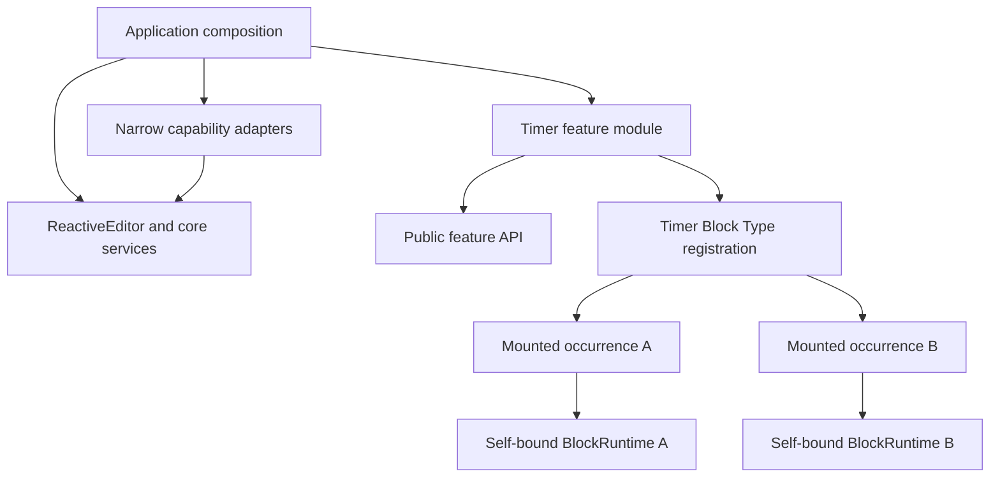

# Feature modules and hosted Block applications

Stages 1–5 are accepted. Timer, Grouping, Entity References and Compact Document use the implemented feature boundaries. For practical examples, start with [the extension architecture](../development/EXTENSION_ARCHITECTURE.md), [Block tutorial](../development/CREATING_BLOCK_TYPES.md) and [feature tutorial](../development/FEATURE_MODULES.md). The [architecture review](../../CODEX_FEATURE_MODULE_ARCHITECTURE_REVIEW.md) remains the roadmap; Stage 6 / History extraction is deferred.

These are trusted TypeScript modules compiled with Codex. There is no plugin discovery, package loader, runtime dependency resolver, sandbox or hot-loading system.

## Composition and dependency direction

Application entry points construct `ReactiveEditor`, call [`registerApplicationViews(editor)`](../../src/application/features.ts), create projections and mount `ReactiveTreeView`. Call registration once per editor; duplicate registration is an error.

Application composition currently calls `registerCoreViews` for legacy/core views and commands, then activates configured Compact Document, Entity References, Grouping and Timer features. `ReactiveEditor` still constructs unmigrated services, but does not import those feature implementations. An editor using only `registerCoreViews` intentionally omits them.

Feature implementations import [`src/feature-api`](../../src/feature-api/index.ts), their own files and appropriate library utilities. Core does not import individual feature implementations. [`src/application/feature-capabilities.tsx`](../../src/application/feature-capabilities.tsx) is a transitional adapter which captures editor internals privately; it does not return the editor, repository, projection or an arbitrary DOM root.

## Module lifetime

[`FeatureHost`](../../src/runtime/features.ts) activates `CodexFeature { id, activate(scope) }` inside a Solid root. A typed feature factory receives only the capabilities it needs; the activation scope is not a service locator.

| Scope member | Contract |
| --- | --- |
| `owner` | Stable feature ID used for registration attribution. |
| `active()` | Lifetime signal; contributed views unmount when the feature is disposed. |
| `own(disposer)` | Tracks a resource and returns an idempotent early-release function. |
| `defer(work)` | Queues a microtask which runs only if the module is still active. |

Activation failure releases acquired resources/registrations. `editor.dispose()` disposes modules and then the remaining editor services. Module-created Solid effects belong to its activation root. Timers, subscriptions and other external resources still need explicit cleanup.

Configuration is resolved before activation. `features.timer` defaults to `true`, preserving the existing Timer capability. Setting it to `false` omits Timer registration at startup; changing configuration requires recreating the editor/reloading. Disposers support teardown, failure rollback and tests; they do not promise arbitrary hot unloading of a live document's types. Other approved feature defaults remain unchanged.

## A Block Type is an executable interpretation

The serialized Block holds authored state. Its registered type supplies the running interpretation. A feature may register a type; that type can have many independently mounted occurrences. A module is therefore not synonymous with a Block or a renderer.

The implemented `BlockApplicationDefinition` contains `type`, optional aliases, capabilities, `create()` for authored defaults, and a component accepting `{ runtime: BlockRuntime }`. Timer keeps authored-state interpretation in its [model](../../src/features/timer/model.ts). There is no generic validation/serializer registration pipeline. Commands, bindings and UI actions are registered separately by the owning module.

The existing internal `BlockTypeRegistration` still supports legacy `BlockViewProps` components and an optional authored default factory. The application adapter translates a hosted definition into that registry without forcing legacy views to migrate.

## Three distinct state/lifetime boundaries

| Boundary | Timer example | Storage / cleanup |
| --- | --- | --- |
| Module | Type, commands, bindings and toolbar/menu entries | One activation per editor; feature-owned registration disposers. |
| Authored Block/content | Duration, mode, deadline/paused remainder, position and size | Canonical JSON, core commands, undo and save/reopen. Can outlive every mounted view. |
| Mounted occurrence | Interval/audio handles, draft input, drag preview and mount | Separate Solid owner and runtime per occurrence; released on unmount. |

Displayed time is derived from the authored deadline and a local clock signal. Clock ticks do not publish canonical edits. Unmounting Timer A releases A's resources while B/C keep running; it does not delete A's authored state. Explicit Block removal is a separate command. Shared content can appear in several views: authored changes are shared, while occurrence resources remain separate.

## Capabilities available now

Module creation policy receives `FeatureBlocks`: `get(key)` returns a read-only summary; `bounds(key)` returns origin coordinates; `insert(dto, destination)` inserts its own registered type; `focusPlacement` defers focus until the occurrence is ready. It cannot fetch arbitrary mounted elements.

A view receives only its own `BlockRuntime`:

| Member | Purpose |
| --- | --- |
| `nodeKey` | Identity of this occurrence; never persist it. |
| `field(name)` | Detached reactive read of this Block's authored field. Read inside reactive computations. |
| `setField(name, value, label)` | Validated core mutation of this Block, with ordinary undo/history behavior. |
| `removeAndFocusFallback()` | Remove this Block through core and restore appropriate focus. |
| `mountWidget(element)` | Register its own element with `opaque-widget` input policy; cleanup is instance-owned. |
| `own(disposer)` | Register idempotent cleanup on the captured Solid instance owner, including resources acquired in later event handlers. |

The adapter traverses the requested field through Solid proxies before returning detached data. Unwrapping before copying would lose nested reactive dependencies. Neither mutating a returned value nor updating a local signal changes authored state. Runtime mutations/mounts reject disposed instances or Blocks whose type is not owned by the feature.

The current runtime is sufficient for Timer's opaque widget. Child traversal, relationships, richer focus/selection adapters and instance-scoped commands are not public capabilities yet. Add one only when a real feature demonstrates the need; do not pass `ReactiveEditor` as a shortcut.

## Registration and contributions

The feature's `register` facade tracks ownership and cleanup automatically:

* `block(definition)` registers the type and its aliases; duplicate type/alias names fail atomically.
* `command(definition)` registers an ID, label, availability predicate and implementation.
* `binding(definition)` uses existing indexed scoped binding dispatch and stable preference IDs.
* `action(definition)` contributes a command-backed item to `document-actions` or `add-block-menu`.

Commands, bindings, Block registrations and UI entries have diagnostic owner IDs. Low-level registry registrations return idempotent disposers; the facade owns them. UI ordering uses `order` then stable ID within the slot. Duplicate registration IDs fail clearly. Default-trigger conflict arbitration has not been redesigned.

Timer owns `timer.create`, `timer.insert`, both its ordinary/cross-text shortcut registrations, and its two UI entries. Existing input dispatch invokes these commands; there is no per-feature document listener or all-plugin event broadcast. Local widget controls use their self-bound runtime directly.

## Compatibility and limits

Unknown authored types, fields, properties, children and opaque relations must survive load/save without an active module. A missing type renders through `UnknownBlockView`. Registration is required for behavior, not for generic storage. The [unknown-feature fixture](../../src/block-tree/test-support/unknown-feature-document.ts) is independent of Timer's implementation.

Stage 1's physical removal experiment passed typecheck, both builds and focused ordinary-document/unknown-data tests with Timer's directory and application activation absent. See the report for exact results and the separate, pre-existing History-disabled envelope preservation defect.

The implemented selection-policy and current-operation contracts are described below. Stage 4 added passive measured-effect and panel contributions plus bounded annotation UI; Stage 5 added one document-window presentation slot. Entity References and Compact now own their extracted policy/UI. There is still no universal property renderer/editor, serializer or application-window header registry. History extraction and Text Superposition remain deferred.

## Stage 2 editor-operation boundaries

[`TextRanges`](../../src/runtime/text-ranges.ts) validates versioned, half-open range snapshots. [`RangeAnnotations`](../../src/runtime/range-annotations.ts) applies ordinary independent annotations through narrow read/write/transaction ports and returns references. Core structural ancestry and containment live in [`BlockQueries`](../../src/runtime/block-queries.ts).

[`SelectionGestures`](../../src/input/selection-gestures.ts) owns the existing Control-selection policy, cancellation and completion protocol. Native and cross-Block input retain selection geometry. The registered policy receives a normalized selection snapshot after pointer release; ordinary typing bypasses policy dispatch. [`CurrentTextOperations`](../../src/runtime/current-text-operation.ts) supplies explicit annotation/deletion targets, separate from passive highlights. Both registrations have one owner and disposable lifetimes.

Grouping now lives in [`features/grouping`](../../src/features/grouping/index.tsx). Application composition activates it with `features.grouping` (default true, preserving existing behavior). A bare `ReactiveEditor` plus core views has no Grouping policy. The feature receives [`TextOperationCapabilities`](../../src/feature-api/text-operation.ts) through an explicit application adapter, with no editor/repository/DOM lookup access.

The module owns its controller, commands, semantic operation/gesture bindings, decorations, notices, counts and Selection help. `FeatureActions` has a bounded toolbar contribution for the existing notice, Selection-details and annotation-description surfaces; this is separate from the passive-effect and panel registries. Core [`deleteTextRanges`](../../src/runtime/range-edits.ts) validates, merges and deletes supplied ranges atomically and returns a caret. The adapter handles native/logical/cross selection completion and caret restoration.

Grouping uses the Stage 2 Show/Hide visibility port; authored Show/Hide storage/rendering remains independent. Grouping is an editor operation, independent of hosted `BlockRuntime`. Its physical removal qualification and remaining adapter responsibilities are recorded in the Stage 3 report.

## Stage 4 and Stage 5 contribution boundaries

[Entity References](../../src/features/entity-references/index.tsx) consumes `AnnotationCapabilities`: revision-aware snapshots/search, shared linked-annotation application, owned panels/decorations, annotation UI and passive measured effects. See [the effect tutorial](../development/CREATING_STANDOFF_EFFECTS.md) for the immutable fragment contract and remaining region/projection limits.

[Compact Document](../../src/features/compact-document/index.tsx) consumes `PresentationCapabilities`: one per-window request/control/style contribution. Core retains expanded geometry, automatic narrow-window collapse, observers, margins/drawers and focus. This does not provide a child application with parent Window controls; see [Window applications](../development/CREATING_WINDOW_APPLICATIONS.md).
