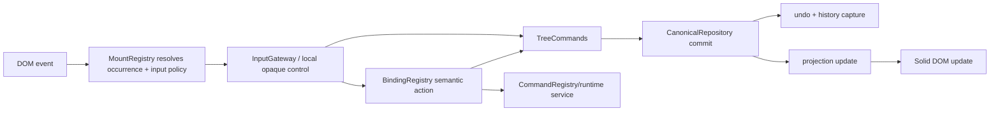

# Input, commands, and keybindings

## The separation to preserve

Browser input answers **what did the user do here?** A command answers **what valid document change does that mean?** `InputGateway` and UI components translate events into `TreeCommands`, command-registry calls, or transient service changes. Only the mutation layer changes canonical records.



## Browser event entry points

[`ReactiveEditor.installGateway`](../../src/reactive-editor/editor.ts) installs one [`InputGateway`](../../src/input/gateway.ts) for a `Document`, plus cross-Block and Find input helpers. The gateway uses capture listeners for `beforeinput`, `input`, composition, focus, keydown, selection change, pointer, clipboard, and context-menu events.

`MountRegistry.resolveEvent` walks the composed DOM path and returns the nearest registered `NodeKey` and its `inputPolicy`:

- `standoff`: Codex owns model text editing;
- `native-text`: a textarea/input owns browser editing and is reconciled through a payload command;
- `control`: a native control consumes its interaction;
- `container`: structural/focus target;
- `opaque-widget`: the widget handles its internal input boundary.

Views register the selection adapters the gateway needs. The gateway should not query component internals by CSS selector.

## Worked example: typing `x` in a standoff paragraph

Ordinary text does **not** travel through a keybinding. `keydown` cannot correctly represent composition, paste, or all text input. The path is:

1. The browser sends `beforeinput` with `inputType="insertText"` and data `x` at the `contenteditable` standoff flow.
2. `InputGateway` resolves the event to the Standoff `MountHandle` and captures browser anchor/head as Cell boundaries.
3. It prevents the browser from becoming authoritative and calls `TreeCommands.replaceInlineRange(nodeKey, start, end, "x")`.
4. The command creates a `text-cell` content record and inline placement, updates the owner's `inlineContent`, maps inclusive standoff ranges around the half-open replacement, and publishes one commit.
5. `CanonicalRepository` validates and records inverse operations, changes its Solid store, and emits commit/model notifications.
6. `BlockTreeProjection` applies its optimized inline update.
7. `StandoffEditorView`'s `<For>` sees the new projected Cell and Solid inserts the span.
8. A queued selection restore maps the canonical boundary back to the updated DOM, keeping the caret after `x`.

The `input` handler is a reconciliation fallback for browser/composition cases. It compares mounted text with canonical Cells and refuses unsafe reconciliation when inline atoms make the text mapping ambiguous.

## Worked example: clicking to position the caret

1. A primary `pointerdown` reaches the document gateway. The mount registry identifies the Standoff occurrence. The gateway clears incompatible secondary Block/text selections and dismisses applicable overlays.
2. The browser performs its normal hit-test and places the native caret in the `contenteditable` flow. Codex does not commit document data.
3. `focusin` causes `FocusService` to adopt that occurrence.
4. `selectionchange` asks the mount's `captureInlineSelection` adapter to translate DOM nodes/offsets to Cell boundaries and writes a `SelectionSet` in `SelectionService`.
5. Selection-dependent SVG/UI can react to the session revision. The canonical repository and undo history remain unchanged.

Clicking a Block's gutter handle is a different scoped action. [`BlockSelectionHandle`](../../src/rendering/block-selection.tsx) dispatches `selection.single`, `selection.toggle`, or range actions through the `block-handle` bindings and updates `BlockSelectionService`; drag reordering eventually calls a tree command.

## Commands and edits

[`TreeCommands`](../../src/block-tree/commands.ts) is the intended mutation boundary. It accepts convenient `NodeKey | PlacementKey` targets, resolves occurrences, checks command-specific preconditions, builds repository operations, supplies command descriptors with authored subjects, and commits them.

Use existing operations where possible:

- payload: `setPayloadField`;
- text: `replaceInlineRange` or `replaceAcrossBlocks`;
- structure: `insert`, `move`, `remove`, `replace`, `unwrap`;
- relations: `setRelation`, `removeRelation`, `ensureMargin`;
- sharing: `transclude`, `unlink`, `detach`, `copy`;
- compound action: `transaction(label, () => { ... })`.

Repository validation is the final structural safety net. Command validation provides useful domain errors before that point. A transaction plans against a draft and publishes one repository commit/undo item.

### CommandRegistry

`CommandRegistry` is a semantic UI-command registry with `id`, `label`, `canExecute`, and `execute`. Core registrations currently live beside Block registration in [`register-core-views.ts`](../../src/rendering/register-core-views.ts). It is suitable when keyboard, menus, or other callers need the same named action.

It is distinct from `TreeCommands`: the registry controls availability and invocation; its implementation normally calls a tree command or runtime service.

Programmatic callers may use either:

```ts
editor.commands.setPayloadField(nodeKey, "checked", true, "Check Block");

await editor.commandRegistry.execute("block.remove", {
  targetKey: nodeKey,
  args: undefined,
});
```

## Keybindings

[`registerInputActions`](../../src/input/binding-catalog.ts) registers action metadata, scopes, default keyboard/mouse/custom triggers, and a handler which calls `context.run(id)`. [`BindingRegistry`](../../src/input/bindings.ts) matches a normalized event in the active scope, including chords and user overrides.

The gateway derives the scope from current UI mode and mount policy, dispatches the match, then routes its action ID. Current implementations are distributed:

- reusable semantic commands can reach `CommandRegistry` through the editor bridge;
- editing/navigation cases live in `InputGateway.runBinding`;
- cross-Block input has its own guarded path;
- some toolbar actions call `TreeCommands` or services directly.

When adding a shortcut, first make the operation callable without the shortcut. Then register an action in the catalogue and add the smallest routing case needed. Do not put document mutation inside trigger matching.

## Mouse, menus, and toolbar actions

Mouse gestures may be binding triggers (`menu.open`, Block selection), local component interactions (checkbox change, Timer drag), or ordinary browser selection. The same rule applies: previews can be local signals; the completed authored change must call a command.

Menus/toolbars do not need to synthesize keyboard events. They call the same semantic command, tree command, or service action directly. `canExecute` should be shared when availability matters.

## Undo and notification

Every nonempty `TreeCommands.publish` reaches `CanonicalRepository.commit(..., recordHistory=true)`. The repository stores inverse/forward operations and emits an immutable commit capture. `undo()`/`redo()` replay those operations with an explicit cause, which projections and durable history observe like other commits.

Changing the DOM, mutating a payload object returned by `readState`, or editing a projection bypasses this path. The result may render briefly but will not have reliable validation, persistence, undo, or historical attribution.
