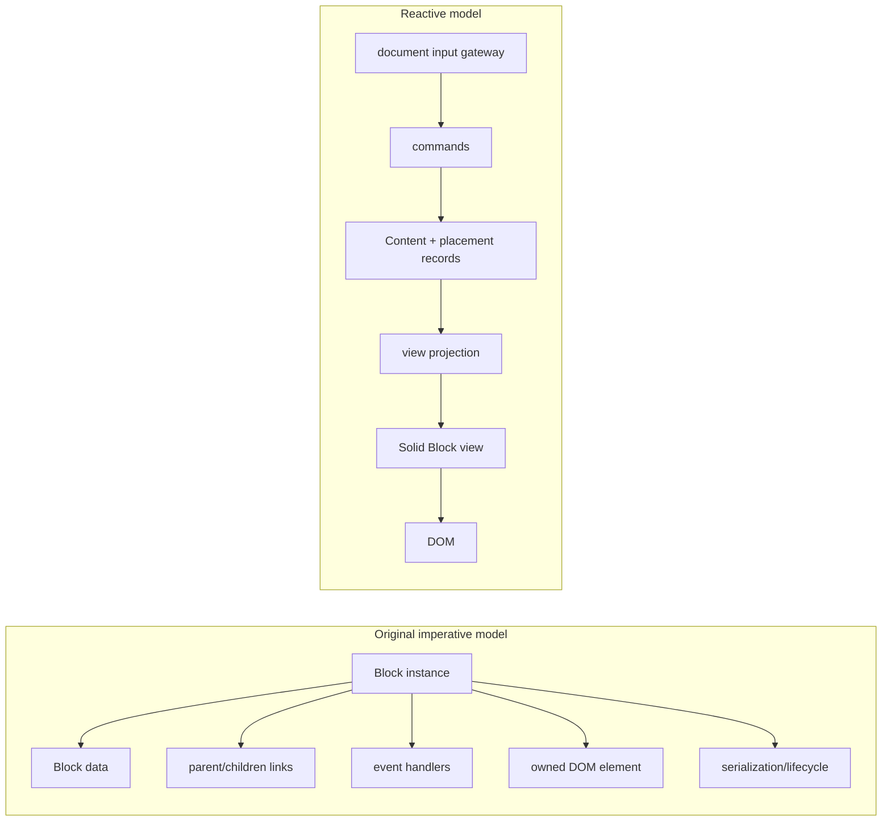

# Old Codex to new Codex

## The mental-model change

The original Codex made each `AbstractBlock` instance the centre of the system. A Block held data and relationship pointers, created and owned DOM, handled input, registered itself with `UniverseBlock`, and participated in serialization and lifecycle. Structural methods changed both arrays and DOM. Standoff editing similarly combined Cells, selection, browser events, measurement, and annotation drawing in `StandoffEditorBlock`.

That model is still available as migration reference in [`src/blocks`](../../src/blocks) and [`src/universe-block.ts`](../../src/universe-block.ts), but it is not the authority for the reactive editor.

The rebuilt system makes plain records authoritative. A Block visible on screen is a projection of those records, rendered by a Solid component. Components request model changes through commands; they do not update a parallel Block object or manually move DOM.

The practical rule is: **change the model through `TreeCommands`; let projections and Solid change the DOM**.

## Old way → new way

| Original habit | Current location and responsibility |
| --- | --- |
| Construct a `Block` subclass which creates its element | Define serializable payload data and a Solid `BlockViewProps` component; register it with `BlockRegistry`. |
| Store children in `block.blocks` and maintain `parent`, `previous`, and `next` | `ContentRecord.children` stores ordered `PlacementKey`s. `deriveLocations` and projections reconstruct ancestry and occurrence order. |
| Insert/move/delete the DOM and Block together | Call `TreeCommands.insert`, `move`, `remove`, `replace`, `setRelation`, and related operations. Repository validation and the renderer do the rest. |
| Treat one Block object as identity | Separate authored `payload.id`, canonical `ContentKey`, attachment `PlacementKey`, and per-view occurrence `NodeKey`. |
| Put key handlers on each Block | `InputGateway` captures document events; `BindingRegistry` matches semantic actions by scope; a view uses local handlers only for opaque/native controls. |
| Mutate Block fields and call `updateView` | Use `setPayloadField`, a specific tree command, or a transaction. Solid computations rerun when the projection fields they read change. |
| Hold caret/range state on the Block | `SelectionService`, `FocusService`, `CrossBlockSelection`, and `MountRegistry` hold session/view state. Browser `Selection` is bridged through mount adapters. |
| Draw annotations from `StandoffEditorBlock.updateView` | `StandoffEditorView` derives CSS runs and local SVG shapes from `standoffProperties`, DOM ranges, and session decorations. |
| Attach CSS/effects through imperative Block-property schemas | `blockAppearance` derives ordinary class/style output. Bespoke interactive or graphical effects still live in the relevant view; this area is transitional. |
| Serialize each Block instance | `encodeDocument` traverses canonical content and placements. `decodeBlockTree` normalizes legacy nested JSON. |
| Keep an ad hoc undo stack around editor methods | `CanonicalRepository.commit` records forward and inverse operations; all `TreeCommands` publish through it. Durable history subscribes to the same commit stream when enabled. |

## What survived

- Authored Blocks still have a `type`, normally a stable `id`, arbitrary JSON payload fields, ordered children, relations, `blockProperties`, and `standoffProperties`.
- Block types still choose distinct visual and interaction behaviour.
- Standoff ranges remain inclusive Cell indexes in persisted payloads.
- Documents and Workspaces still cross the server boundary as JSON, including legacy nested Block JSON.
- Margin documents, windows, transclusion, linked annotations, and inline Cells remain domain concepts.

## What disappeared or moved

- A runtime Block class is no longer the document model.
- DOM nodes, browser ranges, timers, observers, and controller instances do not belong in persisted records.
- Parent/sibling links are derived rather than independently mutable.
- Rendering no longer owns canonical state and commands no longer perform routine DOM surgery.
- Input dispatch is centralized rather than discovered by walking Block instances.
- One authored Block may have several placements or several view occurrences. An instance-shaped mental model cannot represent that correctly.

## Four identities instead of one object

| Identity | Meaning | Lifetime |
| --- | --- | --- |
| `payload.id` (`BlockId`) | Stable authored identity used by persistence, references, and Block history | Save/reopen |
| `ContentKey` | Runtime key of one canonical content definition | Editor repository |
| `PlacementKey` | Runtime attachment/reference edge to content; normalized files may also carry a persistent `placementId` | Editor repository |
| `NodeKey` within a `ViewId` | One rendered occurrence of a placement | Projection/view |

Use the `NodeKey` received by a view for focus, selection, mounts, and command targeting. Resolve it through `OccurrenceIndex` before canonical mutation. Never persist it. Use authored IDs for durable semantic references.

## Where code belongs now

- **Serializable fields and structure:** [`src/block-tree/types.ts`](../../src/block-tree/types.ts), codecs, and repository records.
- **Document mutations and validation at the user-operation level:** [`TreeCommands`](../../src/block-tree/commands.ts).
- **Record validation, undo capture, and reactive publication:** [`CanonicalRepository`](../../src/block-tree/repository.ts).
- **A view occurrence:** a component under [`src/rendering`](../../src/rendering), registered in [`register-core-views.ts`](../../src/rendering/register-core-views.ts).
- **Browser event translation:** [`src/input/gateway.ts`](../../src/input/gateway.ts) and focused runtime services.
- **Semantic shortcuts:** [`binding-catalog.ts`](../../src/input/binding-catalog.ts).
- **Transient focus, selection, overlays, and measurements:** [`src/runtime`](../../src/runtime).
- **Save/load:** codecs plus [`PersistenceService`](../../src/reactive-editor/persistence.ts).
- **Historical recording/read/restore:** [`src/history`](../../src/history) and [`BlockHistorySession`](../../src/runtime/block-history.ts).

The rebuild is not uniformly plugin-oriented. Block views and commands have registries. Standoff appearance uses a schema table plus a rendering switch. Block properties use a rendering switch. The recipes document those actual integration points rather than presenting them as generalized extension APIs.
