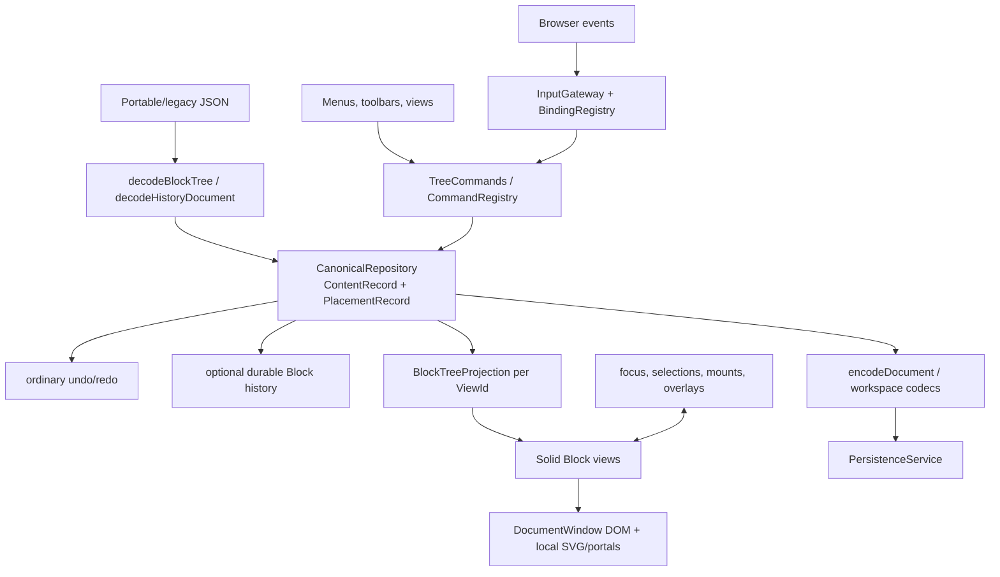

# Architecture overview

`ReactiveEditor` is the composition root. It decodes input, owns the canonical repository and commands, creates projections, and wires input and runtime services. Application code constructs an editor, calls `registerCoreViews(editor)`, creates one or more views, installs the input gateway, and renders `ReactiveTreeView`.

## Major systems

| System | Authority/responsibility | Main symbols |
| --- | --- | --- |
| Portable boundary | Nested legacy-compatible Block JSON, Workspace manifests, or a versioned history envelope | `ExistingBlockDto`, `decodeBlockTree`, `encodeDocument`, `WorkspaceManifest`, `HistoryDocumentEnvelope` |
| Canonical model | Normalized content definitions and placement edges | `RepositoryState`, `ContentRecord`, `PlacementRecord`, `CanonicalRepository` |
| Editing | Validated intent-level changes, transactions, structure, payload, inline edits | `TreeCommands` |
| Occurrence projection | Finite per-view render tree and canonical-to-occurrence indexes | `BlockTreeProjection`, `OccurrenceIndex`, `BlockNode` |
| Rendering | Block-type selection, Solid components, child/relation traversal | `BlockRegistry`, `ReactiveTreeView`, `BlockOutlet`, `ChildBlocks`, `RelationBlocks` |
| Input | One document-level gateway, scoped semantic bindings, browser/model selection bridge | `InputGateway`, `BindingRegistry`, `MountRegistry` |
| Session state | Focus, selections, open overlays, selected Blocks, search highlights, minimap state | services under `src/runtime` |
| Persistence | HTTP save/load plus workspace resolution and optimistic revision checks | `PersistenceService` |
| History | In-memory inverse operations; optional immutable durable commit stream and Block-level reader/restore | repository undo stack, `src/history`, `BlockHistorySession` |

## Source of truth and derived state

### Authoritative document state

`CanonicalRepository.state` is the live document authority. Its `contents` table stores type/payload, ordered child placements, inline placements, owned relations, wire-presence flags, and revisions. Its `placements` table connects an occurrence in the authored graph to content and says whether the edge is owned, a reference, or inline.

Developers must treat `repository.state` and `readState()` as read-only. Change them through `TreeCommands`. Repository-level operations are infrastructure and are normally too low-level for a feature.

### Derived or reconstructed

- Locations/parent slots and reference counts are rebuilt by `CanonicalRepository`.
- A `BlockTreeProjection` derives `BlockNode`s for a particular root and `ViewId` and updates after commits.
- `OccurrenceIndex` maps occurrence keys back to placements and content.
- DOM comes from Solid views and is disposable.
- CSS style runs and SVG shapes are derived from annotations plus current DOM geometry.
- Search/entity highlights in `SessionDecorations` are transient and invalidated by content edits.
- The page minimap has its own derived canvas geometry and marker state.

### Session state, not document state

Focus, current selection, open panels, hover state, drag previews, mounted elements, native `Range`s, timers, scroll positions, and most open/closed UI belong to runtime services or local component signals. A small exception is focus bookmarks written by `encodeDocument` so a document can reopen near its last authored Block; runtime `NodeKey`s are still never persisted.

### History is a record of authority, not another editable model

Ordinary undo entries contain forward/inverse repository operations. Durable history consumes immutable commit captures and reconstructs historical resource snapshots for reading. A restore creates a new current command; it does not rewrite the archive.

## “If I want to change X…”

| X | Change this |
| --- | --- |
| A Block payload field | `editor.commands.setPayloadField(...)` or a focused command built on `TreeCommands` |
| Child order/ownership | `insert`, `move`, `remove`, `replace`, `unwrap`, or a transaction of structural commands |
| Text in a standoff paragraph | `replaceInlineRange`; do not edit DOM text or `inlineContent` directly |
| A standoff property | Replace/edit `payload.standoffProperties` through a command; use `editStandoffProperty` for monitored edits |
| A Block property | Replace `payload.blockProperties` through a command |
| Selection/focus/open UI | The relevant runtime service, not the repository |
| How a type looks | Its registered Solid view or shared rendering helper |
| How a semantic operation is invoked | `CommandRegistry`, a binding action, menu/toolbar callback, or direct programmatic call |
| Save representation | Codec only when the generic payload/child/relation round trip is insufficient |

## Ownership and references

Owned placements determine lifetime and must form a valid acyclic ownership graph. Reference placements point to shared content without becoming another owner. A projection can therefore render the same `ContentRecord` through several occurrences. It detects recursive expansion and renders a `cyclic-reference` placeholder rather than recursing forever.

Children, inline content, and named owned relations are distinct slots. Do not put `children` or `relation` into payload with `setPayloadField`; that method rejects them. Margin Blocks use `ownedRelations`; Standoff Cells use `inlineContent`.

## Current boundaries and transitional areas

- Legacy `src/blocks` code coexists as reference and for unmigrated context. Do not infer the reactive extension path from it.
- `BlockRegistry` and `CommandRegistry` are explicit per editor; there is no module scanning or automatic plugin discovery.
- The binding catalogue registers semantic actions, but implementations are distributed between the gateway, command registry, and specific UI/runtime services.
- Standoff styles and Block appearance are tables/switches, not public renderer registries.
- Durable Block history is feature-flagged off by default and has stricter document identity/enrollment rules than ordinary undo.
- The normalized extended repository format exists, while normal save/load retains portable/legacy document boundaries.
