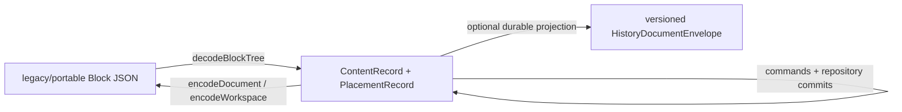

# Persistence and history

## The portable/runtime boundary

Codex normally saves a portable nested `ExistingBlockDto`, while the live editor uses a normalized `RepositoryState`. [`codecs.ts`](../../src/block-tree/codecs.ts) is the boundary:

`PersistenceService.saveDocument` snapshots the current repository revision, calls `editor.encodeDocument()`, adds file metadata, and sends it to `/api/saveDocumentJson`. Load validates the response and constructs a new `ReactiveEditor`, which decodes it. Workspace save/load has a versioned manifest and resolves referenced Document resources separately.

An explicit extended normalized format exists in [`extended-codec.ts`](../../src/block-tree/extended-codec.ts), but it is a separate endpoint/format. Do not make an ordinary extension depend on it.

## What an extension gets for free

For ordinary JSON-shaped payload fields, children, and owned left/right margins, generic codecs preserve the extension without a custom serializer:

- `payload.type` becomes `ContentRecord.viewType` and is written back as the Block `type`;
- other payload fields, including `blockProperties` and `standoffProperties`, round-trip generically;
- nested `children` become child placements and encode recursively;
- `leftMargin`/`rightMargin` become owned relations;
- unrecognized relation fields remain opaque and round-trip.

A new leaf Block with `{ id, type, myField }` therefore needs a registered renderer, not a codec branch. Add codec work only for a genuinely different normalized representation, as Standoff text/Cells and Workspace resources do.

To verify Save → Close → Reopen, encode the repository, construct a fresh editor from the encoded DTO, register views, and assert the payload and rendering. Persistence HTTP tests are only needed when changing store behaviour.

## Stable identity and unknown types

Authored Blocks should carry a stable `id`. `TreeCommands.insert` runs `prepareNewBlockIdentities`, so newly inserted authored definitions receive IDs if needed. Copy/detach operations follow explicit identity-remapping rules. Durable history and linked references depend on authored IDs; `NodeKey`, `ContentKey`, and runtime `PlacementKey` are not substitutes.

The codec preserves unknown payload/type data. At rendering time an unregistered `viewType` falls back to `UnknownBlockView`; registering the type later makes it render normally. A DTO with no type normalizes as `unknown-block`.

Legacy aliases `main-list-block` and `membrane-block` normalize to `document-block`. Codecs also preserve omitted/null/present collection shape where possible. Avoid post-processing encoded JSON in an extension; that risks breaking these compatibility details.

Inline images are a special case: a Standoff paragraph is no longer representable as only legacy `text` when its inline stream contains non-text atoms. The codec refuses loss unless an explicit lossy export context is used.

## Ordinary undo/redo

`CanonicalRepository` plans every commit, validates the resulting graph, captures inverse operations, and pushes a `HistoryEntry` when `recordHistory` is true. `undo()` and `redo()` materialize the stored operations as new repository transitions with causes pointing to the source commit.

An extension automatically participates when it uses `TreeCommands`:

- `setPayloadField` captures Block/standoff property arrays;
- structure commands capture content and placement changes;
- `replaceInlineRange` captures Cells and annotation-range mapping;
- `transaction` groups several command calls into one undo entry.

Local Solid signals and runtime services are intentionally not undoable document state. Commit a final authored value at the end of an interaction, rather than committing every pointer-move preview.

## Commit capture and document history

Each repository commit emits an immutable `RepositoryCommitResult` containing exact changed-record preimages/postimages, revision and root transitions, cause, label, and command descriptors. This stream is separate from the bounded ordinary undo stack.

The history code under [`src/history`](../../src/history) projects the repository to a durable resource model, stores verified checkpoints/transitions, groups edits, and supports bounded historical queries. The browser bridge uses a worker and a persistent outbox. It also captures undo and redo transitions; history is a chronology, not merely a larger undo stack.

Use `TreeCommands` rather than raw `repository.commit`. The latter can technically produce undo/capture, but without specific command descriptors it falls back to `repository.commit` with no subjects. That weakens edit grouping, genealogy, and Block attribution.

## Block-scoped history

[`BlockHistorySession`](../../src/runtime/block-history.ts) is the UI/runtime facade. It can show session history and, for an enrolled saved Document, persistent durable history. It identifies Blocks by stable authored `blockId`, reads immutable historical subtrees, prepares a restore plan, verifies it against the current revision, and applies the restore through `TreeCommands.restoreBlock`.

A restore is a new current change. The previous current state remains available in ordinary undo and durable history; the historical archive is not rewritten.

Current constraints:

- `features.blockHistory` is off by default;
- persistent recording currently requires a saved `document-block` root with a stable authored ID;
- history-enrolled Documents use the versioned `codex-history-document` envelope;
- persistent history inside a Workspace is explicitly unsupported at present;
- capture health and verified-prefix checks can block restore without blocking ordinary editing/save fallback.

A new Block/property generally needs no Block-history adapter if its authored data is JSON-shaped and changed through commands. Give authored Blocks stable IDs and use specific command descriptors (which standard `TreeCommands` methods already supply). A new structure with nonstandard identity or serialization requires dedicated history/resource work as well as codec work.

## Ways to bypass history accidentally

- Mutating an object reached through `repository.state`, `readState`, or a projected `node.payload`.
- Writing DOM text and never reconciling it to the model.
- Keeping an authored property only in a component signal/runtime service.
- Calling `repository.commit` directly without a strong infrastructure reason and command metadata.
- Splitting one user action into many unrelated commits instead of a transaction.
- Persisting a semantic reference to `NodeKey` instead of stable authored identity.

Focused tests live in `src/block-tree/*undo*`, `src/block-tree/commit-capture.test.ts`, `src/history`, `src/runtime/block-history-persistence.test.tsx`, and `src/reactive-editor/persistence.test.ts`.
