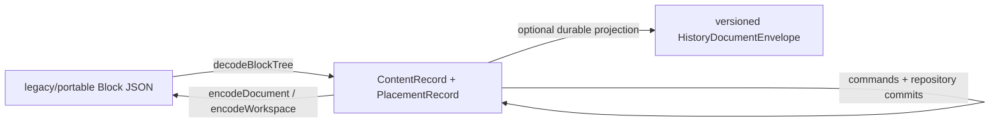

# Persistence and history

## Accepted SQLite P3 baseline

**3 October 2026: P3a–P3d are complete and accepted.** This is the current authority and application-composition contract. The individual [P3 reports and original composition plan](../../MUTABLE_SQLITE_PERSISTENCE_P3_APPLICATION_COMPOSITION_PLAN.md) retain qualification evidence; their earlier proposals and stop points are historical. P3 closure authorizes no P4/P6, further persistence hardening or performance work. The [Flint product checkpoint](../../FLINT_APPLICATION_IMPLEMENTATION_PLAN.md#9-post-p3-product-checkpoint) records the choices awaiting product review.

### Authored authority and query evidence

| State | Authority and boundary |
| --- | --- |
| Prose, Blocks, BlockProperties, BlockRelations, annotation definitions and standoff properties | Native Resources persist authored state; the canonical repository owns current live edits. SQLite's saved projection cannot author, simplify or overwrite these values. |
| EntityReference ranges and target GUIDs | Native annotations, including linked/cross-Block segments. An EntityReference asserts a mention of an Entity; it is not the Entity record. |
| Entities, preferred names/enrichment, explicit aliases and explicit canonical Relationships | Vault-scoped SQLite canonical knowledge. Stable Entity GUIDs are identity; names are not unique identity keys. No canonical `entities.json` sidecar or SurrealDB write fallback. |
| File-derived SQL rows, Facts, search/backlink/mention results | Verified saved projections or live query evidence, never ownership, binding, persistence or navigation authority. Rebuilding them preserves canonical database knowledge and never modifies Resource files. |
| Resource identity, ownership, location and publication | Existing canonical repository and managed-store contracts. Paths are locations, registrations are non-owning retention, occurrences are transient presentation, and `external` does not imply non-ownership. SQL rows cannot establish or transfer any of these authorities. |

The accepted composition is **live canonical state → verified SQL saved state → independently verified file fallback → unknown/incomplete coverage**. A database row is insufficient evidence of current knowledge. Preserve scope, freshness, identity, boundedness, cancellation and failure checks; uncertainty never means absence or a zero count. Live unsaved assertions suppress stale saved assertions, including for loaded Documents without mounted tabs. Existing C2/C3 host activation/revalidation remains the navigation authority for the invoking Window.

P3a separates background preparation from protected, revalidated publication. Foreground/native persistence and ordinary vault operations do not wait for size-dependent background SQL decoding/projection/comparison; stale publication is rejected. This is not an incremental whole-Resource Save claim.

Current composition switches are `nativeKnowledge:true`, `sqliteKnowledge:true`, `sqliteEntities:true`, and **`nativeKnowledgeSaved:false`**. Saved coverage remains explicitly enabled where qualified; SQLite backend availability does not silently enable it. The Entity service uses the source Document's verified Mutable Vault/binding, currently supplied through the qualified Flint host, not the last-focused Window or an implicit global database. Missing/ambiguous context fails explicitly. Broader Desktop/Canvas/Spatial host integration remains separate work. Legacy SurrealDB infrastructure elsewhere is not a fallback for this canonical service.

Production seams: [Entity capability](../../src/feature-api/entities.ts), [application Entity service](../../src/application/entity-service.ts), [SQLite host](../../server/sqlite-knowledge-host.ts), and [canonical Entity/Alias/Relationship operations](../../src/knowledge-sqlite/entities.mjs). Features receive narrow semantic capabilities, not database rows or arbitrary editor access.

### Mutable Vault platform boundary

**Accepted clarification, 3 October 2026.** A Vault is a filesystem root associated with one Mutable system directory and one persistence/knowledge context. Mutable owns filesystem confinement, Vault establishment/identity, Document recognition/admission, source binding and canonical Entity/Relationship services. Flint and other applications consume these capabilities. A chooser or Window does not establish persistence authority merely by holding a selected path.

Reuse `<root>/.mutable/mutable.db` and `<root>/.mutable/audit.db`, their existing identity/schema checks and worker lifecycle. Open valid existing infrastructure rather than creating a second database; invalid or partial infrastructure requires an explicit unavailable/recovery outcome. System infrastructure is not an ordinary user folder. Pair archives and relocation records remain governed by their accepted protocols.

Vault roots must not overlap. This includes established ancestor/descendant Vaults whose application leases have closed. Enforce the rule in the shared platform/server establishment and opening paths, not only Flint's chooser. Same-root reuse is valid; closing a lease does not authorize nested establishment. No nearest-Vault-wins rule, automatic merge or global catalog is introduced. The shared foundation/worker establishment guard now checks persistent topology independently of active entries; the [correction strategy](../../MUTABLE_VAULT_CONTENT_RECOGNITION_STRATEGY.md#non-overlap-is-a-durable-platform-invariant) records the bounded evidence check, purpose-specific cross-process establishment coordinator and limitations.

Physical containment supplies scope; validated content supplies Document type/codec; canonical authored identity supplies resource identity; verified source binding supplies location/currentness evidence. SQL enrollment and filename suffix supply none of those authorities. A recognized historical `.json` Document is not inherently read-only or ineligible for LER. Safe Save must follow its actual codec and storage capability, preserve its existing format unless conversion is explicitly requested, and report concrete limitations. Preserve unknown authored values, duplicate/ambiguous identity guards, caller baselines and pending save/relocation checks.

The platform resolves **verified Document source → unique Mutable Vault → existing vault SQLite context**. The development default is the configured managed `data` root, subject to non-overlap validation; it is a convenience for initial selection, not a fallback Entity authority. Starter Notes/Ideas remain unbound until explicit Save. Generated Markdown is not required for this correction; existing enrolled pair evidence remains protected.

Normal Mutable servers are writable. The obsolete `publicHostedVersion` feature switch and `SPEEDY_PUBLIC_HOSTED_VERSION` server override no longer disable persistence or redirect the default UI to local-file saving. Explicit local-file actions remain available. Failed writes, unavailable infrastructure and invalid topology are operational failures, not a read-only product branch.

Future explicit cross-Vault knowledge import/merge is recorded separately. Separate Vaults retain separate canonical Entity/Alias/Relationship contexts. This correction introduces no cross-Vault synchronization, knowledge merging or broader application-hosting framework.

### Link Entity Reference is a semantic-authoring component

The **Link Entity Reference (LER) Window** follows: annotation target → resolution query/evidence → canonical Entity selection → explicit EntityReference binding. Preserve this interaction in future UI work; it is more than autocomplete.

| Concept | Meaning |
| --- | --- |
| Target | The authored span being annotated, visibly decorated while resolving. Editing the query never changes this span. |
| Query | Freely editable candidate-discovery text. Target `he`, query `leonardo`, Entity `Leonardo da Vinci` may bind the unchanged `he` to Leonardo's GUID. |
| Canonical name | The Entity's preferred name, separate from query and mention text. Explicit creation offers an editable initial name derived from query/selection; selected text supplies the default without a mandatory re-entry step. |
| Alias | An explicitly curated/imported alternative name. Add/update/remove is a canonical database mutation. |
| Mention | Actual authored EntityReference surface text, with native range and source provenance. Mention evidence never silently becomes an alias. |

Name/Alias/Mention are distinct resolver streams, with independent Partial/Exact matching and Current Document/Vault scope. Local evidence can influence ranking; candidate provenance does not confer canonical authority. Explicit aliases require database backup for exact recovery. Observed mention forms are rebuildable from surviving authored references; their recoverability does not turn them into curated aliases. Native `entityName` metadata is a display snapshot, not preferred-name authority. Missing Entity GUIDs remain unresolved rather than being matched or merged by name.

Default **Link** preserves prose. **Replace & Link** is an explicit action for a suitable plain-text Block, using one native replacement/annotation transaction and atomic Undo. Additional occurrences require candidate review and explicit binding. Range adjustment is transient, grapheme-safe and introduces no authored delimiter Cells. Retain native text input, composition, focus/selection restoration, scoped keyboard interaction and existing cross-Block annotation capability. Mere mention proximity never creates a Relationship; canonical Relationships require an explicit operation and their own endpoint identities.

### Independent Entity creation and partial outcomes

Entity creation and native annotation are separate commits across different authorities. Outcomes are **not created**, **created and linked**, **created but not linked**, or **creation outcome unconfirmed**. Supplied stable Entity GUIDs and idempotent mutation attempts govern retries. A created Entity whose annotation failed is valid canonical knowledge, not an orphan.

Cancelling before dispatch creates nothing; cancelling after dispatch cannot promise rollback. Panel closure prevents late annotation. Native Undo/Redo changes EntityReferences, not the independently committed Entity. A confirmed GUID can remain in transient interaction/Window state and offer **Bind to new selection**: validate a fresh selection, vault and Entity, then perform a new annotation action. Never replay a stale target. Do not add compensating deletion, distributed transactions or staged Entity publication. The bounded audit outbox supplies mutation retry receipts; end-to-end audit delivery remains deferred.

### Recorded limits and separately scoped future work

- Known baseline regression: `Flint saved composition sqlite=true > selected Open retains the existing owned-external dependency/ownership admission guard` reaches `Saved result is stale` before the expected `multiple semantic owners` guard. It was reproduced at unchanged accepted commit `b2fcfff`; it is neither a P3d blocker nor a new P3d regression. Preserve both guards and the test for later investigation.
- Approximately five seconds for native foreground Save in the 10,000-Block control remains future work. P3 establishes neither incremental whole-Resource Save/reconciliation nor P6 Typical/Large performance qualification.
- Entity Merge/Delete, external authority lookup/import (for example Wikidata/GND), semantic/NL candidate discovery, automatic alias suggestions/extraction, broader Relationship-management UI and audit delivery are separate roadmap items. Duplicate conceptual Entities are possible; name uniqueness is not a substitute for future explicit management.
- Semantic/NL queries such as `that Florentine artist` may eventually feed the existing candidate-provider boundary. They remain discovery evidence followed by explicit LER selection/binding; AI output cannot confer canonical authority.
- The subsequent manual-acceptance correction authorizes content-recognized Document access, safe format-based Save/source binding and LER, with Mutable-owned non-overlapping Vault scopes. The [correction report](../../MUTABLE_VAULT_ACCEPTANCE_CORRECTION_REPORT.md) records qualification and the remaining format/consumer limitations; it is not evidence that all formats or hosts are supported. `.ink.md` generation, new serialization formats, native Save optimisation, broader presentation-host integration and P6 remain deferred. Default Markdown export is not required; existing enrolled pair receipts/recovery remain protected. See the [content recognition strategy](../../MUTABLE_VAULT_CONTENT_RECOGNITION_STRATEGY.md).

## The legacy portable/runtime boundary

The following sections describe existing legacy/portable extension and History paths. They do not replace Flint's native resource path or authorize flattening native registered resources through legacy Document/Workspace serialization. Native resource capture/admission lives in [native-resource.ts](../../src/persistence/native-resource.ts); native session/pair coordination in [native-session.ts](../../src/persistence/native-session.ts). Save belongs to the canonical resource, independently of its visible occurrences.

Codex normally saves a portable nested `ExistingBlockDto`, while the live editor uses a normalized `RepositoryState`. [`codecs.ts`](../../src/block-tree/codecs.ts) is the boundary:

```mermaid
flowchart LR
  L[legacy/portable Block JSON] -->|decodeBlockTree| R[ContentRecord + PlacementRecord]
  R -->|commands + repository commits| R
  R -->|encodeDocument / encodeWorkspace| L
  R -->|optional durable projection| H[versioned HistoryDocumentEnvelope]
```

`PersistenceService.saveDocument` records the current revision and first offers the save to `BlockHistorySession.savePersistent`. When that path is unavailable it calls `editor.encodeDocument()`, adds file metadata, and sends ordinary JSON to `/api/saveDocumentJson`. Load validates the response and constructs a new `ReactiveEditor`, which decodes it. Workspace save/load has a versioned manifest and resolves referenced Document resources separately.

An explicit extended normalized format exists in [`extended-codec.ts`](../../src/block-tree/extended-codec.ts), but it is a separate endpoint/format. Do not make an ordinary extension depend on it.

## What an extension gets for free

For ordinary JSON-shaped payload fields, children, and owned left/right margins, generic codecs preserve the extension without a custom serializer:

- `payload.type` becomes `ContentRecord.viewType` and is written back as the Block `type`;
- other payload fields, including `blockProperties` and `standoffProperties`, round-trip generically;
- nested `children` become child placements and encode recursively;
- `leftMargin`/`rightMargin` and recognized `superposition:` Block relations become owned relations;
- unrecognized relation fields remain opaque and round-trip.

A new leaf Block with `{ id, type, myField }` needs type registration for executable behavior, not for preserving that JSON. It does not need a codec branch. Add codec work only for a genuinely different normalized representation, as Standoff text/Cells and Workspace resources do.

To verify Save → Close → Reopen, encode the repository, construct a fresh editor from the encoded DTO, register views, and assert the payload and rendering. Persistence HTTP tests are only needed when changing store behaviour.

## Stable identity and unknown types

Authored Blocks should carry a stable `id`. `TreeCommands.insert` runs `prepareNewBlockIdentities`, so newly inserted authored definitions receive IDs if needed. Copy/detach operations follow explicit identity-remapping rules. Durable history and linked references depend on authored IDs; `NodeKey`, `ContentKey`, and runtime `PlacementKey` are not substitutes.

The codec preserves unknown payload/type data. At rendering time an unregistered `viewType` falls back to `UnknownBlockView`; activating the type when constructing a fresh editor restores its registered behavior. Hot registration into a running document is not a Stage 1 guarantee. A DTO with no type normalizes as `unknown-block`.

Legacy aliases `main-list-block` and `membrane-block` normalize to `document-block`. Codecs also preserve omitted/null/present collection shape where possible. Avoid post-processing encoded JSON in an extension; that risks breaking these compatibility details.

Inline images are a special case: a Standoff paragraph is no longer representable as only legacy `text` when its inline stream contains non-text atoms. The codec refuses loss unless an explicit lossy export context is used.

## Feature absence is not data removal

The authored state of a hosted Block is serialized independently of its executable type. The Timer pilot verifies unknown fields, Block/standoff properties, child content and opaque relations with the module enabled, disabled and physically absent. Its clocks, audio handles, mount resources and local drafts never enter the DTO. See the [wire fixture](../../src/block-tree/test-support/unknown-feature-document.ts) and [absence test](../../src/rendering/unknown-feature.test.tsx).

Known structural format rules remain available even when their feature UI is absent. Optional registration must not change owned-relation decoding or strip unfamiliar data. Stage 1 adds no serializer plugin system.

## Ordinary undo/redo

`CanonicalRepository` plans every commit, validates the resulting graph, captures inverse operations, and pushes a `HistoryEntry` when `recordHistory` is true. `undo()` and `redo()` materialize the stored operations as new repository transitions with causes pointing to the source commit.

An extension automatically participates when it uses `TreeCommands`:

- `setPayloadField` captures Block/standoff property arrays;
- structure commands capture content and placement changes;
- `replaceInlineRange` captures Cells and annotation-range mapping;
- `transaction` groups several command calls into one undo entry.

Local Solid signals and runtime services are intentionally not undoable document state. Commit a final authored value at the end of an interaction, rather than committing every pointer-move preview.

## Commit capture and document history

When subscribed, the repository prepares an immutable `RepositoryCommitResult` containing exact changed-record preimages/postimages, revision and root transitions, cause, label, and command descriptors. This stream is separate from the bounded ordinary undo stack. History also uses its compact `subscribeHistoryChanges` stream. Capture work is subscription-dependent; do not add an unconditional whole-document observer to dispatch feature updates.

The history code under [`src/history`](../../src/history) projects the repository to a durable resource model, stores verified checkpoints/transitions, groups edits, and supports bounded historical queries. The browser bridge uses a worker and a persistent outbox. It also captures undo and redo transitions; history is a chronology, not merely a larger undo stack.

Use `TreeCommands` rather than raw `repository.commit`. The latter can technically produce undo/capture, but without specific command descriptors it falls back to `repository.commit` with no subjects. That weakens edit grouping, genealogy, and Block attribution.

## Block-scoped history

[`BlockHistorySession`](../../src/runtime/block-history.ts) is the UI/runtime facade. It can show session history and, for an enrolled saved Document, persistent durable history. It identifies Blocks by stable authored `blockId`, reads immutable historical subtrees, prepares a restore plan, verifies it against the current revision, and applies the restore through `TreeCommands.restoreBlock`.

A restore is a new current change. The previous current state remains available in ordinary undo and durable history; the historical archive is not rewritten.

Current constraints:

- `features.blockHistory` is off by default;
- persistent recording currently requires a saved `document-block` root with a stable authored ID;
- history-enrolled Documents use the versioned `codex-history-document` envelope;
- persistent history inside a Workspace is explicitly unsupported at present;
- capture health and verified-prefix checks can block restore without blocking ordinary editing/save fallback.

A new Block/property generally needs no Block-history adapter if its authored data is JSON-shaped and changed through commands. Give authored Blocks stable IDs and use specific command descriptors (which standard `TreeCommands` methods already supply). A new structure with nonstandard identity or serialization requires dedicated history/resource work as well as codec work.

## Known History-disabled envelope limitation

Stage 0/1 confirmed an existing defect: loading a `codex-history-document` with History disabled and calling `saveDocument` falls back to ordinary Block encoding. The captured outgoing request retains authored text but omits the envelope, memoir association and history proof. The ordinary Node save route does not compare the destination's previous format, so overwriting an enrolled file can drop that association.

The characterization reproduced on the untouched baseline and Stage 1 code with a mocked HTTP response; it did not overwrite a user file or establish archive deletion. No History code was changed. Always-available envelope/identity preservation and destination downgrade handling need separate review before History extraction. See [the Stage 1 report](../../CODEX_FEATURE_MODULE_STAGE_1_REPORT.md#6-preservation-fixtures-and-the-history-issue). Timer's generic data preservation does not resolve this separate format issue.

## Ways to bypass history accidentally

- Mutating an object reached through `repository.state`, `readState`, or a projected `node.payload`.
- Writing DOM text and never reconciling it to the model.
- Keeping an authored property only in a component signal/runtime service.
- Calling `repository.commit` directly without a strong infrastructure reason and command metadata.
- Splitting one user action into many unrelated commits instead of a transaction.
- Persisting a semantic reference to `NodeKey` instead of stable authored identity.

Focused tests live in `src/block-tree/*undo*`, `src/block-tree/commit-capture.test.ts`, `src/history`, `src/runtime/block-history-persistence.test.tsx`, and `src/reactive-editor/persistence.test.ts`.
