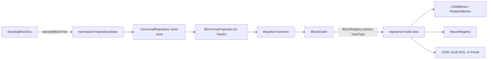

# Rendering and reactivity

## From JSON to a visible DocumentWindow

The actual pipeline is:



`ReactiveEditor` performs decoding in its constructor. `createView()` creates a `BlockTreeProjection`, normally rooted at the repository root placement. `ReactiveTreeView` supplies editor and projection context, renders the root `BlockOutlet`, then mounts global portal/layer UI such as overlays and Block-history panels.

A `document-window-block` resolves to `WindowView` in [`core-block-views.tsx`](../../src/rendering/core-block-views.tsx). It renders its projected children; the contained `document-block` resolves to `ContainerBlockView`. A Page uses `PageView`. “DocumentWindow” is therefore rendered composition, not a special canonical tree implementation.

## Decode and normalization

[`decodeBlockTree`](../../src/block-tree/codecs.ts) walks nested `ExistingBlockDto` data and produces one `ContentRecord` plus one owned `PlacementRecord` per nested Block. It:

- maps legacy root aliases `main-list-block` and `membrane-block` to `document-block`;
- moves `leftMargin` and `rightMargin` Block relations into `ownedRelations`;
- retains other relation values in `opaqueRelations`;
- records whether `children`/`relation` were omitted, null, or present;
- removes `text` from a `standoff-editor-block` payload and creates an inline `text-cell` content/placement for each Unicode code point.

The canonical repository validates record references, ownership, reachability, and cycles before publishing a commit.

## Projection and stable occurrence identity

[`BlockTreeProjection`](../../src/block-tree/projection.ts) recursively projects placements into `BlockNode`s. It owns a Solid store with `rootKey`, `nodes`, and `revision`. A node contains the data a renderer needs: `viewType`, payload, child occurrence keys, inline occurrence keys, and relation occurrence keys.

`NodeKey` identifies a route to a placement in one `ViewId`. The projection retains route-to-key mappings so a surviving occurrence normally keeps its key across edits and moves it can reconcile. The same canonical content can still have distinct node keys when rendered through multiple placements or views. Use:

- `payload.id` for authored/durable identity;
- `ContentKey` for shared canonical content;
- `PlacementKey` for the attachment edge;
- `NodeKey` for DOM, focus, selection, and view-local state.

The projection subscribes to repository changes. It has optimized inline, split, and child updates and otherwise rebuilds/reconciles the projection. Projection objects are derived and must never be edited directly.

## Renderer selection and traversal

[`registerCoreViews`](../../src/rendering/register-core-views.ts) explicitly populates `editor.registry`. `BlockOutlet` reads `projection.state.nodes[nodeKey].viewType`, resolves a `BlockTypeRegistration`, and uses Solid's `Dynamic` component. Missing registration falls back to `UnknownBlockView`.

Container views traverse children with:

```tsx
<ChildBlocks parentKey={props.nodeKey} />
```

`ChildBlocks` reads the projected `children` array and renders a `BlockOutlet` for each key. `RelationBlocks` does the same for `ownedRelations`; document margins may move their live relation view to a drawer when collapsed. Inline Cells are deliberately different: `StandoffEditorView` renders `node.inlineContent` as text spans or inline images because they are part of one editing host.

## What causes updates

A command publishes repository operations. `CanonicalRepository` applies them with Solid's `reconcile`, increments revisions, and notifies subscribers. Each projection updates its Solid store. A view reruns only computations that read changed reactive fields.

Typical dependencies are deliberately narrow:

- a checkbox reads `payload.checked`;
- a container reads its `children` array;
- `blockAppearance` reads `payload.blockProperties`;
- `StandoffEditorView` reads inline keys, annotation data, and selected session revisions;
- local UI state such as a timer tick uses component signals and does not commit every second.

Do not force a rerender after a command. If the UI does not update, first check that the view reads the projected field reactively rather than a one-time copy.

## DOM ownership and mounts

Solid components own their DOM lifetime. A view that participates in focus/input registers a `MountHandle` with [`MountRegistry`](../../src/runtime/mounts.ts) in `onMount` and disposes it in `onCleanup`. The handle describes its root, focus element, input policy, and optional text/selection adapters.

The model contains no `HTMLElement`, `Range`, observer, or cleanup callback. A `NodeKey` connects a disposable mount to its projected occurrence. When the component remounts, the registry generation prevents old cleanup from deleting the new handle.

Portal views, such as Timer Blocks and global overlays, remain canonically located in the Block graph even though their DOM is mounted elsewhere. Render placement is not ownership.

## Performance assumptions

- Payload and record values are JSON-shaped; avoid inserting class instances or DOM handles.
- Use one command/transaction for one user operation. Repeated direct commits multiply validation, projection, undo, and durable-history work.
- Standoff text is one inline Cell per code point. Use `replaceInlineRange`, which has an optimized repository/projection path; do not rebuild the whole document for each keystroke.
- CSS standoff styles are compiled into endpoint runs so SVG-only annotations do not become per-cell dependencies.
- Occurrence keys should be used as keyed identity. Array indexes are positions, not identity.
- A renderer must tolerate being disposed/recreated and the same content appearing in another occurrence.

See [SVG and overlays](SVG_AND_OVERLAYS.md) for geometry-derived rendering.
