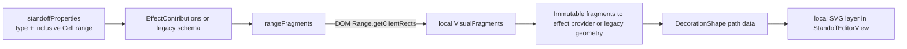

# SVG and graphical overlays

Codex has three related but separate visual systems:

1. **Standoff decoration SVGs** owned locally by each `StandoffEditorView`.
2. **Floating UI overlays/panels** with core focus/owner services, registered feature panels through `ContributedPanels`, and deliberate legacy layers mounted by `ReactiveTreeView`.
3. **Page minimap** canvas geometry owned by `PageMinimap`/`MinimapService`.

Do not treat them as one global overlay engine. This page focuses on standoff geometry, then explains when the other systems apply.

## Feature-module status

Stages 1–5 are accepted. [`EffectContributions`](../../src/runtime/effect-contributions.ts) provides a passive measured-fragment-to-SVG contract, and [`PanelContributions`](../../src/runtime/panel-contributions.ts) hosts registered panel views through existing overlay/focus mechanics. Entity References proves both. Follow [Creating an SVG Standoff Effect](../development/CREATING_STANDOFF_EFFECTS.md) or [Feature Modules](../development/FEATURE_MODULES.md) for working examples. `BlockRuntime.own` still only owns its widget's resources; it does not grant access to standoff measurement or other Blocks' DOM.

## Semantic range to SVG



[`standoff-styles.ts`](../../src/rendering/standoff-styles.ts) checks registered passive effects before legacy SVG schemas and decides whether a legacy property is cell CSS, value-based CSS, SVG, or deferred. `standoffSvgStyles` also assigns vertical lanes to overlapping underlines/rainbows.

[`StandoffEditorView`](../../src/rendering/standoff-editor-view.tsx) creates a DOM `Range` from the first and last Cell elements. `range.getClientRects()` produces one viewport rectangle per wrapped line fragment. `rangeFragments` translates them into the standoff surface's coordinates:

```text
x = rect.left - surfaceRect.left + surface.scrollLeft
y = rect.top  - surfaceRect.top  + surface.scrollTop
```

It merges adjacent rectangles on the same line. Pure geometry functions in [`decorations.ts`](../../src/rendering/decorations.ts) turn fragments into underline, rainbow, highlight, rectangle, or spiky-outline paths.

## Layer ownership and z-order

Each Standoff surface owns its SVG layers and disposes them with the component. The current DOM order is:

1. highlighter/background annotation SVG;
2. selection SVG;
3. search/session-decoration SVG and exclusion controls;
4. editable Cell flow;
5. foreground annotation SVG.

The SVG layers are `aria-hidden`; CSS makes decoration layers passive. Candidate exclusion buttons are separate interactive HTML controls. A semantic annotation should not intercept caret/pointer input unless it deliberately supplies an accessible control outside the passive SVG.

Multiple properties coexist by producing separate keyed shapes. Underline/rainbow lane offsets prevent only their direct vertical collisions; rectangles/highlighters can overlap by design. Source order and layer determine paint order.

## Invalidation and layout changes

Measurement is scheduled through `requestAnimationFrame`, coalescing repeated invalidations. A reactive effect schedules it when inline length, resolved annotation JSON, selection revision, session decorations, effect registrations, cross-Block selection, or annotation preview changes.

A `ResizeObserver` watches the Standoff surface, covering container resizing and most text reflow. Inline image load explicitly schedules a new measure. A scroll listener is currently used when interactive candidate controls need viewport placement; the SVG itself is local to content and normally moves with the surface without remeasurement. An `IntersectionObserver` avoids maintaining candidate controls while offscreen.

If an effect demonstrates a missing invalidation cause—loaded font metrics, a custom asynchronously sized child, or a transform outside the observed surface—propose a core scheduling correction. A passive feature provider must not install independent observers. Standoff rendering has no dedicated font-ready hook. `PageMinimap` has its own broader observer/font/viewport invalidation logic; it is not automatically inherited by standoff SVG.

## Coordinate utilities for other graphics

[`MeasurementService`](../../src/runtime/measurements.ts) exposes mounted Block rectangles, current native selection rectangles, and viewport-to-layer coordinate conversion. Use it for view-level graphics which are not standoff ranges. Register the view root in `MountRegistry` first.

For a Block graphical property there is currently no generalized renderer/layer registry. The owning view must:

1. read the property reactively;
2. own an SVG/canvas/component layer;
3. measure from its registered DOM root or `MeasurementService`;
4. observe every layout cause it depends on;
5. coalesce measurement;
6. clean up listeners/observers/animation frames.

That limitation is documented in [Adding a Block property](../development/ADDING_A_BLOCK_PROPERTY.md).

## Floating UI overlays

[`OverlayService`](../../src/runtime/overlays.ts) stores transient descriptors for entity search, Find/Replace, annotation panels, and context menus. It captures return focus/selection, assigns session-only keys, and closes overlays whose owner occurrence disappears. [`ContributedPanels`](../../src/rendering/contributed-panels.tsx) renders registered feature panels in a Portal using core `PanelSession` handles. Entity search/list UI owns its widget mounts and cleanup. [`ReactiveTreeView`](../../src/rendering/reactive-tree-view.tsx) also retains deliberate legacy Find, annotation, context-menu and other layers. The older `OverlayLayer` helper exists but is not that render root's composition path.

Use this path for floating interactive UI anchored to a point. Do not persist overlay descriptors or use it to paint semantic document decoration.

## Page minimap

[`PageMinimap`](../../src/rendering/page-minimap.tsx) draws a separate canvas representation of document geometry and markers. It listens to scroll, resize, visual viewport, font readiness, DOM mutation, resize, and mount events. Its markers come from `MinimapService`. Use that service for navigation markers; adding a standoff SVG type does not require minimap integration unless the feature explicitly needs a marker.

## Performance rules

- Measure after DOM has rendered, never while building canonical operations.
- Batch reads before writes and coalesce with one animation frame.
- Keep shape generation pure and test it without a browser where possible.
- Observe the smallest owning surface; avoid a global mutation observer for each annotation.
- Derive geometry from current DOM each time. Do not persist pixel coordinates in the document.
- Clean up observers/listeners and discard scheduled frames on component disposal.
- Keep passive decoration layers out of pointer hit-testing and accessibility trees.
