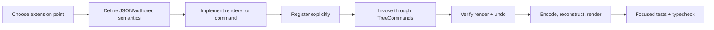

# Minimal extension examples and workflow

These snippets isolate the lines that matter. Production features should add names, accessibility, error handling, and focused tests appropriate to their behaviour.

## Minimal hosted Block module

This example uses the implemented Stage 1 API. Place it at
`src/features/rating/index.tsx`; it does not access `ReactiveEditor`.

```tsx
import { onMount } from "solid-js";
import type {
  BlockApplicationDefinition, BlockFeatureCapabilities, BlockRuntime,
  CodexFeature, FeatureScope,
} from "../../feature-api";

function RatingView(props: { runtime: BlockRuntime }) {
  const runtime = props.runtime;
  let root!: HTMLLabelElement;
  const value = () => Number(runtime.field("value") ?? 0);
  onMount(() => runtime.mountWidget(root)); // instance-owned cleanup

  return <label ref={root} tabIndex={-1} class="rating-block"
    data-runtime-key={runtime.nodeKey}>
    Rating
    <input type="range" min="0" max="5" value={value()}
      onChange={event => runtime.setField(
        "value", event.currentTarget.valueAsNumber, "Set Rating",
      )} />
  </label>;
}

export function createRatingFeature(
  capabilities: (scope: FeatureScope) => BlockFeatureCapabilities,
): CodexFeature {
  return {
    id: "rating",
    activate(scope) {
      const { blocks, register } = capabilities(scope);
      const type: BlockApplicationDefinition = {
        type: "rating-block", view: RatingView,
        capabilities: ["control", "opaque-widget", "selectable"],
        create: () => ({ id: crypto.randomUUID(), type: "rating-block", value: 3 }),
      };
      register.block(type);
      register.command({
        id: "rating.create", label: "Add rating",
        canExecute: ({ targetKey }) => !!blocks.get(targetKey),
        execute: ({ targetKey }) => {
          const origin = blocks.get(targetKey)!;
          const placement = blocks.insert(type.create(),
            origin.isRoot || origin.type === "document-block"
              ? { kind: "at", parentKey: origin.key, index: origin.children.length }
              : { kind: "after", anchorKey: origin.key });
          blocks.focusPlacement(placement, origin.viewId);
        },
      });
      register.action({ id: "rating.add", slot: "add-block-menu",
        label: "Rating", command: "rating.create" });
    },
  };
}
```

Application composition imports the factory and activates it with
`createRatingFeature(scope => blockFeatureCapabilities(editor, scope))`, following
[Timer's existing registration](../../src/application/features.ts). Gate activation
with the feature's approved configuration; new substantial features default off
unless the user specifies otherwise. Call application registration once per editor.
Do not add the module import to `registerCoreViews` or the input gateway.

The generic codec persists the authored `value` even without the module. The
runtime supplies undoable edits and only this occurrence's mount access. A timer,
observer or subscription acquired by the instance should register cleanup with
`runtime.own(...)`; module-wide resources use `scope.own(...)`. Do not put those
handles into the DTO. See [Adding a Block type](ADDING_A_BLOCK_TYPE.md) for the
boundary and verification checklist.

## Remaining core/legacy extension examples

The following property examples describe the existing internal implementation,
not public feature capabilities. Stage 1 has not added standoff/property renderer,
annotation-target or selection-behavior registries. Keep changes to these systems
explicitly scoped; do not pass the editor into a feature to imitate these snippets.

## Minimal CSS standoff property

```ts
// standoff-styles.ts
"style/letter-spaced": { cell: { "letter-spacing": ".08em" } },

// applying it
const old = (node.payload.standoffProperties as object[] | undefined) ?? [];
editor.commands.setPayloadField(node.key, "standoffProperties", [
  ...old,
  { id: crypto.randomUUID(), type: "style/letter-spaced", start, end },
], "Apply Letter Spacing");
```

That schema entry is the renderer registration. `start` and `end` are inclusive Cell indexes.

## Minimal SVG standoff property

If an existing shape is acceptable, one schema entry is enough:

```ts
// Reuse current outline rendering.
"review/needs-attention": { svg: { kind: "rectangle" } },
```

For new geometry, add the kind and view switch as described in [Adding a standoff property](ADDING_A_STANDOFF_PROPERTY.md). The smallest reusable implementation is a pure fragment-to-shape function:

```ts
export function baselineDots(key: string, fragments: VisualFragment[]): DecorationShape[] {
  return fragments.map((f, index) => ({
    key: `${key}:${index}`,
    path: `M ${f.x} ${f.y + f.height + 2} H ${f.x + f.width}`,
    stroke: "#7257d8",
    strokeWidth: 2,
    dashArray: "1 4",
    fill: "none",
  }));
}
```

Then connect `svg.kind === "dots"` to `baselineDots` in `StandoffEditorView.measure`. Range-to-DOM geometry, resize invalidation, local coordinates, layering, and cleanup remain owned by the existing view.

## Minimal CSS Block property

```ts
// appearance.ts
case "block/dimmed":
  style.opacity = String(property.value ?? 0.55);
  break;

// writing it from a view/action
editor.commands.setPayloadField(node.key, "blockProperties", [
  ...properties.filter(p => p.type !== "block/dimmed"),
  { type: "block/dimmed", value: 0.55 },
], "Dim Block");
```

This appears only in views which call `blockAppearance`.

## Minimal graphical Block property

There is no registry to copy. For a graphic local to one Block, keep it inside that view and avoid measurement when CSS can size it:

```tsx
const hasRule = () => ((node()?.payload.blockProperties as any[]) ?? [])
  .some(property => property.type === "block/diagonal-rule" && !property.isDeleted);

<div class="my-block-surface">
  <Show when={hasRule()}>
    <svg class="my-block-rule" viewBox="0 0 100 100"
      preserveAspectRatio="none" aria-hidden="true">
      <path d="M 0 100 L 100 0" />
    </svg>
  </Show>
  {/* ordinary Block content */}
</div>
```

Position `.my-block-rule` absolutely within a positioned surface and make it pointer-passive. Use `MeasurementService` and an owned observer lifecycle only when the graphic spans measured targets.

## Normal development loop



1. Separate module lifetime, mounted-instance runtime, authored data and derived state. Only authored data enters the repository.
2. Use the available public capabilities for a hosted Block; they delegate to existing `TreeCommands` operations. A genuinely missing primitive requires a separately justified core change.
3. Keep module policy, type defaults/reader, view and contributions together. Register through application composition; use legacy schema/appearance paths only for extensions that still require them.
4. Add input after the operation is programmatically callable. Use a semantic command when several UI surfaces share it.
5. Verify the model value and visible result, then undo/redo.
6. Encode, create a fresh editor, activate configured modules, and verify reopen. Repeat with the module absent to verify preservation and fallback.
7. If durable Block history is relevant, enable it in a focused test and confirm authored ID/attribution. Generic payload changes rarely need a new history suite.

## Proportionate test choices

| Change | Usually run/add |
| --- | --- |
| Hosted Block module | focused behavior/undo/round-trip tests, activation rollback/disposal, independent instances, disabled/absent-type preservation and removal check |
| Structure/identity/transclusion | focused `src/block-tree` tests plus compatibility and undo tests |
| Binding/input | `src/input/bindings.test.ts` and a focused gateway/rendering interaction test |
| CSS standoff property | `standoff-styles.test.ts`; visual spot-check |
| SVG standoff property | geometry unit test plus one `standoff-editor-view` integration; browser spot-check for wrap/resize |
| Block property | appearance/helper test and one representative view; visual spot-check |
| Persistence format | codec compatibility fixtures and `persistence.test.ts` as applicable |
| Durable history semantics | the narrow `src/history`/Block-history suite that owns the changed contract |

During ordinary work, run the focused Vitest file, then `npm run typecheck` and the relevant build. Full browser qualification, performance benchmarks, every history stage gate, and every demo suite are warranted only when the changed boundary reaches them. Visual styling does not need tests for every density or pixel value.
