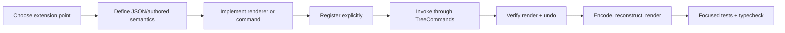

# Minimal extension examples and workflow

These snippets isolate the lines that matter. Production features should add names, accessibility, error handling, and focused tests appropriate to their behaviour.

## Minimal Block type

```tsx
// rendering/rating-block.tsx
import type { BlockViewProps } from "../block-tree/types";
import { useReactiveView } from "../reactive-editor/context";

export function RatingBlockView(props: BlockViewProps) {
  const { editor, projection } = useReactiveView();
  const node = () => projection.state.nodes[props.nodeKey];
  const value = () => Number(node()?.payload.value ?? 0);

  return <label class="rating-block">
    Rating
    <input type="range" min="0" max="5" value={value()}
      onChange={event => editor.commands.setPayloadField(
        props.nodeKey, "value", event.currentTarget.valueAsNumber, "Set Rating",
      )} />
  </label>;
}

// in registerCoreViews(editor)
editor.registry.register({
  type: "rating-block",
  view: RatingBlockView,
  capabilities: ["control", "selectable"],
});

// creation
editor.commands.insert(
  { id: crypto.randomUUID(), type: "rating-block", value: 3 },
  { kind: "after", anchorKey },
);
```

The generic codec persists this payload. The command supplies undo and history capture. Register a mount with `inputPolicy: "control"` if the gateway must resolve/focus the root beyond the native input's local handler.

## Minimal CSS standoff property

```ts
// standoff-styles.ts
"style/letter-spaced": { cell: { "letter-spacing": ".08em" } },

// applying it
const old = (node.payload.standoffProperties as object[] | undefined) ?? [];
editor.commands.setPayloadField(node.key, "standoffProperties", [
  ...old,
  { id: crypto.randomUUID(), type: "style/letter-spaced", start, end },
], "Apply Letter Spacing");
```

That schema entry is the renderer registration. `start` and `end` are inclusive Cell indexes.

## Minimal SVG standoff property

If an existing shape is acceptable, one schema entry is enough:

```ts
// Reuse current outline rendering.
"review/needs-attention": { svg: { kind: "rectangle" } },
```

For new geometry, add the kind and view switch as described in [Adding a standoff property](ADDING_A_STANDOFF_PROPERTY.md). The smallest reusable implementation is a pure fragment-to-shape function:

```ts
export function baselineDots(key: string, fragments: VisualFragment[]): DecorationShape[] {
  return fragments.map((f, index) => ({
    key: `${key}:${index}`,
    path: `M ${f.x} ${f.y + f.height + 2} H ${f.x + f.width}`,
    stroke: "#7257d8",
    strokeWidth: 2,
    dashArray: "1 4",
    fill: "none",
  }));
}
```

Then connect `svg.kind === "dots"` to `baselineDots` in `StandoffEditorView.measure`. Range-to-DOM geometry, resize invalidation, local coordinates, layering, and cleanup remain owned by the existing view.

## Minimal CSS Block property

```ts
// appearance.ts
case "block/dimmed":
  style.opacity = String(property.value ?? 0.55);
  break;

// writing it from a view/action
editor.commands.setPayloadField(node.key, "blockProperties", [
  ...properties.filter(p => p.type !== "block/dimmed"),
  { type: "block/dimmed", value: 0.55 },
], "Dim Block");
```

This appears only in views which call `blockAppearance`.

## Minimal graphical Block property

There is no registry to copy. For a graphic local to one Block, keep it inside that view and avoid measurement when CSS can size it:

```tsx
const hasRule = () => ((node()?.payload.blockProperties as any[]) ?? [])
  .some(property => property.type === "block/diagonal-rule" && !property.isDeleted);

<div class="my-block-surface">
  <Show when={hasRule()}>
    <svg class="my-block-rule" viewBox="0 0 100 100"
      preserveAspectRatio="none" aria-hidden="true">
      <path d="M 0 100 L 100 0" />
    </svg>
  </Show>
  {/* ordinary Block content */}
</div>
```

Position `.my-block-rule` absolutely within a positioned surface and make it pointer-passive. Use `MeasurementService` and an owned observer lifecycle only when the graphic spans measured targets.

## Normal development loop



1. Decide whether the feature is authored document state, placement structure, or transient UI. Only authored data enters the repository.
2. Reuse a `TreeCommands` operation. Add a focused command only when an existing payload/structure operation cannot express the invariant.
3. Implement a view/schema/appearance case and register it at the explicit point listed in [Repository map](REPOSITORY_MAP.md).
4. Add input after the operation is programmatically callable. Use a semantic command when several UI surfaces share it.
5. Verify the model value and visible result, then undo/redo.
6. Encode, create a fresh editor, repeat registration, and verify reopen.
7. If durable Block history is relevant, enable it in a focused test and confirm authored ID/attribution. Generic payload changes rarely need a new history suite.

## Proportionate test choices

| Change | Usually run/add |
| --- | --- |
| Block payload/view | one renderer test, relevant command/model test, encode/reopen assertion |
| Structure/identity/transclusion | focused `src/block-tree` tests plus compatibility and undo tests |
| Binding/input | `src/input/bindings.test.ts` and a focused gateway/rendering interaction test |
| CSS standoff property | `standoff-styles.test.ts`; visual spot-check |
| SVG standoff property | geometry unit test plus one `standoff-editor-view` integration; browser spot-check for wrap/resize |
| Block property | appearance/helper test and one representative view; visual spot-check |
| Persistence format | codec compatibility fixtures and `persistence.test.ts` as applicable |
| Durable history semantics | the narrow `src/history`/Block-history suite that owns the changed contract |

During ordinary work, run the focused Vitest file, then `npm run typecheck` and the relevant build. Full browser qualification, performance benchmarks, every history stage gate, and every demo suite are warranted only when the changed boundary reaches them. Visual styling does not need tests for every density or pixel value.
